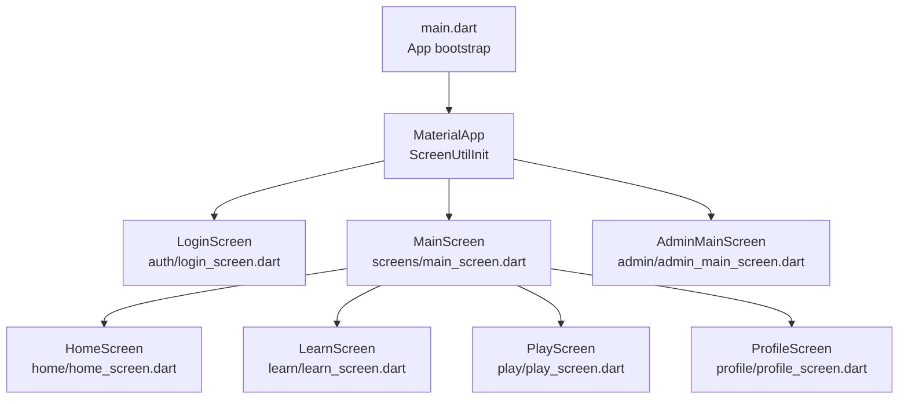
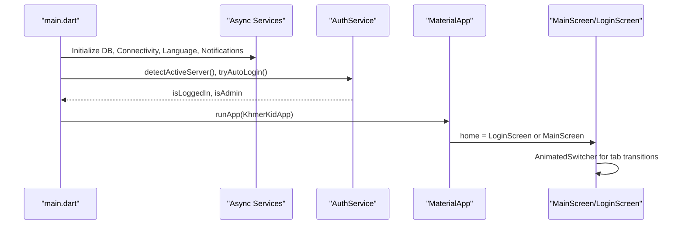
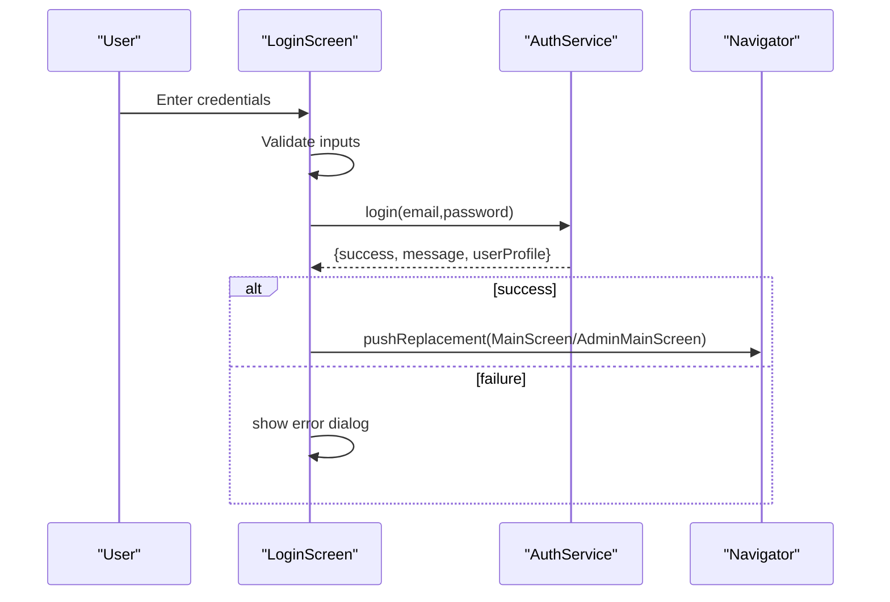
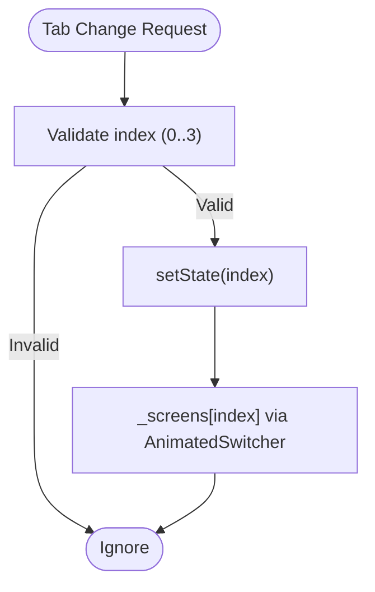
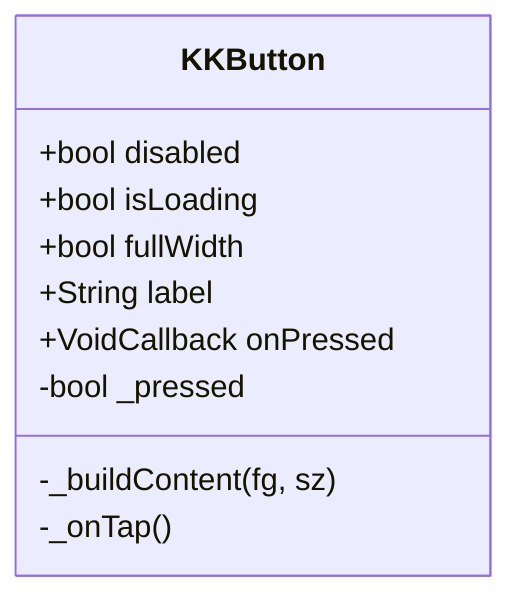
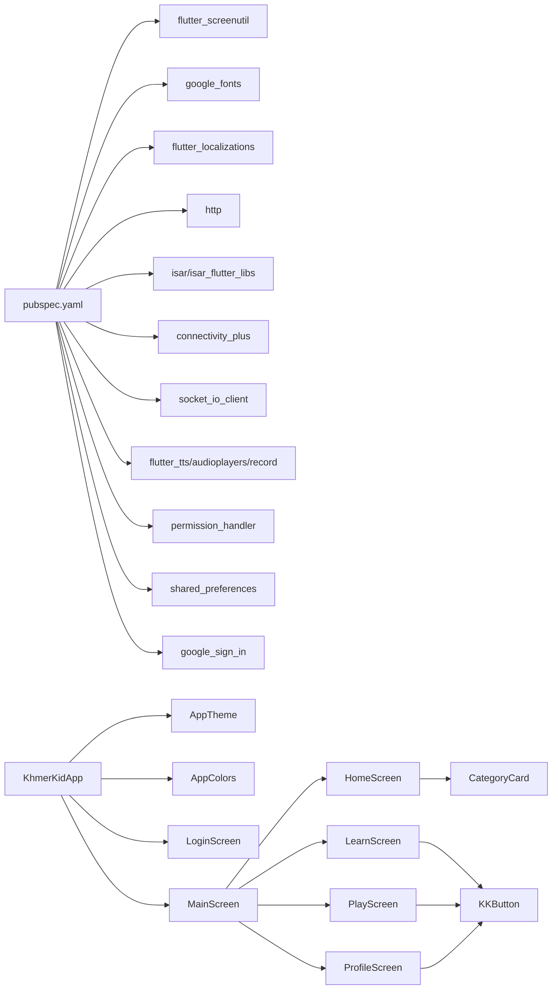

# Screens and UI Components

<cite>
**Referenced Files in This Document**
- [main.dart](file://lib/main.dart)
- [pubspec.yaml](file://pubspec.yaml)
- [app_theme.dart](file://lib/theme/app_theme.dart)
- [app_colors.dart](file://lib/constants/app_colors.dart)
- [login_screen.dart](file://lib/screens/auth/login_screen.dart)
- [main_screen.dart](file://lib/screens/main_screen.dart)
- [kk_button.dart](file://lib/widgets/kk/kk_button.dart)
- [category_card.dart](file://lib/screens/home/widgets/category_card.dart)
- [spelling_hub_screen.dart](file://lib/screens/learn/spelling_hub_screen.dart)
- [library_screen.dart](file://lib/screens/library/library_screen.dart)
</cite>

## Table of Contents
1. [Introduction](#introduction)
2. [Project Structure](#project-structure)
3. [Core Components](#core-components)
4. [Architecture Overview](#architecture-overview)
5. [Detailed Component Analysis](#detailed-component-analysis)
6. [Dependency Analysis](#dependency-analysis)
7. [Performance Considerations](#performance-considerations)
8. [Troubleshooting Guide](#troubleshooting-guide)
9. [Conclusion](#conclusion)

## Introduction
This document describes the screen architecture and user interface components of the application. It covers the main screen hierarchy (login, home, learning, play, and profile), the UI component library and reusable patterns, the responsive design system using Flutter ScreenUtil, theme management, styling conventions, navigation patterns, state management integration, and user interaction flows. Accessibility, cross-platform considerations, and UI performance optimizations are also addressed.

## Project Structure
The application initializes asynchronously, performs pre-boot tasks (database, connectivity, localization, notifications), detects servers, attempts auto-login, and launches into either the Login screen or the Main screen depending on authentication state. The Main screen hosts a bottom navigation bar and animated transitions between Home, Learn, Play, and Profile screens. Authentication-related screens reside under lib/screens/auth, while reusable UI components live under lib/widgets.

**Diagram sources**
- [main.dart:79-128](file://lib/main.dart#L79-L128)
- [main_screen.dart:14-142](file://lib/screens/main_screen.dart#L14-L142)
- [login_screen.dart:11-17](file://lib/screens/auth/login_screen.dart#L11-L17)

**Section sources**
- [main.dart:21-77](file://lib/main.dart#L21-L77)
- [main.dart:79-128](file://lib/main.dart#L79-L128)

## Core Components
- Application bootstrap and routing:
  - Initializes local database, connectivity, language manager, and local notifications in parallel.
  - Attempts server detection and auto-login; sets up SystemChrome orientation and status bar style.
  - Builds MaterialApp with localized locales, Google Fonts text theme, and conditional home screen selection.
- Theme and design system:
  - AppTheme defines Material 3 theme with color scheme, typography, AppBar, Card, Button, and BottomNavigationBar configurations.
  - AppColors centralizes semantic colors, gradients, and shadows for consistent UI.
- Responsive design:
  - ScreenUtilInit configured with designSize and splitScreenMode; widgets use h, w, r, sp extensions for scalable layouts.

**Section sources**
- [main.dart:21-77](file://lib/main.dart#L21-L77)
- [main.dart:91-121](file://lib/main.dart#L91-L121)
- [app_theme.dart:10-93](file://lib/theme/app_theme.dart#L10-L93)
- [app_colors.dart:10-218](file://lib/constants/app_colors.dart#L10-L218)
- [pubspec.yaml:30](file://pubspec.yaml#L30)

## Architecture Overview
The UI architecture follows a layered pattern:
- Entry point initializes services and constructs the MaterialApp.
- Conditional routing selects LoginScreen or MainScreen based on authentication state.
- MainScreen manages bottom navigation and animated transitions between child screens.
- Reusable widgets encapsulate micro-interactions and consistent styling.

**Diagram sources**
- [main.dart:21-77](file://lib/main.dart#L21-L77)
- [main.dart:91-121](file://lib/main.dart#L91-L121)
- [main_screen.dart:44-88](file://lib/screens/main_screen.dart#L44-L88)

## Detailed Component Analysis

### Login Screen
- Purpose: Modernized authentication UI with form validation, social login options, and mock login bypass.
- Key UI elements:
  - Decorative wave backgrounds using CustomClipper.
  - Animated input fields with focus-driven styling and error hints.
  - Micro-interaction buttons with press animations and haptic feedback.
  - Social login buttons (Google, Facebook) with gradient accents.
- Interaction flows:
  - Form validation triggers inline error messages.
  - Login button dispatches to AuthService; navigates to MainScreen or AdminMainScreen based on role.
  - Google login supports developer bypass dialog for testing environments.

**Diagram sources**
- [login_screen.dart:596-636](file://lib/screens/auth/login_screen.dart#L596-L636)
- [login_screen.dart:638-661](file://lib/screens/auth/login_screen.dart#L638-L661)

**Section sources**
- [login_screen.dart:11-17](file://lib/screens/auth/login_screen.dart#L11-L17)
- [login_screen.dart:66-397](file://lib/screens/auth/login_screen.dart#L66-L397)
- [login_screen.dart:596-757](file://lib/screens/auth/login_screen.dart#L596-L757)

### Main Screen (Bottom Navigation)
- Purpose: Hosts Home, Learn, Play, and Profile screens with animated transitions and a persistent bottom navigation bar.
- Navigation pattern:
  - AnimatedSwitcher with FadeTransition for smooth tab changes.
  - Bottom bar items animate selection state with scaling icons, label weights, and active indicators.
- External tab switching:
  - Provides a static accessor to switch tabs programmatically from child screens.

**Diagram sources**
- [main_screen.dart:31-41](file://lib/screens/main_screen.dart#L31-L41)
- [main_screen.dart:21-55](file://lib/screens/main_screen.dart#L21-L55)

**Section sources**
- [main_screen.dart:14-142](file://lib/screens/main_screen.dart#L14-L142)

### Home Screen Composition
- Purpose: Entry hub with category cards and progress banners.
- Composition highlights:
  - CategoryCard widgets with image or icon placeholders, drop shadows, and prominent labels.
  - Programmatic tab switching via MainScreenState.of(context).
- Styling conventions:
  - Uses ScreenUtil extensions (h, w, r, sp) for responsive sizing and spacing.
  - Typography and shadows aligned with AppTheme and AppColors.

**Section sources**
- [main_screen.dart:24-29](file://lib/screens/main_screen.dart#L24-L29)
- [category_card.dart:78-115](file://lib/screens/home/widgets/category_card.dart#L78-L115)

### Learning Screen Composition
- Purpose: Educational pathways with navigation bar integrated at the bottom of the screen content.
- Composition highlights:
  - Bottom navigation bar built inside the screen’s layout container with rounded corners and subtle shadows.
  - Navigation items mirror MainScreen’s selection logic for consistent UX.

**Section sources**
- [spelling_hub_screen.dart:791-806](file://lib/screens/learn/spelling_hub_screen.dart#L791-L806)
- [spelling_hub_screen.dart:808-810](file://lib/screens/learn/spelling_hub_screen.dart#L808-L810)

### Library Screen Composition
- Purpose: Content browsing with bottom navigation bar placed at the base of the scrollable area.
- Composition highlights:
  - Bottom navigation bar styled with rounded top edges and soft shadow.
  - Navigation items use consistent icon and label styling.

**Section sources**
- [library_screen.dart:1151-1182](file://lib/screens/library/library_screen.dart#L1151-L1182)
- [library_screen.dart:1173-1177](file://lib/screens/library/library_screen.dart#L1173-L1177)

### UI Component Library and Reusable Patterns
- KKButton (lib/widgets/kk/kk_button.dart):
  - Implements micro-interactions: press-scale animations, animated container resizing, and haptic feedback on tap.
  - Supports loading states, full-width behavior, configurable sizes and paddings, borders, and shadows.
  - Encapsulates consistent styling using AppColors and AppTheme-derived text styles.

**Diagram sources**
- [kk_button.dart:185-221](file://lib/widgets/kk/kk_button.dart#L185-L221)

**Section sources**
- [kk_button.dart:185-221](file://lib/widgets/kk/kk_button.dart#L185-L221)

## Dependency Analysis
- External libraries:
  - flutter_screenutil: responsive units and scalable UI.
  - google_fonts: consistent typography across themes.
  - flutter_localizations/intl/timezone: internationalization and date/time support.
  - http, socket_io_client, connectivity_plus: network and real-time features.
  - isar, isar_flutter_libs: offline-first data persistence.
  - flutter_tts, audioplayers, record: audio playback and recording.
  - permission_handler, shared_preferences: permissions and preferences.
  - google_sign_in: third-party sign-in.
- Internal dependencies:
  - Main app depends on AppTheme and AppColors for unified styling.
  - Screens depend on reusable widgets (e.g., CategoryCard, KKButton) and ScreenUtil extensions.

**Diagram sources**
- [pubspec.yaml:15-48](file://pubspec.yaml#L15-L48)
- [main.dart:91-121](file://lib/main.dart#L91-L121)
- [app_theme.dart:10-93](file://lib/theme/app_theme.dart#L10-L93)
- [app_colors.dart:10-218](file://lib/constants/app_colors.dart#L10-L218)

**Section sources**
- [pubspec.yaml:15-48](file://pubspec.yaml#L15-L48)

## Performance Considerations
- Asynchronous bootstrapping:
  - Parallel initialization of services reduces startup latency.
- Animated transitions:
  - AnimatedSwitcher with FadeTransition minimizes heavy rebuilds during tab switches.
- Responsive scaling:
  - ScreenUtilInit with splitScreenMode and minTextAdapt ensures consistent UI scaling across devices.
- Widget reuse:
  - Centralized styling via AppTheme and AppColors avoids repeated style computations.
- Micro-interactions:
  - Press animations and haptic feedback are lightweight and scoped to interactive widgets.

[No sources needed since this section provides general guidance]

## Troubleshooting Guide
- Login failures:
  - Validate input errors and display inline messages; handle network exceptions gracefully with dialogs.
  - Google login supports a developer bypass dialog for environments where Google services are unavailable.
- Navigation issues:
  - Ensure MainScreenState.of(context) is called within the correct subtree; verify tab indices are within bounds.
- Responsive layout problems:
  - Confirm ScreenUtilInit is wrapping the root widget and that h/w/r/sp extensions are applied consistently.
- Theme inconsistencies:
  - Verify GoogleFonts integration and that AppTheme is applied to MaterialApp.

**Section sources**
- [login_screen.dart:596-757](file://lib/screens/auth/login_screen.dart#L596-L757)
- [main_screen.dart:31-41](file://lib/screens/main_screen.dart#L31-L41)
- [main.dart:91-121](file://lib/main.dart#L91-L121)
- [app_theme.dart:10-93](file://lib/theme/app_theme.dart#L10-L93)

## Conclusion
The application employs a clean, modular UI architecture with a responsive design system, consistent theming, and reusable components. The MainScreen orchestrates navigation and transitions, while LoginScreen provides a polished authentication experience. Reusable widgets like KKButton and CategoryCard enforce design consistency and improve maintainability. With ScreenUtil and AppTheme, the UI scales effectively across devices and platforms, ensuring a cohesive educational experience.