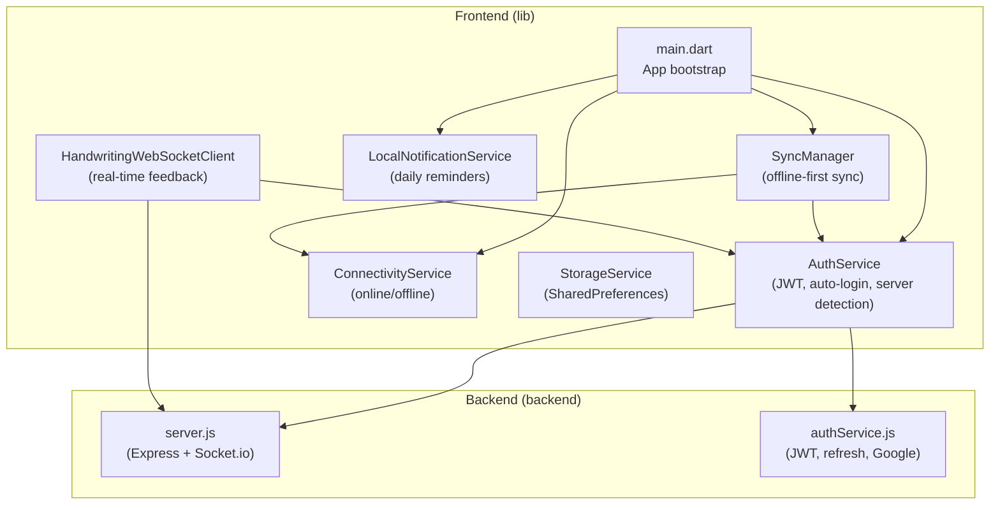
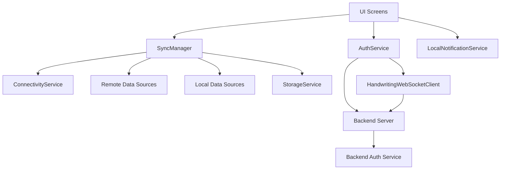
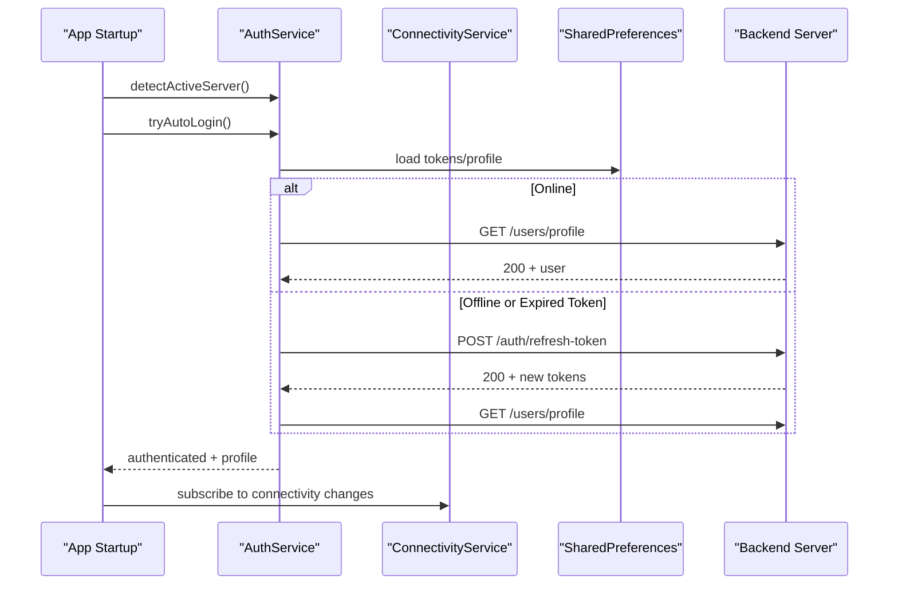
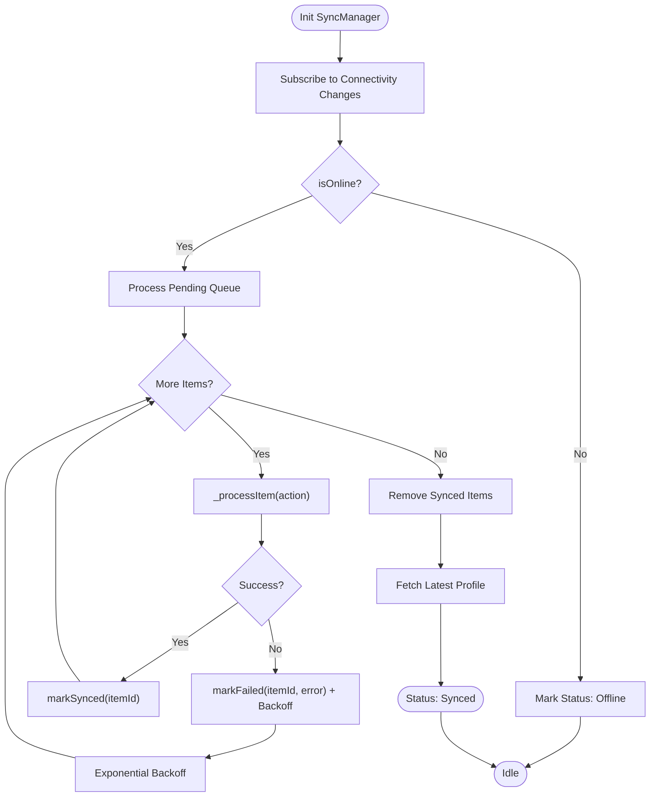
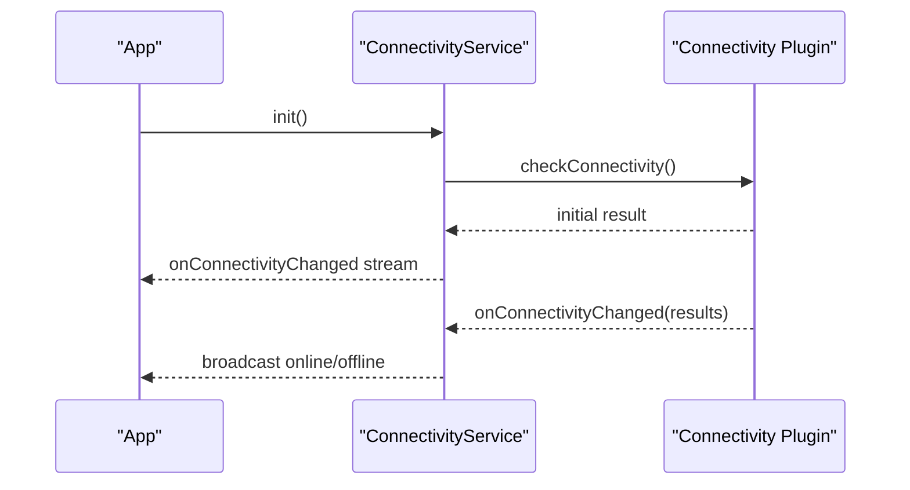
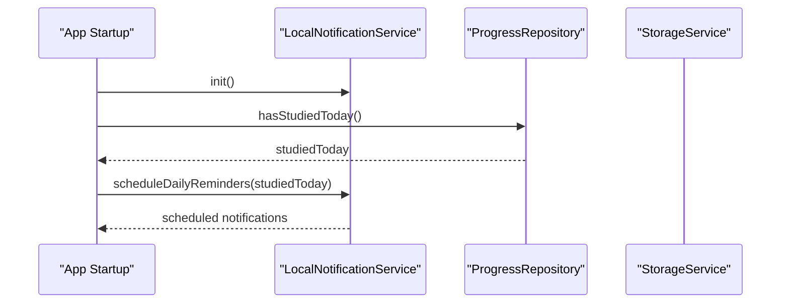
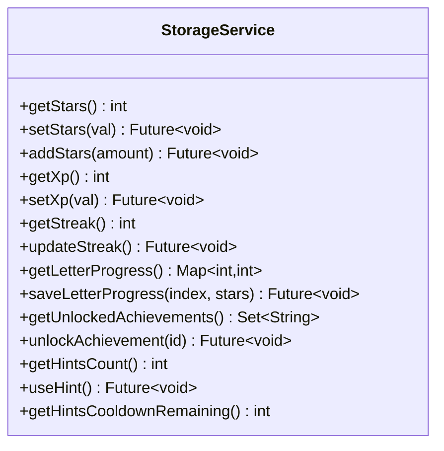
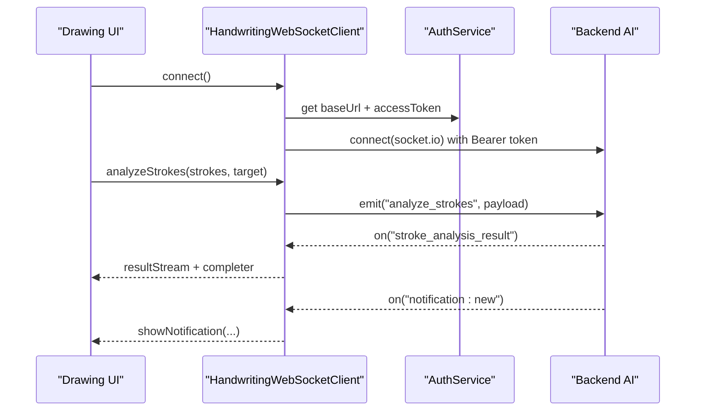
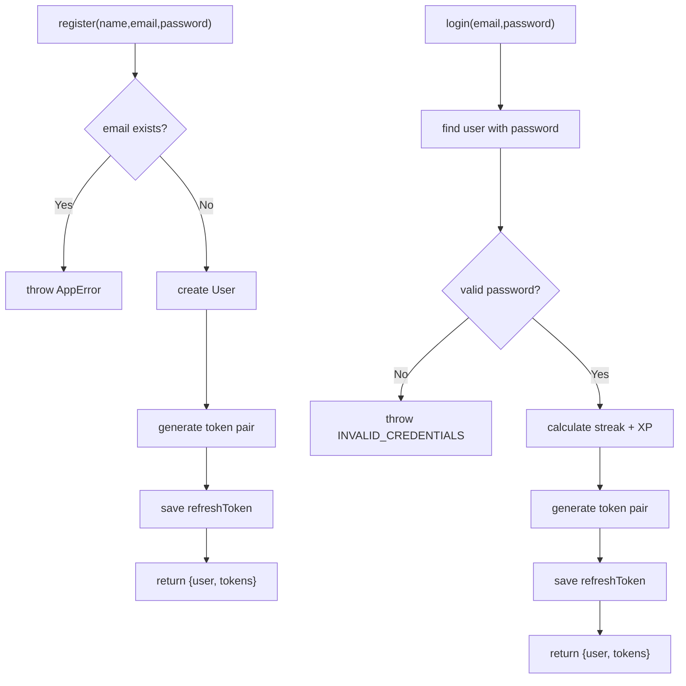
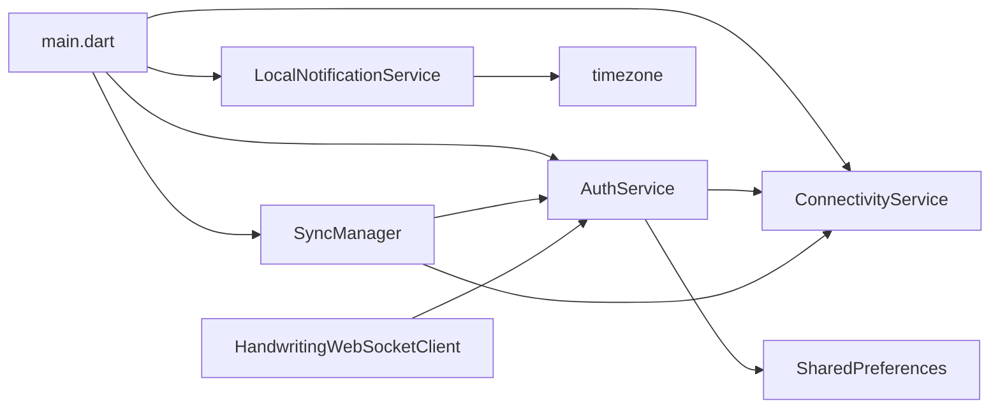

# Services Layer

<cite>
**Referenced Files in This Document**
- [main.dart](file://lib/main.dart)
- [auth_service.dart](file://lib/services/auth_service.dart)
- [sync_manager.dart](file://lib/services/sync_manager.dart)
- [connectivity_service.dart](file://lib/services/connectivity_service.dart)
- [local_notification_service.dart](file://lib/services/local_notification_service.dart)
- [storage_service.dart](file://lib/services/storage_service.dart)
- [handwriting_websocket_client.dart](file://lib/services/handwriting_websocket_client.dart)
- [server.js](file://backend/server.js)
- [authService.js](file://backend/src/services/authService.js)
</cite>

## Table of Contents
1. [Introduction](#introduction)
2. [Project Structure](#project-structure)
3. [Core Components](#core-components)
4. [Architecture Overview](#architecture-overview)
5. [Detailed Component Analysis](#detailed-component-analysis)
6. [Dependency Analysis](#dependency-analysis)
7. [Performance Considerations](#performance-considerations)
8. [Troubleshooting Guide](#troubleshooting-guide)
9. [Conclusion](#conclusion)

## Introduction
This document describes the services layer architecture and business logic implementation for the application. It focuses on:
- Authentication service with JWT lifecycle, auto-login, and server detection
- Offline-first synchronization via SyncManager
- Network connectivity monitoring
- Local notification scheduling
- Repository pattern and data access abstractions
- Specialized services such as handwriting recognition and progress tracking
- Service initialization sequences, dependency injection patterns, error handling, and lifecycle management

## Project Structure
The services layer is primarily implemented in the Flutter frontend under lib/services, with backend services under backend/src/services. The main entry initializes services in parallel and orchestrates startup flows.

**Diagram sources**
- [main.dart:21-77](file://lib/main.dart#L21-L77)
- [auth_service.dart:16-800](file://lib/services/auth_service.dart#L16-L800)
- [sync_manager.dart:21-246](file://lib/services/sync_manager.dart#L21-L246)
- [connectivity_service.dart:6-60](file://lib/services/connectivity_service.dart#L6-L60)
- [local_notification_service.dart:6-263](file://lib/services/local_notification_service.dart#L6-L263)
- [storage_service.dart:6-558](file://lib/services/storage_service.dart#L6-L558)
- [handwriting_websocket_client.dart:178-524](file://lib/services/handwriting_websocket_client.dart#L178-L524)
- [server.js:13-160](file://backend/server.js#L13-L160)
- [authService.js:16-250](file://backend/src/services/authService.js#L16-L250)

**Section sources**
- [main.dart:21-77](file://lib/main.dart#L21-L77)

## Core Components
- Authentication Service: Handles registration, login, refresh token, profile fetch/update, and Google sign-in. Includes server detection and auto-login with offline fallback.
- Sync Manager: Implements offline-first synchronization with retry/backoff, conflict resolution, and periodic sync.
- Connectivity Service: Wraps platform connectivity checks and broadcasts online/offline state.
- Local Notification Service: Initializes and schedules daily study reminders with timezone-aware scheduling.
- Storage Service: Provides SharedPreferences-backed storage for user progress, settings, and power-ups regeneration.
- Handwriting WebSocket Client: Manages Socket.IO connection to backend AI analyzer for real-time stroke feedback and notifications.

**Section sources**
- [auth_service.dart:16-800](file://lib/services/auth_service.dart#L16-L800)
- [sync_manager.dart:21-246](file://lib/services/sync_manager.dart#L21-L246)
- [connectivity_service.dart:6-60](file://lib/services/connectivity_service.dart#L6-L60)
- [local_notification_service.dart:6-263](file://lib/services/local_notification_service.dart#L6-L263)
- [storage_service.dart:6-558](file://lib/services/storage_service.dart#L6-L558)
- [handwriting_websocket_client.dart:178-524](file://lib/services/handwriting_websocket_client.dart#L178-L524)

## Architecture Overview
The services layer follows a layered architecture:
- Presentation depends on Services
- Services depend on Data Access (local/remote) and Repositories
- Authentication integrates with backend JWT and refresh flows
- SyncManager coordinates offline-first data merging and retries
- Notifications and WebSocket integrate with real-time backend features

**Diagram sources**
- [auth_service.dart:16-800](file://lib/services/auth_service.dart#L16-L800)
- [sync_manager.dart:21-246](file://lib/services/sync_manager.dart#L21-L246)
- [connectivity_service.dart:6-60](file://lib/services/connectivity_service.dart#L6-L60)
- [local_notification_service.dart:6-263](file://lib/services/local_notification_service.dart#L6-L263)
- [handwriting_websocket_client.dart:178-524](file://lib/services/handwriting_websocket_client.dart#L178-L524)
- [server.js:13-160](file://backend/server.js#L13-L160)
- [authService.js:16-250](file://backend/src/services/authService.js#L16-L250)

## Detailed Component Analysis

### Authentication Service
Responsibilities:
- Server detection: Background subnet scanning, manual override, and saved server URL
- Auto-login: Loads tokens, attempts profile fetch, refresh token if needed, offline fallback
- JWT lifecycle: Login, register, refresh token, profile update, badges/missions retrieval
- Google sign-in: Native flow and mock login for development
- Image upload: Avatar upload to Cloudinary before profile update

**Diagram sources**
- [auth_service.dart:241-317](file://lib/services/auth_service.dart#L241-L317)
- [auth_service.dart:780-800](file://lib/services/auth_service.dart#L780-L800)
- [auth_service.dart:568-625](file://lib/services/auth_service.dart#L568-L625)
- [connectivity_service.dart:28-53](file://lib/services/connectivity_service.dart#L28-L53)

Key implementation highlights:
- Server detection prioritization: manual URL > saved URL > candidate URLs > background subnet scan
- Auto-login timeout safeguards to prevent UI stalls
- Refresh token flow integrated with WebSocket reconnection
- Profile caching and storage sync for offline mode

**Section sources**
- [auth_service.dart:120-175](file://lib/services/auth_service.dart#L120-L175)
- [auth_service.dart:241-317](file://lib/services/auth_service.dart#L241-L317)
- [auth_service.dart:780-800](file://lib/services/auth_service.dart#L780-L800)
- [auth_service.dart:568-625](file://lib/services/auth_service.dart#L568-L625)

### Sync Manager (Offline-First)
Responsibilities:
- Detect online/offline and queue changes locally
- Retry failed sync with exponential backoff
- Process pending queue FIFO and merge data
- Trigger full sync after login and post-sync profile refresh

**Diagram sources**
- [sync_manager.dart:46-155](file://lib/services/sync_manager.dart#L46-L155)
- [sync_manager.dart:158-186](file://lib/services/sync_manager.dart#L158-L186)
- [sync_manager.dart:189-210](file://lib/services/sync_manager.dart#L189-L210)

Operational notes:
- Periodic sync every 5 minutes while online
- Conflict resolution strategy documented as “take-max” in comments
- After successful sync, triggers profile refresh to keep UI consistent

**Section sources**
- [sync_manager.dart:21-246](file://lib/services/sync_manager.dart#L21-L246)

### Connectivity Service
Responsibilities:
- Wrap platform connectivity checks
- Broadcast online/offline state via stream
- Initialize once and dispose cleanly

**Diagram sources**
- [connectivity_service.dart:28-53](file://lib/services/connectivity_service.dart#L28-L53)

**Section sources**
- [connectivity_service.dart:6-60](file://lib/services/connectivity_service.dart#L6-L60)

### Local Notification Service
Responsibilities:
- Initialize notification plugin and request permissions
- Schedule daily reminders with timezone awareness
- Cancel or replace reminders to avoid duplication

**Diagram sources**
- [main.dart:48-56](file://lib/main.dart#L48-L56)
- [local_notification_service.dart:210-261](file://lib/services/local_notification_service.dart#L210-L261)

**Section sources**
- [local_notification_service.dart:6-263](file://lib/services/local_notification_service.dart#L6-L263)

### Storage Service
Responsibilities:
- SharedPreferences wrapper with per-user key scoping
- Progress tracking for letters, vowels, reading, numbers, diacritics, spelling, writing
- XP/stars, streak, daily study minutes, achievements, shop items
- Power-ups regeneration system with cooldowns

**Diagram sources**
- [storage_service.dart:33-558](file://lib/services/storage_service.dart#L33-L558)

**Section sources**
- [storage_service.dart:6-558](file://lib/services/storage_service.dart#L6-L558)

### Handwriting WebSocket Client
Responsibilities:
- Manage Socket.IO connection to backend AI analyzer
- Send stroke data for analysis and receive detailed feedback
- Pre-fetch character metadata and cache it
- Reconnect with refreshed tokens and handle auth errors
- Broadcast real-time notifications to UI

**Diagram sources**
- [handwriting_websocket_client.dart:214-354](file://lib/services/handwriting_websocket_client.dart#L214-L354)
- [handwriting_websocket_client.dart:379-436](file://lib/services/handwriting_websocket_client.dart#L379-L436)
- [handwriting_websocket_client.dart:304-321](file://lib/services/handwriting_websocket_client.dart#L304-L321)
- [auth_service.dart:233-238](file://lib/services/auth_service.dart#L233-L238)

**Section sources**
- [handwriting_websocket_client.dart:178-524](file://lib/services/handwriting_websocket_client.dart#L178-L524)

### Backend Authentication Service
Responsibilities:
- Register, login, logout, refresh token
- Google OAuth callback and mobile sign-in
- Streak calculation and XP awarding

**Diagram sources**
- [authService.js:20-95](file://backend/src/services/authService.js#L20-L95)
- [authService.js:167-246](file://backend/src/services/authService.js#L167-L246)

**Section sources**
- [authService.js:16-250](file://backend/src/services/authService.js#L16-L250)

## Dependency Analysis
- Initialization order: LocalDatabase, ConnectivityService, LanguageManager, LocalNotificationService, SyncManager
- AuthService depends on ConnectivityService for auto-login decisions and on SharedPreferences for persistence
- SyncManager depends on ConnectivityService and delegates remote operations to ProgressRemoteDataSource
- HandwritingWebSocketClient depends on AuthService for token and server URL
- LocalNotificationService depends on timezone utilities and platform plugins

**Diagram sources**
- [main.dart:21-34](file://lib/main.dart#L21-L34)
- [auth_service.dart:16-800](file://lib/services/auth_service.dart#L16-L800)
- [sync_manager.dart:21-246](file://lib/services/sync_manager.dart#L21-L246)
- [connectivity_service.dart:6-60](file://lib/services/connectivity_service.dart#L6-L60)
- [local_notification_service.dart:6-263](file://lib/services/local_notification_service.dart#L6-L263)

**Section sources**
- [main.dart:21-77](file://lib/main.dart#L21-L77)

## Performance Considerations
- Parallel initialization reduces startup latency
- SyncManager uses exponential backoff to avoid server thrashing
- WebSocket connection reuse with forced reconnect on token refresh prevents stale connections
- Notification scheduling uses timezone-aware scheduling to minimize missed alarms
- Server detection batches subnet scans to avoid network congestion

## Troubleshooting Guide
Common issues and resolutions:
- Auto-login stalls: Ensure ConnectivityService reports online and AuthService timeout is respected
- Sync stuck offline: Verify ConnectivityService state and periodic timer triggers
- WebSocket auth failures: Confirm AuthService.refreshAccessToken is invoked and token is propagated
- Notification permission denied: Request permissions again via LocalNotificationService
- Server detection timeouts: Use manual server URL override and verify network reachability

**Section sources**
- [auth_service.dart:241-317](file://lib/services/auth_service.dart#L241-L317)
- [sync_manager.dart:77-155](file://lib/services/sync_manager.dart#L77-L155)
- [handwriting_websocket_client.dart:263-297](file://lib/services/handwriting_websocket_client.dart#L263-L297)
- [local_notification_service.dart:64-89](file://lib/services/local_notification_service.dart#L64-L89)

## Conclusion
The services layer implements a robust, offline-first architecture with strong separation of concerns. Authentication integrates seamlessly with backend JWT flows and real-time features. SyncManager ensures reliable data synchronization with intelligent retry and conflict handling. ConnectivityService, LocalNotificationService, and StorageService provide essential infrastructure for a responsive and resilient user experience.