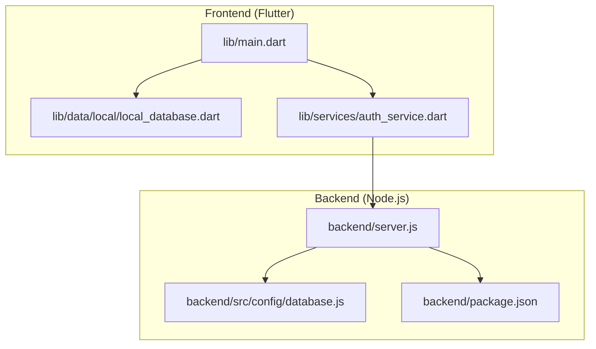
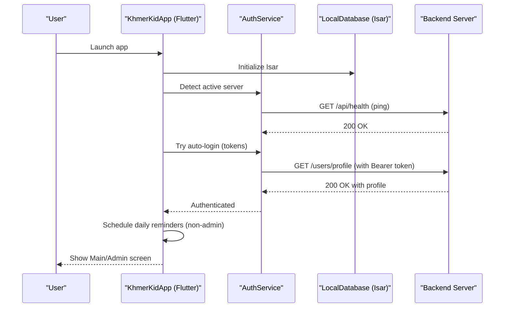
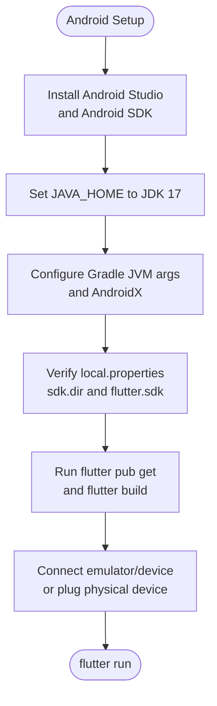
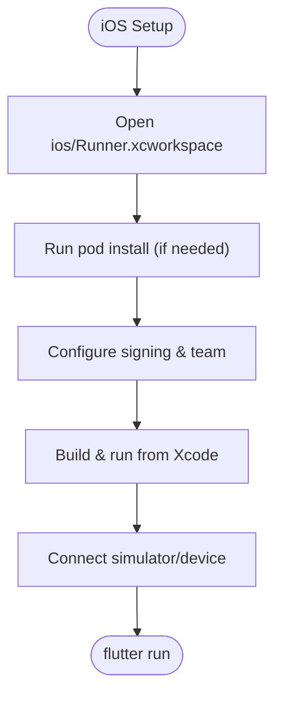
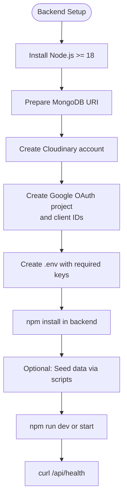
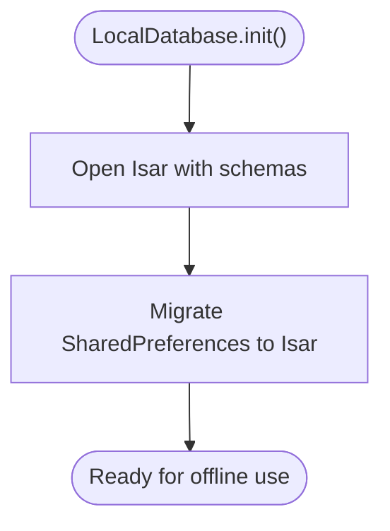
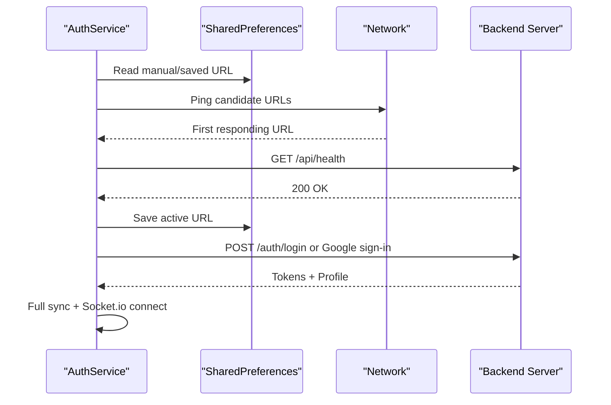
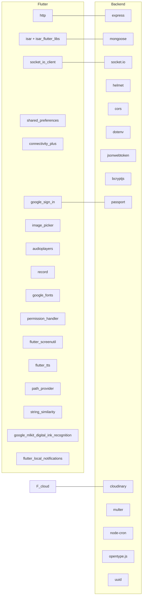

# Getting Started

<cite>
**Referenced Files in This Document**
- [README.md](file://README.md)
- [pubspec.yaml](file://pubspec.yaml)
- [main.dart](file://lib/main.dart)
- [local_database.dart](file://lib/data/local/local_database.dart)
- [auth_service.dart](file://lib/services/auth_service.dart)
- [backend/package.json](file://backend/package.json)
- [backend/src/config/database.js](file://backend/src/config/database.js)
- [backend/server.js](file://backend/server.js)
- [backend/src/docs/SETUP.md](file://backend/src/docs/SETUP.md)
- [android/app/build.gradle.kts](file://android/app/build.gradle.kts)
- [android/gradle.properties](file://android/gradle.properties)
- [android/local.properties](file://android/local.properties)
- [ios/Runner/AppDelegate.swift](file://ios/Runner/AppDelegate.swift)
- [ios/Runner/Info.plist](file://ios/Runner/Info.plist)
</cite>

## Table of Contents
1. [Introduction](#introduction)
2. [Project Structure](#project-structure)
3. [Core Components](#core-components)
4. [Architecture Overview](#architecture-overview)
5. [Detailed Component Analysis](#detailed-component-analysis)
6. [Dependency Analysis](#dependency-analysis)
7. [Performance Considerations](#performance-considerations)
8. [Troubleshooting Guide](#troubleshooting-guide)
9. [Conclusion](#conclusion)
10. [Appendices](#appendices)

## Introduction
This guide helps you set up the KhmerKid educational application locally for development on Android and iOS. It covers prerequisites, environment setup, backend and database configuration, and the end-to-end development workflow from cloning to running the app on simulators or devices. It also includes troubleshooting tips, environment variable configuration, and initial verification steps.

## Project Structure
KhmerKid is a Flutter application with a companion Node.js backend. The frontend (Flutter) integrates with a local database and communicates with the backend via HTTP and WebSocket connections. The backend uses MongoDB for persistence, Socket.io for real-time features, and Cloudinary for media storage.

**Diagram sources**
- [main.dart:1-129](file://lib/main.dart#L1-L129)
- [local_database.dart:1-276](file://lib/data/local/local_database.dart#L1-L276)
- [auth_service.dart:1-910](file://lib/services/auth_service.dart#L1-L910)
- [backend/server.js:1-160](file://backend/server.js#L1-L160)
- [backend/src/config/database.js:1-66](file://backend/src/config/database.js#L1-L66)
- [backend/package.json:1-54](file://backend/package.json#L1-L54)

**Section sources**
- [README.md:1-18](file://README.md#L1-L18)
- [pubspec.yaml:1-115](file://pubspec.yaml#L1-L115)
- [main.dart:1-129](file://lib/main.dart#L1-L129)

## Core Components
- Frontend startup and initialization:
  - Initializes local database, connectivity, language, and notifications in parallel during app boot.
  - Attempts to auto-detect and connect to the backend server, then performs optional daily reminders scheduling.
- Local database:
  - Uses Isar for offline-first caching and migration from legacy SharedPreferences.
- Authentication service:
  - Supports manual server URL configuration, automatic server discovery, and multiple login flows (email/password, Google).
  - Provides health checks and robust fallbacks for offline scenarios.
- Backend server:
  - Express-based API with MongoDB via Mongoose, Socket.io for real-time, Helmet/CORS/Morgan middleware, and rate limiting.
  - Exposes a health endpoint and mounts modular routes.

**Section sources**
- [main.dart:21-77](file://lib/main.dart#L21-L77)
- [local_database.dart:32-61](file://lib/data/local/local_database.dart#L32-L61)
- [auth_service.dart:117-175](file://lib/services/auth_service.dart#L117-L175)
- [backend/server.js:38-139](file://backend/server.js#L38-L139)
- [backend/src/config/database.js:16-40](file://backend/src/config/database.js#L16-L40)

## Architecture Overview
The app follows a hybrid offline-first architecture:
- Local caching with Isar for lessons, progress, achievements, and sync queue.
- Real-time communication via Socket.io for handwriting recognition updates.
- Backend microservice-style routes under /api with JWT-based authentication and Google OAuth support.

**Diagram sources**
- [main.dart:21-77](file://lib/main.dart#L21-L77)
- [auth_service.dart:105-175](file://lib/services/auth_service.dart#L105-L175)
- [backend/server.js:95-106](file://backend/server.js#L95-L106)

## Detailed Component Analysis

### Android Setup
- Prerequisites:
  - Android Studio with Android SDK and platform-tools.
  - JDK 17 configured for Gradle.
- Build configuration:
  - Compile SDK and target SDK are set in the Gradle configuration.
  - Java 17 compatibility and desugaring enabled.
- Local properties:
  - Ensure the Android SDK path and Flutter SDK path are correct in local.properties.
- Permissions:
  - Internet permission is declared for development builds.

**Diagram sources**
- [android/app/build.gradle.kts:8-21](file://android/app/build.gradle.kts#L8-L21)
- [android/gradle.properties:1-3](file://android/gradle.properties#L1-L3)
- [android/local.properties:1-5](file://android/local.properties#L1-L5)

**Section sources**
- [android/app/build.gradle.kts:8-21](file://android/app/build.gradle.kts#L8-L21)
- [android/gradle.properties:1-3](file://android/gradle.properties#L1-L3)
- [android/local.properties:1-5](file://android/local.properties#L1-L5)

### iOS Setup
- Prerequisites:
  - Xcode installed.
  - CocoaPods for dependency management.
- Build configuration:
  - Flutter-generated AppDelegate integrates with the implicit engine and plugin registration.
  - Info.plist defines app metadata, scene configurations, and supported orientations.
- Steps:
  - Open ios/Runner.xcworkspace in Xcode.
  - Ensure signing and team are configured.
  - Run pod install in the ios directory if dependencies change.
  - Build and run from Xcode or via flutter run.

**Diagram sources**
- [ios/Runner/AppDelegate.swift:1-17](file://ios/Runner/AppDelegate.swift#L1-L17)
- [ios/Runner/Info.plist:1-71](file://ios/Runner/Info.plist#L1-L71)

**Section sources**
- [ios/Runner/AppDelegate.swift:1-17](file://ios/Runner/AppDelegate.swift#L1-L17)
- [ios/Runner/Info.plist:1-71](file://ios/Runner/Info.plist#L1-L71)

### Backend and Database Setup
- Prerequisites:
  - Node.js >= 18.0.0 and npm >= 9.0.0.
  - MongoDB instance (Atlas or local Community Server).
  - Cloudinary account for media uploads.
  - Google Cloud project for OAuth client IDs.
- Installation:
  - Install dependencies in the backend directory.
- Environment variables:
  - Copy .env.example to .env and configure server, database, JWT, Google OAuth, and Cloudinary settings.
- Running:
  - Start the server in development mode.
  - Verify the health endpoint responds.

**Diagram sources**
- [backend/src/docs/SETUP.md:7-61](file://backend/src/docs/SETUP.md#L7-L61)
- [backend/package.json:6-13](file://backend/package.json#L6-L13)
- [backend/server.js:126-139](file://backend/server.js#L126-L139)

**Section sources**
- [backend/src/docs/SETUP.md:7-61](file://backend/src/docs/SETUP.md#L7-L61)
- [backend/package.json:6-13](file://backend/package.json#L6-L13)
- [backend/server.js:126-139](file://backend/server.js#L126-L139)
- [backend/src/config/database.js:16-40](file://backend/src/config/database.js#L16-L40)

### Local Database Initialization (Isar)
- Isar is initialized early in app startup and opens multiple schemas for lessons, progress, sync queue, game results, achievements, and user profiles.
- One-time migration from SharedPreferences is performed to populate Isar.

**Diagram sources**
- [local_database.dart:32-61](file://lib/data/local/local_database.dart#L32-L61)

**Section sources**
- [local_database.dart:32-61](file://lib/data/local/local_database.dart#L32-L61)

### Authentication and Server Discovery
- The app attempts to auto-detect the backend server using:
  - Manual server URL stored in preferences.
  - Previously saved server URL.
  - Hardcoded candidate URLs.
  - Background subnet scanning.
- Health checks are performed against /api/health before marking a server as active.
- After successful login, the app triggers a full synchronization and connects to Socket.io for real-time updates.

**Diagram sources**
- [auth_service.dart:117-175](file://lib/services/auth_service.dart#L117-L175)
- [auth_service.dart:360-414](file://lib/services/auth_service.dart#L360-L414)
- [auth_service.dart:416-508](file://lib/services/auth_service.dart#L416-L508)
- [backend/server.js:95-106](file://backend/server.js#L95-L106)

**Section sources**
- [auth_service.dart:117-175](file://lib/services/auth_service.dart#L117-L175)
- [auth_service.dart:240-317](file://lib/services/auth_service.dart#L240-L317)
- [auth_service.dart:360-414](file://lib/services/auth_service.dart#L360-L414)
- [auth_service.dart:416-508](file://lib/services/auth_service.dart#L416-L508)
- [backend/server.js:95-106](file://backend/server.js#L95-L106)

## Dependency Analysis
- Flutter dependencies (selected):
  - http, shared_preferences, isar, socket_io_client, flutter_secure_storage, connectivity_plus, google_sign_in, image_picker, audioplayers, record, google_fonts, permission_handler, flutter_screenutil, flutter_tts, path_provider, string_similarity, google_mlkit_digital_ink_recognition, flutter_local_notifications.
- Backend dependencies (selected):
  - express, mongoose, socket.io, helmet, cors, dotenv, jsonwebtoken, bcryptjs, passport, cloudinary, multer, node-cron, opentype.js, uuid.

**Diagram sources**
- [pubspec.yaml:15-61](file://pubspec.yaml#L15-L61)
- [backend/package.json:24-45](file://backend/package.json#L24-L45)

**Section sources**
- [pubspec.yaml:15-61](file://pubspec.yaml#L15-L61)
- [backend/package.json:24-45](file://backend/package.json#L24-L45)

## Performance Considerations
- Parallel initialization:
  - Local database, connectivity, language, and notification services are initialized concurrently to reduce startup time.
- Retry and timeouts:
  - Backend connection detection uses short timeouts and retries to avoid blocking the UI.
- Local caching:
  - Isar reduces network requests and enables offline-first experiences.
- Image optimization:
  - Cloudinary URL optimization reduces payload sizes for images.

[No sources needed since this section provides general guidance]

## Troubleshooting Guide
- Backend not reachable:
  - Confirm the backend is running and the health endpoint responds.
  - Check CORS settings and CLIENT_URL in environment variables.
- MongoDB connection failures:
  - Verify MONGO_URI and network access.
  - Review connection logs and retry behavior.
- Android build issues:
  - Ensure JDK 17 is configured and Gradle JVM args are set.
  - Confirm sdk.dir and flutter.sdk in local.properties.
- iOS build issues:
  - Open Runner.xcworkspace in Xcode and run pod install if needed.
  - Ensure signing and team are configured.
- Authentication problems:
  - Clear saved server URL and re-run detection.
  - For Google login, verify OAuth client IDs and callback URLs.
- Initial verification:
  - After starting the backend, curl /api/health to confirm it is ready.
  - On the app, open Settings and choose “Connect to server” to select the backend URL.

**Section sources**
- [backend/server.js:62-89](file://backend/server.js#L62-L89)
- [backend/src/config/database.js:16-40](file://backend/src/config/database.js#L16-L40)
- [android/gradle.properties:1-3](file://android/gradle.properties#L1-L3)
- [android/local.properties:1-5](file://android/local.properties#L1-L5)
- [ios/Runner/AppDelegate.swift:1-17](file://ios/Runner/AppDelegate.swift#L1-L17)
- [auth_service.dart:117-175](file://lib/services/auth_service.dart#L117-L175)

## Conclusion
You now have the essentials to set up KhmerKid locally: Flutter prerequisites, Android/iOS toolchains, backend dependencies, and database configuration. Follow the step-by-step workflows to run the app on simulators or devices, and use the troubleshooting section to resolve common issues.

[No sources needed since this section summarizes without analyzing specific files]

## Appendices

### Environment Variable Reference (Backend)
- Required keys:
  - PORT, NODE_ENV, CLIENT_URL
  - MONGO_URI
  - JWT_SECRET, JWT_EXPIRES_IN, JWT_REFRESH_SECRET, JWT_REFRESH_EXPIRES_IN
  - GOOGLE_CLIENT_ID, GOOGLE_CLIENT_SECRET, GOOGLE_CALLBACK_URL
  - CLOUDINARY_CLOUD_NAME, CLOUDINARY_API_KEY, CLOUDINARY_API_SECRET

**Section sources**
- [backend/src/docs/SETUP.md:26-58](file://backend/src/docs/SETUP.md#L26-L58)

### Development Workflow Checklist
- Clone the repository.
- Install Flutter dependencies (pub get).
- Start the backend server (dev or start).
- Verify backend health endpoint.
- Configure Android/iOS toolchains.
- Run the app on a simulator or device.
- In-app, connect to the backend server and log in.

**Section sources**
- [README.md:1-18](file://README.md#L1-L18)
- [backend/package.json:6-13](file://backend/package.json#L6-L13)
- [backend/server.js:126-139](file://backend/server.js#L126-L139)
- [pubspec.yaml:1-115](file://pubspec.yaml#L1-L115)