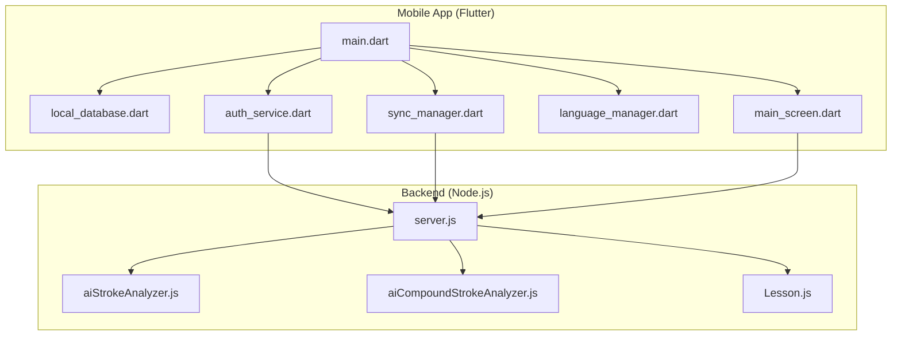
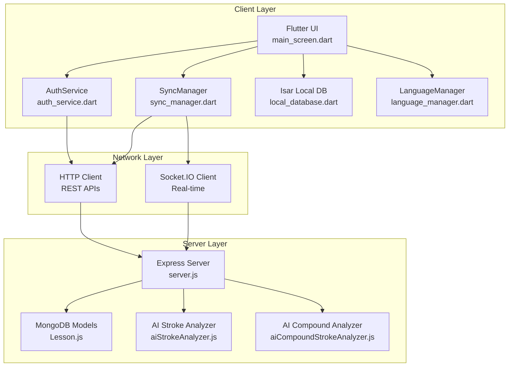
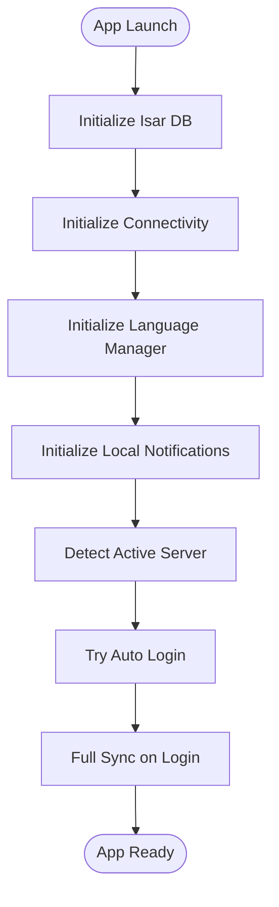
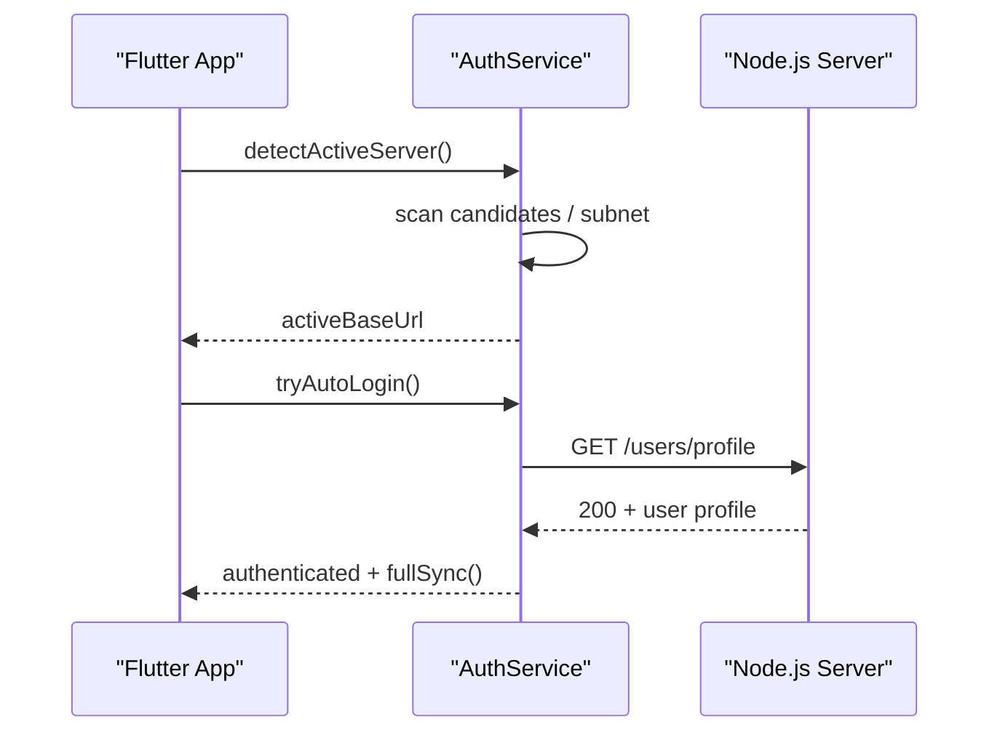
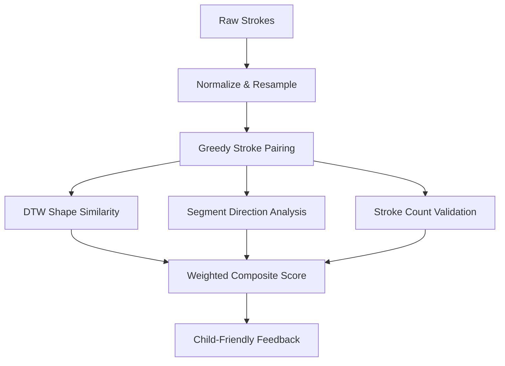
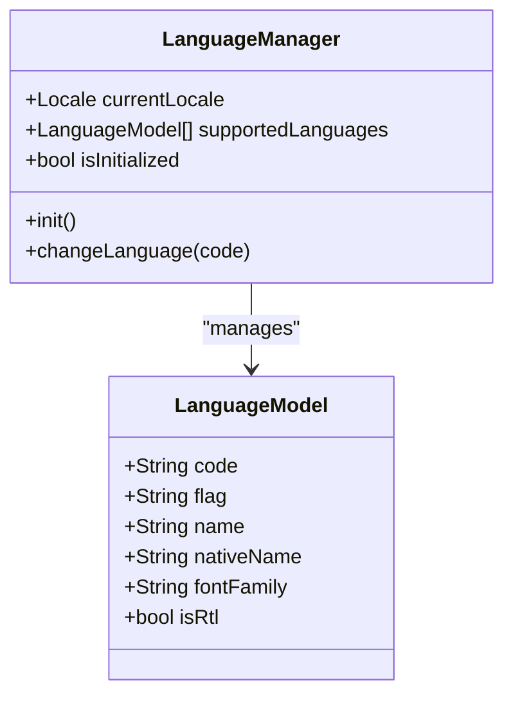
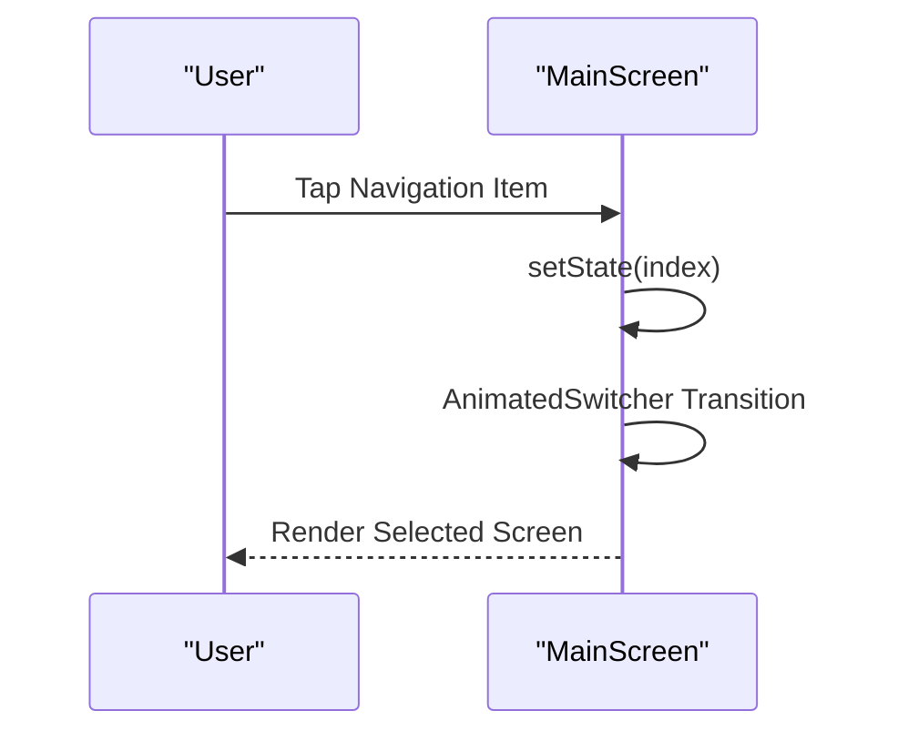
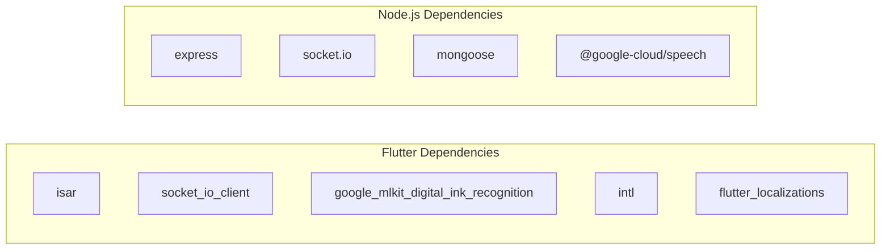

# Project Overview

<cite>
**Referenced Files in This Document**
- [README.md](file://README.md)
- [pubspec.yaml](file://pubspec.yaml)
- [main.dart](file://lib/main.dart)
- [local_database.dart](file://lib/data/local/local_database.dart)
- [sync_manager.dart](file://lib/services/sync_manager.dart)
- [auth_service.dart](file://lib/services/auth_service.dart)
- [language_manager.dart](file://lib/l10n/language_manager.dart)
- [server.js](file://backend/server.js)
- [aiStrokeAnalyzer.js](file://backend/src/services/aiStrokeAnalyzer.js)
- [aiCompoundStrokeAnalyzer.js](file://backend/src/services/aiCompoundStrokeAnalyzer.js)
- [Lesson.js](file://backend/src/models/Lesson.js)
- [en.json](file://assets/translations/en.json)
- [languages.json](file://assets/translations/languages.json)
- [main_screen.dart](file://lib/screens/main_screen.dart)
- [package.json](file://backend/package.json)
</cite>

## Table of Contents
1. [Introduction](#introduction)
2. [Project Structure](#project-structure)
3. [Core Components](#core-components)
4. [Architecture Overview](#architecture-overview)
5. [Detailed Component Analysis](#detailed-component-analysis)
6. [Dependency Analysis](#dependency-analysis)
7. [Performance Considerations](#performance-considerations)
8. [Troubleshooting Guide](#troubleshooting-guide)
9. [Conclusion](#conclusion)

## Introduction
KhmerKid is an educational mobile application designed to teach Khmer language and script to elementary school children through gamified, interactive learning. The project combines a Flutter-powered frontend with a Node.js backend to deliver a hybrid offline-first experience, featuring handwriting recognition, real-time progress tracking, and multi-language support. Its core value proposition lies in making Khmer literacy accessible and engaging for young learners while maintaining robust offline capabilities and adaptive feedback mechanisms.

## Project Structure
The repository follows a clear separation of concerns:
- Frontend (Flutter): Application UI, offline-first data persistence, synchronization, authentication, localization, and UI navigation.
- Backend (Node.js): RESTful API, WebSocket support, MongoDB-backed models, AI-driven handwriting analysis, and media management.

**Diagram sources**
- [main.dart:1-129](file://lib/main.dart#L1-L129)
- [local_database.dart:1-276](file://lib/data/local/local_database.dart#L1-L276)
- [sync_manager.dart:1-246](file://lib/services/sync_manager.dart#L1-L246)
- [auth_service.dart:1-910](file://lib/services/auth_service.dart#L1-L910)
- [language_manager.dart:1-111](file://lib/l10n/language_manager.dart#L1-L111)
- [main_screen.dart:1-142](file://lib/screens/main_screen.dart#L1-L142)
- [server.js:1-160](file://backend/server.js#L1-L160)
- [aiStrokeAnalyzer.js:1-966](file://backend/src/services/aiStrokeAnalyzer.js#L1-L966)
- [aiCompoundStrokeAnalyzer.js:1-695](file://backend/src/services/aiCompoundStrokeAnalyzer.js#L1-L695)
- [Lesson.js:1-155](file://backend/src/models/Lesson.js#L1-L155)

**Section sources**
- [README.md:1-18](file://README.md#L1-L18)
- [pubspec.yaml:1-115](file://pubspec.yaml#L1-L115)
- [package.json:1-54](file://backend/package.json#L1-L54)

## Core Components
- Dual-platform architecture:
  - Flutter frontend with hybrid offline-first design using Isar for local persistence and Socket.IO for real-time updates.
  - Node.js backend with Express, MongoDB, Passport for authentication, and Socket.IO for real-time notifications.
- Educational features:
  - Gamified learning paths, games, library, and achievements.
  - Multi-language support with dynamic language switching and localized assets.
  - Real-time progress tracking and daily reminders.
- Handwriting recognition:
  - Two-tier AI recognition pipeline: on-device ML Kit (Tier 1) and backend geometric analysis (Tier 2) for consonants, vowels, numbers, and compound characters.
- Offline-first design:
  - Isar local database, queued sync engine, and automatic conflict resolution.

**Section sources**
- [pubspec.yaml:39-48](file://pubspec.yaml#L39-L48)
- [pubspec.yaml:46-48](file://pubspec.yaml#L46-L48)
- [main.dart:21-77](file://lib/main.dart#L21-L77)
- [local_database.dart:32-61](file://lib/data/local/local_database.dart#L32-L61)
- [sync_manager.dart:46-74](file://lib/services/sync_manager.dart#L46-L74)
- [auth_service.dart:120-175](file://lib/services/auth_service.dart#L120-L175)
- [language_manager.dart:47-87](file://lib/l10n/language_manager.dart#L47-L87)
- [server.js:38-139](file://backend/server.js#L38-L139)

## Architecture Overview
The system integrates offline-first client-side logic with a responsive backend that supports real-time communication and intelligent handwriting analysis.

**Diagram sources**
- [main_screen.dart:14-88](file://lib/screens/main_screen.dart#L14-L88)
- [auth_service.dart:15-508](file://lib/services/auth_service.dart#L15-L508)
- [sync_manager.dart:21-236](file://lib/services/sync_manager.dart#L21-L236)
- [local_database.dart:10-61](file://lib/data/local/local_database.dart#L10-L61)
- [language_manager.dart:10-111](file://lib/l10n/language_manager.dart#L10-L111)
- [server.js:15-139](file://backend/server.js#L15-L139)
- [Lesson.js:13-155](file://backend/src/models/Lesson.js#L13-L155)
- [aiStrokeAnalyzer.js:1-966](file://backend/src/services/aiStrokeAnalyzer.js#L1-L966)
- [aiCompoundStrokeAnalyzer.js:1-695](file://backend/src/services/aiCompoundStrokeAnalyzer.js#L1-L695)

## Detailed Component Analysis

### Hybrid Offline-First Architecture
- Local persistence: Isar schema includes caches for lessons, user progress, game results, and achievements.
- Sync engine: Queues actions (complete lesson, unlock lesson, sync progress) and retries with exponential backoff.
- Conflict resolution: Take-max strategy merges local and server data upon reconciliation.

**Diagram sources**
- [main.dart:21-77](file://lib/main.dart#L21-L77)
- [local_database.dart:32-61](file://lib/data/local/local_database.dart#L32-L61)
- [sync_manager.dart:46-74](file://lib/services/sync_manager.dart#L46-L74)
- [auth_service.dart:240-317](file://lib/services/auth_service.dart#L240-L317)

**Section sources**
- [local_database.dart:10-61](file://lib/data/local/local_database.dart#L10-L61)
- [sync_manager.dart:21-236](file://lib/services/sync_manager.dart#L21-L236)

### Authentication and Server Discovery
- Automatic server discovery across candidate IPs, with manual override and saved URL fallback.
- Supports email/password and Google OAuth flows with refresh token handling and offline-capable profile caching.

**Diagram sources**
- [auth_service.dart:120-175](file://lib/services/auth_service.dart#L120-L175)
- [auth_service.dart:240-317](file://lib/services/auth_service.dart#L240-L317)
- [server.js:95-121](file://backend/server.js#L95-L121)

**Section sources**
- [auth_service.dart:120-317](file://lib/services/auth_service.dart#L120-L317)
- [server.js:95-121](file://backend/server.js#L95-L121)

### Two-Tier Handwriting Recognition System
- Tier 1 (on-device): ML Kit Digital Ink Recognition for initial character classification.
- Tier 2 (backend): Geometric analysis engines:
  - aiStrokeAnalyzer.js: Per-stroke DTW shape matching, directional cosine similarity, and stroke count scoring.
  - aiCompoundStrokeAnalyzer.js: Heuristic-based analysis for compound characters, loops, scribbles, aspect ratios, and centroid distribution.

**Diagram sources**
- [aiStrokeAnalyzer.js:593-752](file://backend/src/services/aiStrokeAnalyzer.js#L593-L752)
- [aiCompoundStrokeAnalyzer.js:375-690](file://backend/src/services/aiCompoundStrokeAnalyzer.js#L375-L690)

**Section sources**
- [aiStrokeAnalyzer.js:1-966](file://backend/src/services/aiStrokeAnalyzer.js#L1-L966)
- [aiCompoundStrokeAnalyzer.js:1-695](file://backend/src/services/aiCompoundStrokeAnalyzer.js#L1-L695)

### Multi-Language Support
- Dynamic language loading from assets/translations/languages.json.
- Runtime language switching with preserved locale and font family selection.
- Localization keys and translated strings stored in JSON files.

**Diagram sources**
- [language_manager.dart:10-111](file://lib/l10n/language_manager.dart#L10-L111)

**Section sources**
- [language_manager.dart:47-111](file://lib/l10n/language_manager.dart#L47-L111)
- [languages.json:1-67](file://assets/translations/languages.json#L1-L67)
- [en.json:1-704](file://assets/translations/en.json#L1-L704)

### UI Navigation and Learning Flow
- Bottom navigation bar with animated transitions and haptic feedback.
- Tab-based navigation among Home, Learn, Games, and Profile screens.

**Diagram sources**
- [main_screen.dart:21-142](file://lib/screens/main_screen.dart#L21-L142)

**Section sources**
- [main_screen.dart:21-142](file://lib/screens/main_screen.dart#L21-L142)

## Dependency Analysis
- Flutter dependencies emphasize offline-first capabilities, real-time communication, and localization:
  - isar, isar_flutter_libs for local database.
  - socket_io_client for real-time updates.
  - google_mlkit_digital_ink_recognition for on-device handwriting recognition.
  - flutter_localizations, google_fonts, intl for internationalization.
- Backend dependencies include Express, Socket.IO, Mongoose, and AI/ML libraries for speech and image processing.

**Diagram sources**
- [pubspec.yaml:15-48](file://pubspec.yaml#L15-L48)
- [package.json:24-46](file://backend/package.json#L24-L46)

**Section sources**
- [pubspec.yaml:15-48](file://pubspec.yaml#L15-L48)
- [package.json:24-46](file://backend/package.json#L24-L46)

## Performance Considerations
- Offline-first design minimizes network dependency and improves responsiveness.
- Isar’s efficient schema and migrations reduce startup overhead.
- Exponential backoff and take-max merge strategy prevent conflicts and reduce re-sync churn.
- Real-time analytics events are treated as best-effort to avoid blocking critical flows.

## Troubleshooting Guide
- Server discovery timeouts: Verify network connectivity and manually set server URL in settings.
- Sync failures: Check connectivity, retry later, or trigger manual sync; monitor pending queue count.
- Authentication errors: Confirm token validity and refresh flow; ensure backend health endpoint responds.
- Language switching issues: Ensure language code exists in supported list and restart UI to rebuild with new locale.

**Section sources**
- [auth_service.dart:120-175](file://lib/services/auth_service.dart#L120-L175)
- [sync_manager.dart:157-236](file://lib/services/sync_manager.dart#L157-L236)
- [server.js:95-121](file://backend/server.js#L95-L121)
- [language_manager.dart:89-111](file://lib/l10n/language_manager.dart#L89-L111)

## Conclusion
KhmerKid delivers a comprehensive, offline-first educational platform that blends gamification with precise handwriting feedback. Its dual-tier AI recognition system, robust synchronization, and multilingual support position it as a scalable solution for Khmer literacy education. The architecture balances simplicity for beginners and extensibility for experienced developers, enabling rapid iteration and deployment across diverse environments.