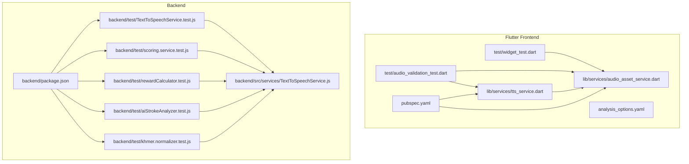
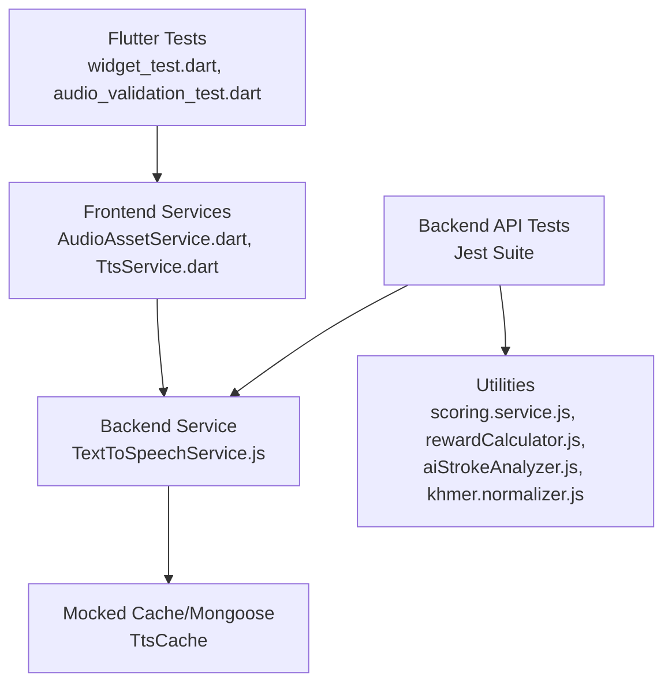
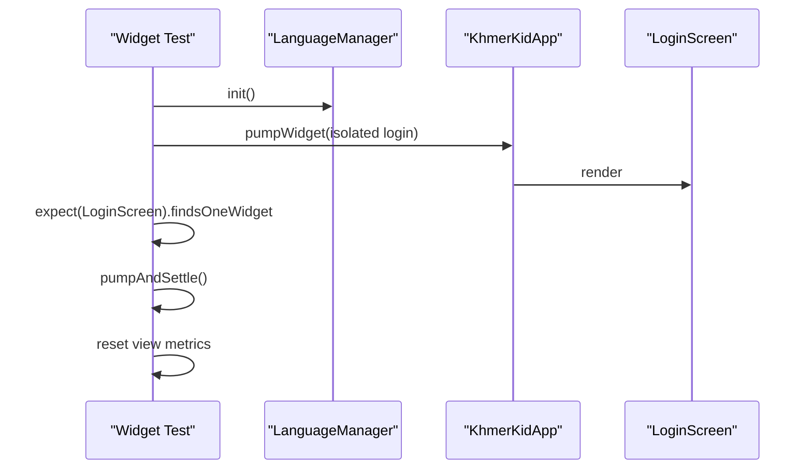
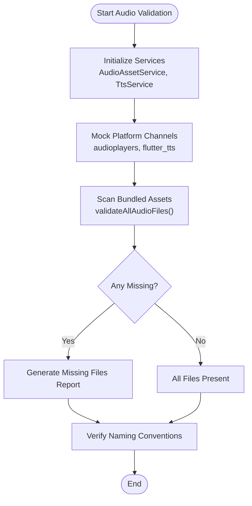
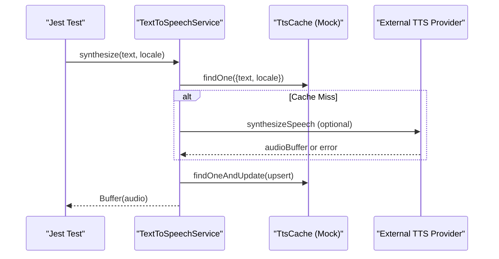
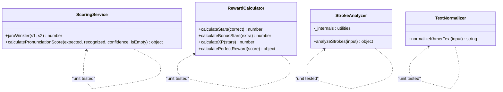
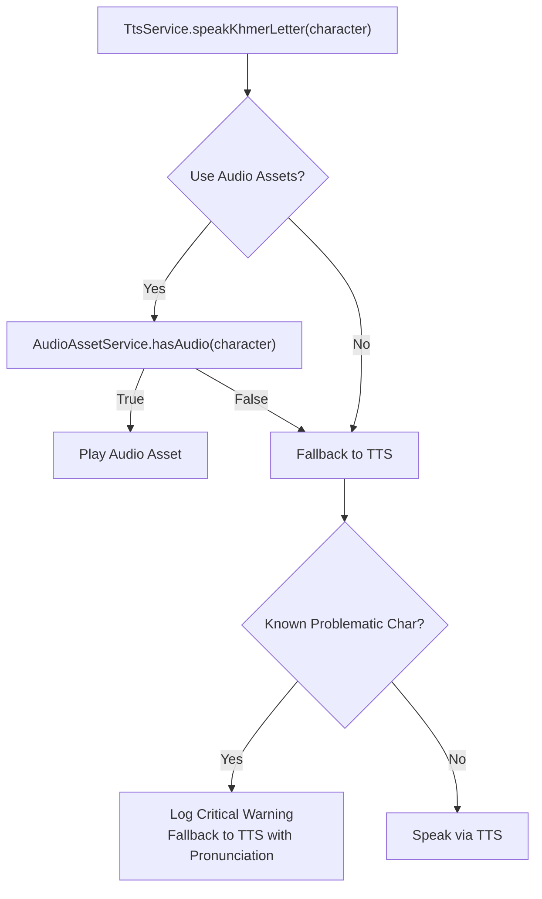
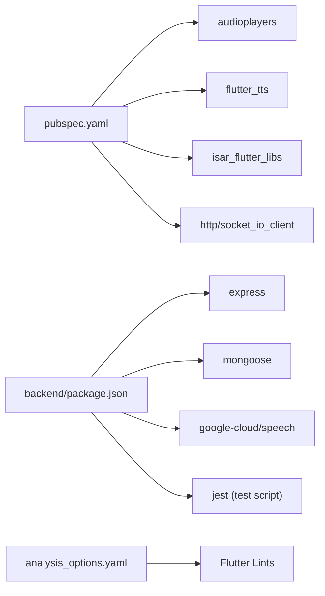

# Testing and Quality Assurance

<cite>
**Referenced Files in This Document**
- [widget_test.dart](file://test/widget_test.dart)
- [audio_validation_test.dart](file://test/audio_validation_test.dart)
- [pubspec.yaml](file://pubspec.yaml)
- [analysis_options.yaml](file://analysis_options.yaml)
- [package.json](file://backend/package.json)
- [TextToSpeechService.test.js](file://backend/test/TextToSpeechService.test.js)
- [TextToSpeechService.js](file://backend/src/services/TextToSpeechService.js)
- [scoring.service.test.js](file://backend/test/scoring.service.test.js)
- [rewardCalculator.test.js](file://backend/test/rewardCalculator.test.js)
- [aiStrokeAnalyzer.test.js](file://backend/test/aiStrokeAnalyzer.test.js)
- [khmer.normalizer.test.js](file://backend/test/khmer.normalizer.test.js)
- [AudioAssetService.dart](file://lib/services/audio_asset_service.dart)
- [TtsService.dart](file://lib/services/tts_service.dart)
- [AUDIO_FIX_GUIDE.md](file://docs/AUDIO_FIX_GUIDE.md)
</cite>

## Table of Contents
1. [Introduction](#introduction)
2. [Project Structure](#project-structure)
3. [Core Components](#core-components)
4. [Architecture Overview](#architecture-overview)
5. [Detailed Component Analysis](#detailed-component-analysis)
6. [Dependency Analysis](#dependency-analysis)
7. [Performance Considerations](#performance-considerations)
8. [Troubleshooting Guide](#troubleshooting-guide)
9. [Conclusion](#conclusion)
10. [Appendices](#appendices)

## Introduction
This document provides comprehensive testing and quality assurance guidance for the project, covering:
- Flutter widget and audio validation testing
- Backend API/service testing with Jest
- Test data management and mock strategies
- Continuous integration and code quality standards
- Best practices, coverage expectations, and debugging techniques for both frontend and backend

## Project Structure
The repository includes dedicated test suites for Flutter and Node.js, along with configuration files for code quality and asset management:
- Flutter tests: widget and audio validation
- Backend tests: unit tests for services and utilities
- Configuration: Flutter analysis options and package scripts

**Diagram sources**
- [widget_test.dart:1-28](file://test/widget_test.dart#L1-L28)
- [audio_validation_test.dart:1-221](file://test/audio_validation_test.dart#L1-L221)
- [AudioAssetService.dart:1-368](file://lib/services/audio_asset_service.dart#L1-L368)
- [TtsService.dart:1-389](file://lib/services/tts_service.dart#L1-L389)
- [pubspec.yaml:1-115](file://pubspec.yaml#L1-L115)
- [analysis_options.yaml:1-29](file://analysis_options.yaml#L1-L29)
- [package.json:1-54](file://backend/package.json#L1-L54)
- [TextToSpeechService.test.js:1-53](file://backend/test/TextToSpeechService.test.js#L1-L53)
- [TextToSpeechService.js:1-111](file://backend/src/services/TextToSpeechService.js#L1-L111)
- [scoring.service.test.js:1-117](file://backend/test/scoring.service.test.js#L1-L117)
- [rewardCalculator.test.js:1-156](file://backend/test/rewardCalculator.test.js#L1-L156)
- [aiStrokeAnalyzer.test.js:1-363](file://backend/test/aiStrokeAnalyzer.test.js#L1-L363)
- [khmer.normalizer.test.js:1-59](file://backend/test/khmer.normalizer.test.js#L1-L59)

**Section sources**
- [widget_test.dart:1-28](file://test/widget_test.dart#L1-L28)
- [audio_validation_test.dart:1-221](file://test/audio_validation_test.dart#L1-L221)
- [pubspec.yaml:1-115](file://pubspec.yaml#L1-L115)
- [analysis_options.yaml:1-29](file://analysis_options.yaml#L1-L29)
- [package.json:1-54](file://backend/package.json#L1-L54)

## Core Components
- Flutter widget testing validates initial app rendering and language initialization.
- Audio validation tests ensure all expected audio assets exist and follow naming conventions, with robust mocking for platform channels.
- Backend Jest tests cover Text-to-Speech synthesis, scoring utilities, reward calculation, handwriting stroke analysis, and text normalization.
- Services integrate audio asset availability and TTS fallback logic for accurate Khmer pronunciation.

Key responsibilities:
- Widget tests: render login screen under emulated device conditions and verify initial state.
- Audio validation tests: scan bundled assets, detect missing files, enforce naming conventions, and initialize platform channels via mocks.
- Backend unit tests: isolate service logic with mocked models and external APIs, assert deterministic outcomes.

**Section sources**
- [widget_test.dart:7-26](file://test/widget_test.dart#L7-L26)
- [audio_validation_test.dart:12-33](file://test/audio_validation_test.dart#L12-L33)
- [audio_validation_test.dart:35-101](file://test/audio_validation_test.dart#L35-L101)
- [audio_validation_test.dart:198-220](file://test/audio_validation_test.dart#L198-L220)
- [TextToSpeechService.test.js:13-52](file://backend/test/TextToSpeechService.test.js#L13-L52)
- [scoring.service.test.js:13-116](file://backend/test/scoring.service.test.js#L13-L116)
- [rewardCalculator.test.js:14-155](file://backend/test/rewardCalculator.test.js#L14-L155)
- [aiStrokeAnalyzer.test.js:31-362](file://backend/test/aiStrokeAnalyzer.test.js#L31-L362)
- [khmer.normalizer.test.js:9-58](file://backend/test/khmer.normalizer.test.js#L9-L58)

## Architecture Overview
The testing architecture separates concerns across platforms and layers:
- Flutter front-end tests depend on services that coordinate audio assets and TTS providers.
- Backend tests target pure functions and service classes, with minimal external dependencies via mocking.
- Shared quality gates include code analysis rules and package scripts for development and testing.

**Diagram sources**
- [widget_test.dart:1-28](file://test/widget_test.dart#L1-L28)
- [audio_validation_test.dart:1-221](file://test/audio_validation_test.dart#L1-L221)
- [AudioAssetService.dart:15-368](file://lib/services/audio_asset_service.dart#L15-L368)
- [TtsService.dart:19-389](file://lib/services/tts_service.dart#L19-L389)
- [TextToSpeechService.test.js:7-52](file://backend/test/TextToSpeechService.test.js#L7-L52)
- [TextToSpeechService.js:9-111](file://backend/src/services/TextToSpeechService.js#L9-L111)
- [scoring.service.test.js:7-116](file://backend/test/scoring.service.test.js#L7-L116)
- [rewardCalculator.test.js:7-155](file://backend/test/rewardCalculator.test.js#L7-L155)
- [aiStrokeAnalyzer.test.js:11-362](file://backend/test/aiStrokeAnalyzer.test.js#L11-L362)
- [khmer.normalizer.test.js:7-58](file://backend/test/khmer.normalizer.test.js#L7-L58)

## Detailed Component Analysis

### Flutter Widget Testing
Strategy:
- Initialize language manager before rendering the app.
- Emulate a wide viewport to avoid layout issues during tests.
- Assert that the login screen is the initial UI.

**Diagram sources**
- [widget_test.dart:7-26](file://test/widget_test.dart#L7-L26)

**Section sources**
- [widget_test.dart:7-26](file://test/widget_test.dart#L7-L26)

### Audio Validation Testing
Strategy:
- Mock platform channels for audio playback and TTS capabilities.
- Scan bundled assets to detect missing files per category.
- Enforce naming conventions and categorization.
- Provide actionable reports and warnings for missing critical assets.

**Diagram sources**
- [audio_validation_test.dart:12-33](file://test/audio_validation_test.dart#L12-L33)
- [audio_validation_test.dart:35-101](file://test/audio_validation_test.dart#L35-L101)
- [audio_validation_test.dart:198-220](file://test/audio_validation_test.dart#L198-L220)

**Section sources**
- [audio_validation_test.dart:12-33](file://test/audio_validation_test.dart#L12-L33)
- [audio_validation_test.dart:35-101](file://test/audio_validation_test.dart#L35-L101)
- [audio_validation_test.dart:198-220](file://test/audio_validation_test.dart#L198-L220)
- [AudioAssetService.dart:149-212](file://lib/services/audio_asset_service.dart#L149-L212)
- [TtsService.dart:67-168](file://lib/services/tts_service.dart#L67-L168)

### Backend API Testing with Jest
Strategy:
- Isolate service logic by mocking external dependencies (e.g., database models).
- Validate deterministic behavior for synthesis, caching, and fallback mechanisms.
- Cover edge cases such as unsupported locales and empty inputs.

**Diagram sources**
- [TextToSpeechService.test.js:13-52](file://backend/test/TextToSpeechService.test.js#L13-L52)
- [TextToSpeechService.js:23-107](file://backend/src/services/TextToSpeechService.js#L23-L107)

**Section sources**
- [TextToSpeechService.test.js:13-52](file://backend/test/TextToSpeechService.test.js#L13-L52)
- [TextToSpeechService.js:9-111](file://backend/src/services/TextToSpeechService.js#L9-L111)

### Service Layer Testing
Coverage areas:
- Scoring service: Jaro-Winkler similarity and final score computation under various scenarios.
- Reward calculator: Stars, XP, and perfect badge logic with boundary checks.
- AI stroke analyzer: Geometry utilities, preprocessing, DTW, direction analysis, and integrated feedback.
- Text normalization: ZWJ/ZWNJ/ZWSP removal, whitespace normalization, dotted circle placeholder conversion, and prefix stripping.

**Diagram sources**
- [scoring.service.test.js:7-116](file://backend/test/scoring.service.test.js#L7-L116)
- [rewardCalculator.test.js:7-155](file://backend/test/rewardCalculator.test.js#L7-L155)
- [aiStrokeAnalyzer.test.js:11-362](file://backend/test/aiStrokeAnalyzer.test.js#L11-L362)
- [khmer.normalizer.test.js:7-58](file://backend/test/khmer.normalizer.test.js#L7-L58)

**Section sources**
- [scoring.service.test.js:13-116](file://backend/test/scoring.service.test.js#L13-L116)
- [rewardCalculator.test.js:14-155](file://backend/test/rewardCalculator.test.js#L14-L155)
- [aiStrokeAnalyzer.test.js:31-362](file://backend/test/aiStrokeAnalyzer.test.js#L31-L362)
- [khmer.normalizer.test.js:9-58](file://backend/test/khmer.normalizer.test.js#L9-L58)

### Audio Asset Service and TTS Service Integration
Behavior highlights:
- AudioAssetService scans the asset manifest to determine available files and exposes validation utilities.
- TtsService prioritizes audio assets when available, otherwise falls back to device TTS or transliteration.
- Critical consonants known to be mispronounced by TTS trigger warnings and fallback strategies.

**Diagram sources**
- [TtsService.dart:250-313](file://lib/services/tts_service.dart#L250-L313)
- [AudioAssetService.dart:294-302](file://lib/services/audio_asset_service.dart#L294-L302)

**Section sources**
- [TtsService.dart:67-168](file://lib/services/tts_service.dart#L67-L168)
- [TtsService.dart:250-313](file://lib/services/tts_service.dart#L250-L313)
- [AudioAssetService.dart:149-212](file://lib/services/audio_asset_service.dart#L149-L212)

## Dependency Analysis
- Flutter dependencies for audio and TTS are declared in pubspec.yaml, including audioplayers and flutter_tts.
- Backend dependencies include Express, Mongoose, and Google Cloud Speech; tests rely on Jest and mocked models.
- Code quality is governed by Flutter lints configured in analysis_options.yaml.

**Diagram sources**
- [pubspec.yaml:15-44](file://pubspec.yaml#L15-L44)
- [package.json:24-46](file://backend/package.json#L24-L46)
- [analysis_options.yaml:8-29](file://analysis_options.yaml#L8-L29)

**Section sources**
- [pubspec.yaml:15-44](file://pubspec.yaml#L15-L44)
- [package.json:24-46](file://backend/package.json#L24-L46)
- [analysis_options.yaml:8-29](file://analysis_options.yaml#L8-L29)

## Performance Considerations
- Prefer asset-backed audio for critical characters to avoid network latency and reduce TTS failures.
- Use caching in backend TTS services to minimize repeated synthesis and external API calls.
- Keep test suites focused and isolated to maintain fast feedback loops; leverage mocking for I/O-bound operations.
- Validate asset presence early in app lifecycle to prevent runtime fallbacks and improve perceived performance.

## Troubleshooting Guide
Common issues and resolutions:
- Missing audio assets:
  - Run the audio validation test to generate a report of missing files.
  - Follow the audio fix guide to record and add missing assets with correct naming and structure.
- TTS provider limitations:
  - Known problematic characters should never rely solely on TTS; ensure audio assets are available.
  - Use TTS fallback with pronunciation hints only when audio assets are unavailable.
- Backend test failures:
  - Ensure mocks are properly configured for database models and external services.
  - Validate environment variables for external providers when synthesizing audio.
- Flutter widget test viewport anomalies:
  - Apply the same viewport emulation pattern used in existing tests to prevent layout overflows.

**Section sources**
- [audio_validation_test.dart:162-183](file://test/audio_validation_test.dart#L162-L183)
- [AUDIO_FIX_GUIDE.md:1-316](file://docs/AUDIO_FIX_GUIDE.md#L1-L316)
- [TtsService.dart:290-313](file://lib/services/tts_service.dart#L290-L313)
- [TextToSpeechService.test.js:10-16](file://backend/test/TextToSpeechService.test.js#L10-L16)
- [widget_test.dart:12-14](file://test/widget_test.dart#L12-L14)

## Conclusion
The project employs a layered testing strategy:
- Flutter tests validate UI and audio asset readiness with robust mocking.
- Backend Jest tests ensure correctness of scoring, rewards, handwriting analysis, and normalization logic.
- Quality standards are enforced via code analysis and explicit test scripts.
Adhering to the outlined best practices and using the provided debugging techniques will help maintain reliability and accuracy across both frontend and backend components.

## Appendices
- Test data management:
  - Flutter: rely on asset scanning and validation utilities to manage audio resources.
  - Backend: use seeded data and mocked models to isolate unit tests.
- Continuous integration:
  - Use the test script defined in backend package.json to run Jest tests in CI environments.
- Coverage requirements:
  - Aim for high coverage in service logic and critical algorithms; ensure audio validation tests cover all categories and naming conventions.

**Section sources**
- [package.json:6-13](file://backend/package.json#L6-L13)
- [pubspec.yaml:78-88](file://pubspec.yaml#L78-L88)