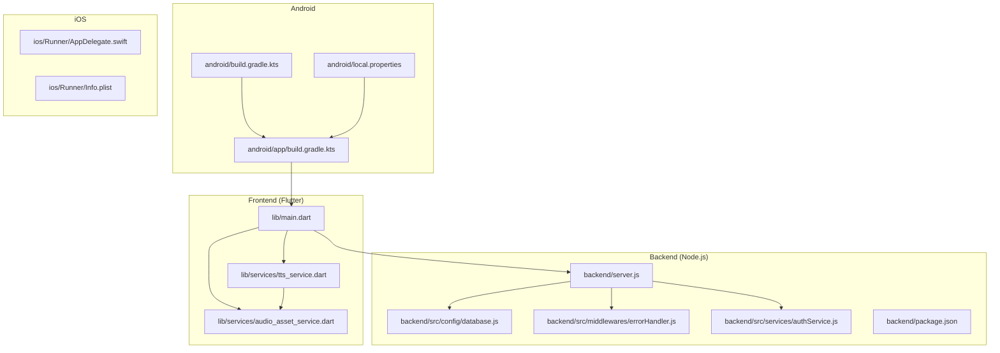
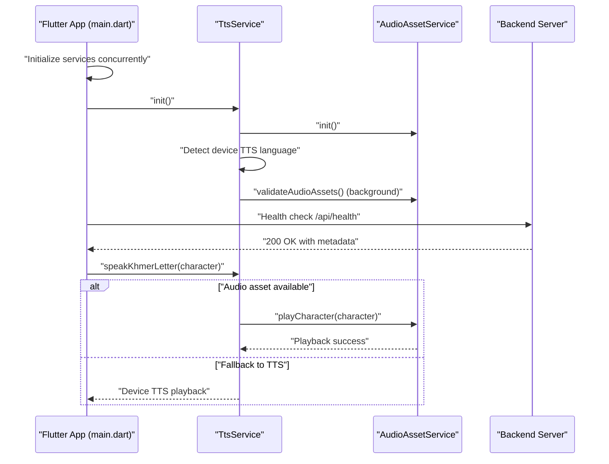
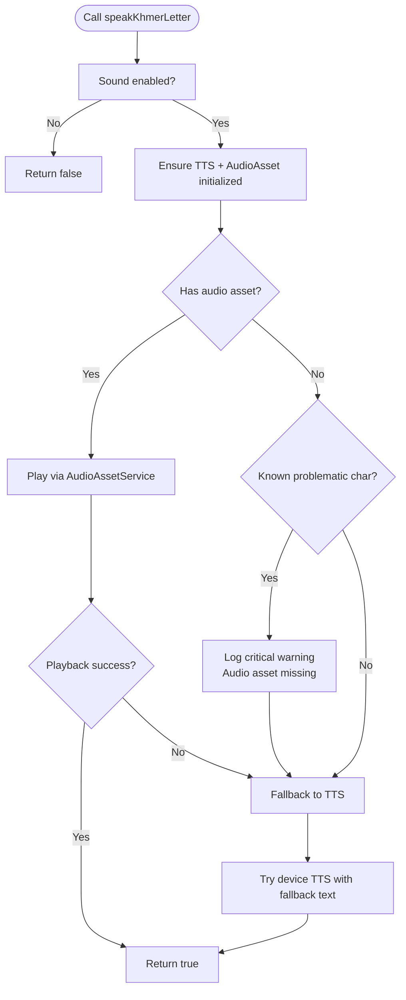
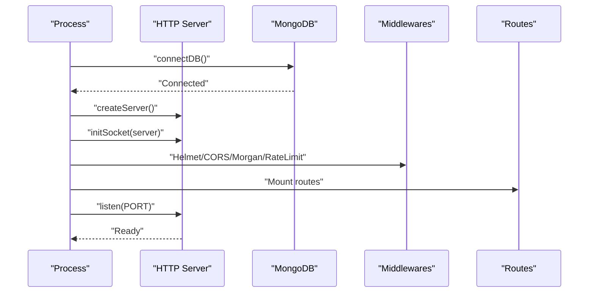
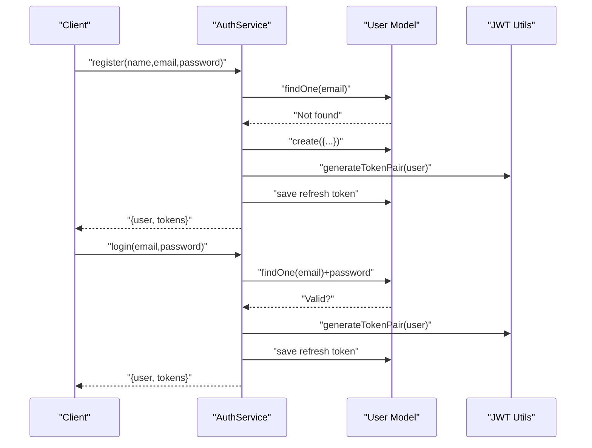
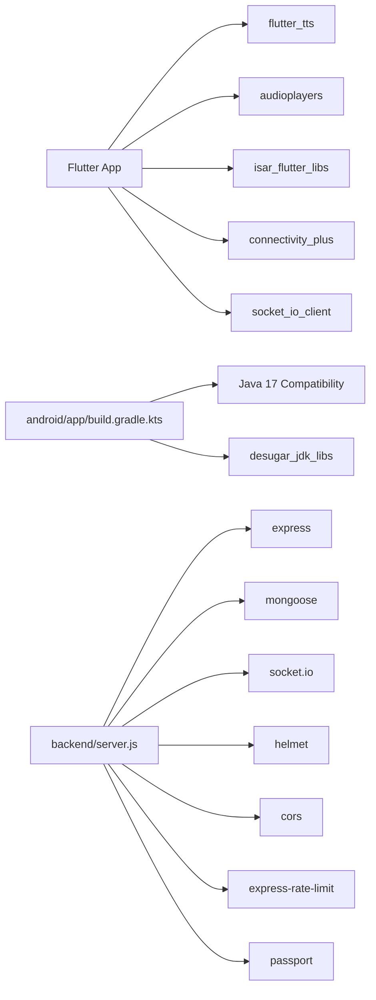

# Troubleshooting and FAQ

<cite>
**Referenced Files in This Document**
- [README.md](file://README.md)
- [pubspec.yaml](file://pubspec.yaml)
- [main.dart](file://lib/main.dart)
- [tts_service.dart](file://lib/services/tts_service.dart)
- [audio_asset_service.dart](file://lib/services/audio_asset_service.dart)
- [AUDIO_FIX_GUIDE.md](file://docs/AUDIO_FIX_GUIDE.md)
- [QUICK_REFERENCE.md](file://docs/QUICK_REFERENCE.md)
- [android/build.gradle.kts](file://android/build.gradle.kts)
- [android/app/build.gradle.kts](file://android/app/build.gradle.kts)
- [android/local.properties](file://android/local.properties)
- [backend/package.json](file://backend/package.json)
- [backend/server.js](file://backend/server.js)
- [backend/src/config/database.js](file://backend/src/config/database.js)
- [backend/src/middlewares/errorHandler.js](file://backend/src/middlewares/errorHandler.js)
- [backend/src/services/authService.js](file://backend/src/services/authService.js)
</cite>

## Table of Contents
1. [Introduction](#introduction)
2. [Project Structure](#project-structure)
3. [Core Components](#core-components)
4. [Architecture Overview](#architecture-overview)
5. [Detailed Component Analysis](#detailed-component-analysis)
6. [Dependency Analysis](#dependency-analysis)
7. [Performance Considerations](#performance-considerations)
8. [Troubleshooting Guide](#troubleshooting-guide)
9. [Conclusion](#conclusion)
10. [Appendices](#appendices)

## Introduction
This document provides a comprehensive troubleshooting guide and FAQ for the KhmerKid project covering development, testing, and production deployment. It focuses on resolving build errors, runtime issues, performance problems, and integration challenges across Flutter frontend, Android, iOS, and Node.js backend. It also includes debugging techniques, diagnostic tools, platform-specific fixes, and community-contributed solutions.

## Project Structure
The project follows a hybrid Flutter application architecture with:
- Flutter frontend under lib/
- Android module under android/
- iOS module under ios/
- Node.js backend under backend/

**Diagram sources**
- [main.dart:1-129](file://lib/main.dart#L1-L129)
- [tts_service.dart:1-389](file://lib/services/tts_service.dart#L1-L389)
- [audio_asset_service.dart:1-368](file://lib/services/audio_asset_service.dart#L1-L368)
- [android/app/build.gradle.kts:1-56](file://android/app/build.gradle.kts#L1-L56)
- [android/build.gradle.kts:1-56](file://android/build.gradle.kts#L1-L56)
- [android/local.properties:1-5](file://android/local.properties#L1-L5)
- [backend/server.js:1-160](file://backend/server.js#L1-L160)
- [backend/src/config/database.js:1-66](file://backend/src/config/database.js#L1-L66)
- [backend/src/middlewares/errorHandler.js:1-98](file://backend/src/middlewares/errorHandler.js#L1-L98)
- [backend/src/services/authService.js:1-250](file://backend/src/services/authService.js#L1-L250)
- [backend/package.json:1-54](file://backend/package.json#L1-L54)

**Section sources**
- [README.md:1-18](file://README.md#L1-L18)
- [pubspec.yaml:1-115](file://pubspec.yaml#L1-L115)

## Core Components
- Frontend initialization and startup orchestration
- Text-to-Speech (TTS) and audio asset playback pipeline
- Backend server bootstrapping, middleware, and error handling
- Database connection with retry and graceful shutdown
- Authentication service with local and Google OAuth flows

Key areas for troubleshooting:
- Startup initialization ordering and timeouts
- Audio asset availability and fallback logic
- Backend health checks, CORS, and rate limiting
- Database connection stability and retry behavior
- Authentication token handling and provider mismatches

**Section sources**
- [main.dart:21-77](file://lib/main.dart#L21-L77)
- [tts_service.dart:68-168](file://lib/services/tts_service.dart#L68-L168)
- [audio_asset_service.dart:150-212](file://lib/services/audio_asset_service.dart#L150-L212)
- [backend/server.js:38-139](file://backend/server.js#L38-L139)
- [backend/src/config/database.js:16-40](file://backend/src/config/database.js#L16-L40)
- [backend/src/services/authService.js:20-95](file://backend/src/services/authService.js#L20-L95)

## Architecture Overview
High-level runtime flow from app launch to backend API calls and audio playback.

**Diagram sources**
- [main.dart:24-30](file://lib/main.dart#L24-L30)
- [tts_service.dart:68-168](file://lib/services/tts_service.dart#L68-L168)
- [audio_asset_service.dart:150-212](file://lib/services/audio_asset_service.dart#L150-L212)
- [backend/server.js:95-106](file://backend/server.js#L95-L106)

## Detailed Component Analysis

### Audio Playback Pipeline (TTS + Audio Assets)
The audio pipeline prioritizes native audio assets over TTS, with strict fallback rules for problematic Khmer characters.

**Diagram sources**
- [tts_service.dart:250-313](file://lib/services/tts_service.dart#L250-L313)
- [audio_asset_service.dart:274-292](file://lib/services/audio_asset_service.dart#L274-L292)

**Section sources**
- [tts_service.dart:250-313](file://lib/services/tts_service.dart#L250-L313)
- [audio_asset_service.dart:274-292](file://lib/services/audio_asset_service.dart#L274-L292)
- [AUDIO_FIX_GUIDE.md:271-285](file://docs/AUDIO_FIX_GUIDE.md#L271-L285)

### Backend Boot and Error Handling
The backend initializes database, Socket.IO, and middleware, then exposes a health endpoint and global error handling.

**Diagram sources**
- [backend/server.js:38-139](file://backend/server.js#L38-L139)
- [backend/src/config/database.js:16-40](file://backend/src/config/database.js#L16-L40)

**Section sources**
- [backend/server.js:38-139](file://backend/server.js#L38-L139)
- [backend/src/middlewares/errorHandler.js:61-92](file://backend/src/middlewares/errorHandler.js#L61-L92)

### Authentication Flow (Local and Google)
Authentication supports local registration/login and Google OAuth with refresh token handling.

**Diagram sources**
- [backend/src/services/authService.js:20-95](file://backend/src/services/authService.js#L20-L95)

**Section sources**
- [backend/src/services/authService.js:20-95](file://backend/src/services/authService.js#L20-L95)

## Dependency Analysis
- Flutter dependencies include localization, TTS, audio playback, offline-first storage, connectivity, and socket communication.
- Android Gradle config centralizes build directories and sets Java compatibility and desugaring.
- Backend depends on Express, Mongoose, Socket.IO, Helmet, CORS, rate limiting, and Passport.

**Diagram sources**
- [pubspec.yaml:15-44](file://pubspec.yaml#L15-L44)
- [android/app/build.gradle.kts:13-21](file://android/app/build.gradle.kts#L13-L21)
- [backend/server.js:15-26](file://backend/server.js#L15-L26)

**Section sources**
- [pubspec.yaml:15-44](file://pubspec.yaml#L15-L44)
- [android/app/build.gradle.kts:13-21](file://android/app/build.gradle.kts#L13-L21)
- [backend/server.js:15-26](file://backend/server.js#L15-L26)

## Performance Considerations
- Audio asset validation runs asynchronously to avoid blocking initialization.
- Handwriting tracing scoring can be tuned via tolerance radius and pass thresholds; caching templates and debouncing scoring improves responsiveness.
- Backend rate limiting and request size limits prevent resource exhaustion.
- Database connection uses pooling and timeouts with retry logic.

[No sources needed since this section provides general guidance]

## Troubleshooting Guide

### Build Errors

- Flutter dependencies not installed
  - Symptom: Errors during flutter pub get or build.
  - Resolution: Ensure pubspec.yaml is up to date and run the package installation command.
  - References:
    - [pubspec.yaml:15-44](file://pubspec.yaml#L15-L44)

- Android build failures (Java/Kotlin/NDK)
  - Symptom: Compilation errors related to Java version or NDK.
  - Resolution: Confirm Java 17 compatibility and NDK version alignment; ensure local.properties points to a valid SDK path.
  - References:
    - [android/app/build.gradle.kts:13-21](file://android/app/build.gradle.kts#L13-L21)
    - [android/build.gradle.kts:28-33](file://android/build.gradle.kts#L28-L33)
    - [android/local.properties:1-5](file://android/local.properties#L1-L5)

- Android desugaring issues
  - Symptom: Method not found or API level errors on older devices.
  - Resolution: Enable coreLibraryDesugaring and use compatible JDK version.
  - References:
    - [android/app/build.gradle.kts:14](file://android/app/build.gradle.kts#L14)
    - [android/app/build.gradle.kts:54](file://android/app/build.gradle.kts#L54)

- iOS build issues
  - Symptom: Missing frameworks or Swift/Objective-C bridging errors.
  - Resolution: Ensure Flutter and Xcode versions are compatible; verify Runner project settings and pod install steps.
  - References:
    - [ios/Runner/AppDelegate.swift](file://ios/Runner/AppDelegate.swift)
    - [ios/Runner/Info.plist](file://ios/Runner/Info.plist)

### Runtime Issues

- App fails to initialize services
  - Symptom: Blank screen or immediate crash on startup.
  - Resolution: Verify concurrent initialization order and timeouts; ensure LocalDatabase, ConnectivityService, LanguageManager, and LocalNotificationService are ready before SyncManager.
  - References:
    - [main.dart:24-33](file://lib/main.dart#L24-L33)

- Audio does not play or fallback to TTS unexpectedly
  - Symptom: Missing audio files cause fallback to TTS; known problematic characters fall back even when assets are missing.
  - Resolution: Record and bundle proper audio assets; follow the audio asset guide and validate with the provided scripts.
  - References:
    - [tts_service.dart:250-313](file://lib/services/tts_service.dart#L250-L313)
    - [audio_asset_service.dart:274-292](file://lib/services/audio_asset_service.dart#L274-L292)
    - [AUDIO_FIX_GUIDE.md:132-243](file://docs/AUDIO_FIX_GUIDE.md#L132-L243)

- Backend health check fails
  - Symptom: 500/404 on /api/health.
  - Resolution: Check environment variables for client URL and port; verify database connectivity and middleware configuration.
  - References:
    - [backend/server.js:95-106](file://backend/server.js#L95-L106)
    - [backend/src/config/database.js:16-40](file://backend/src/config/database.js#L16-L40)

- CORS or preflight errors
  - Symptom: Browser/network requests blocked due to CORS policy.
  - Resolution: Ensure origin matches client URL and credentials are allowed.
  - References:
    - [backend/server.js:63-68](file://backend/server.js#L63-L68)

- Authentication errors
  - Symptom: Invalid credentials, token invalid/expired, or Google login issues.
  - Resolution: Validate token pair generation and refresh token flow; ensure Google ID token decoding and user creation/update logic.
  - References:
    - [backend/src/services/authService.js:51-95](file://backend/src/services/authService.js#L51-L95)
    - [backend/src/services/authService.js:167-246](file://backend/src/services/authService.js#L167-L246)

- Database connection failures
  - Symptom: Application exits after multiple connection attempts.
  - Resolution: Verify MONGO_URI, network connectivity, and retry/backoff configuration.
  - References:
    - [backend/src/config/database.js:16-40](file://backend/src/config/database.js#L16-L40)

### Performance Problems

- Slow handwriting tracing scoring
  - Symptom: UI lag during tracing evaluation.
  - Resolution: Tune tolerance radius and pass threshold; cache template bitmaps; debounce scoring; reduce grid resolution for real-time feedback.
  - References:
    - [QUICK_REFERENCE.md:224-240](file://docs/QUICK_REFERENCE.md#L224-L240)

- High CPU usage during audio playback
  - Symptom: Device throttles or battery drain.
  - Resolution: Stop previous playback before starting new audio; ensure proper disposal of audio players.
  - References:
    - [tts_service.dart:338-353](file://lib/services/tts_service.dart#L338-L353)
    - [audio_asset_service.dart:315-327](file://lib/services/audio_asset_service.dart#L315-L327)

- Backend request latency
  - Symptom: Slow API responses.
  - Resolution: Review rate limiter configuration, request body sizes, and middleware overhead.
  - References:
    - [backend/server.js:78-89](file://backend/server.js#L78-L89)
    - [backend/server.js:84-85](file://backend/server.js#L84-L85)

### Integration Challenges

- Audio asset integration
  - Symptom: Missing audio files cause fallback to TTS; validation reports missing assets.
  - Resolution: Bundle audio assets per the guide, update pubspec.yaml, and run validation scripts.
  - References:
    - [AUDIO_FIX_GUIDE.md:132-243](file://docs/AUDIO_FIX_GUIDE.md#L132-L243)
    - [pubspec.yaml:77-88](file://pubspec.yaml#L77-L88)

- Real-time features (Socket.IO)
  - Symptom: Live updates not received.
  - Resolution: Verify Socket.IO initialization and event handlers; confirm backend emits to connected clients.
  - References:
    - [backend/server.js:49-50](file://backend/server.js#L49-L50)

### Platform-Specific Issues

- Android
  - Permissions: Ensure RECORD_AUDIO and STORAGE permissions are requested and granted.
  - NDK/JNI: Verify ndkVersion and ABI configurations align with app requirements.
  - References:
    - [android/app/build.gradle.kts:11](file://android/app/build.gradle.kts#L11)
    - [android/app/build.gradle.kts:42-46](file://android/app/build.gradle.kts#L42-L46)

- iOS
  - Background modes: Configure audio session categories for playback.
  - Privacy: Add NSMicrophoneUsageDescription and NSAppleMusicUsageDescription in Info.plist if applicable.
  - References:
    - [ios/Runner/Info.plist](file://ios/Runner/Info.plist)

### Frequently Asked Questions

- How do I validate audio assets?
  - Use the provided validation script and manual checks described in the audio guide.
  - References:
    - [AUDIO_FIX_GUIDE.md:163-214](file://docs/AUDIO_FIX_GUIDE.md#L163-L214)

- Why does the app fall back to TTS for certain characters?
  - Some characters are known to mispronounce with TTS; audio assets are required for accuracy.
  - References:
    - [tts_service.dart:290-308](file://lib/services/tts_service.dart#L290-L308)

- How do I fix CORS errors?
  - Ensure the client URL matches the backend’s allowed origin and credentials are enabled.
  - References:
    - [backend/server.js:63-68](file://backend/server.js#L63-L68)

- How do I test handwriting tracing scoring?
  - Follow the quick reference examples for unit and widget tests.
  - References:
    - [QUICK_REFERENCE.md:184-222](file://docs/QUICK_REFERENCE.md#L184-L222)

### Debugging Techniques and Diagnostic Tools

- Flutter
  - Use flutter doctor to verify environment setup.
  - Enable verbose logging and inspect logs for audio asset validation and TTS initialization.
  - References:
    - [main.dart:21-77](file://lib/main.dart#L21-L77)
    - [tts_service.dart:155-163](file://lib/services/tts_service.dart#L155-L163)

- Backend
  - Health endpoint: GET /api/health for environment and timestamp verification.
  - Error logs: Check development logs for error stacks and global error handling responses.
  - References:
    - [backend/server.js:95-106](file://backend/server.js#L95-L106)
    - [backend/src/middlewares/errorHandler.js:66-72](file://backend/src/middlewares/errorHandler.js#L66-L72)

- Android
  - Validate SDK path and Gradle sync; check desugaring and Java compatibility.
  - References:
    - [android/local.properties:1-5](file://android/local.properties#L1-L5)
    - [android/app/build.gradle.kts:13-21](file://android/app/build.gradle.kts#L13-L21)

### Step-by-Step Resolution Guides

- Fix audio pronunciation issues
  1. Record high-quality native Khmer audio for all required characters.
  2. Place files in the correct asset paths and update pubspec.yaml.
  3. Run validation script and manual checks.
  4. Deploy and verify logs for successful audio playback.
  - References:
    - [AUDIO_FIX_GUIDE.md:132-243](file://docs/AUDIO_FIX_GUIDE.md#L132-L243)
    - [pubspec.yaml:77-88](file://pubspec.yaml#L77-L88)

- Resolve backend connection issues
  1. Verify MONGO_URI and network accessibility.
  2. Confirm retry logic and connection events.
  3. Check graceful shutdown and unhandled rejection handling.
  - References:
    - [backend/src/config/database.js:16-40](file://backend/src/config/database.js#L16-L40)
    - [backend/server.js:144-157](file://backend/server.js#L144-L157)

- Optimize handwriting tracing performance
  1. Adjust tolerance radius and pass threshold.
  2. Cache template bitmaps and debounce scoring.
  3. Reduce grid resolution for real-time feedback.
  - References:
    - [QUICK_REFERENCE.md:224-240](file://docs/QUICK_REFERENCE.md#L224-L240)

## Conclusion
This guide consolidates actionable troubleshooting steps for building, running, and maintaining the KhmerKid application. By validating audio assets, ensuring robust backend connectivity, tuning performance-sensitive features, and following platform-specific best practices, teams can resolve most issues quickly and maintain a reliable learning experience for children.

## Appendices

### Quick Commands
- Install Flutter dependencies: flutter pub get
- Run backend in development: npm run dev
- Seed database: npm run seed
- Run tests: flutter test

**Section sources**
- [pubspec.yaml:15-44](file://pubspec.yaml#L15-L44)
- [backend/package.json:6-13](file://backend/package.json#L6-L13)