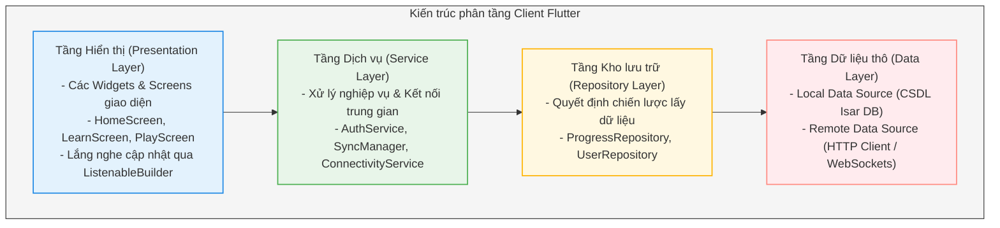
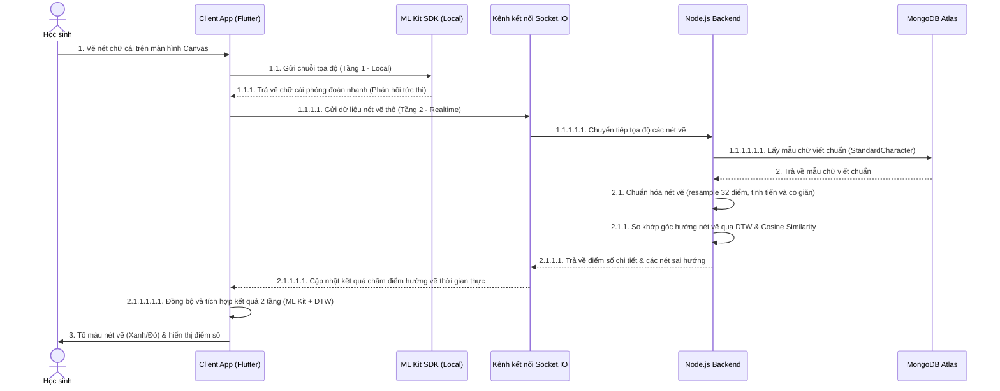
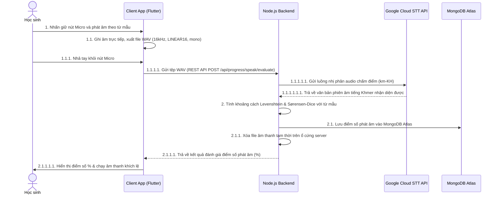
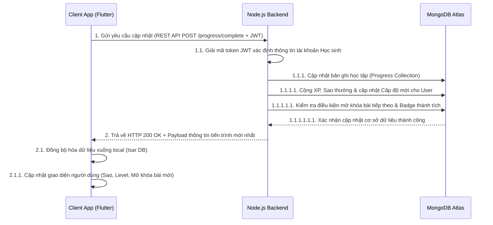
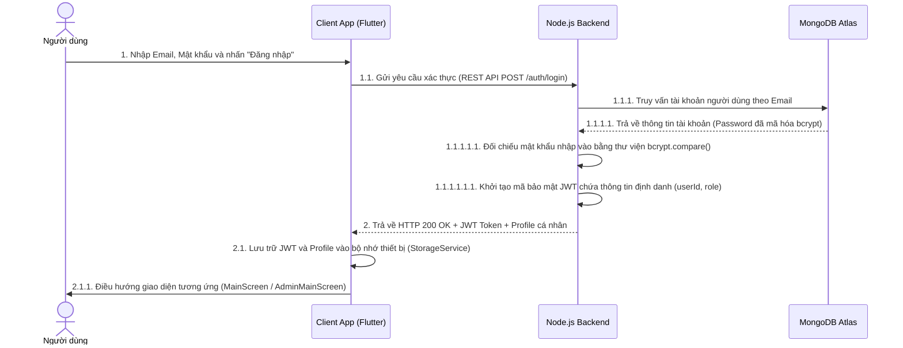
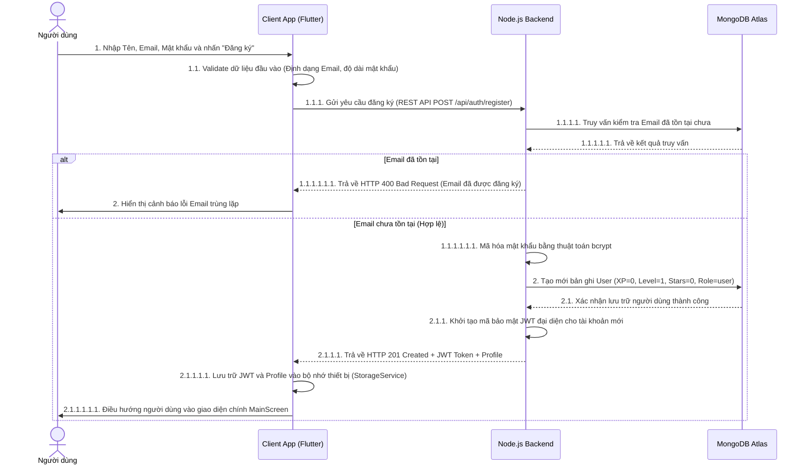
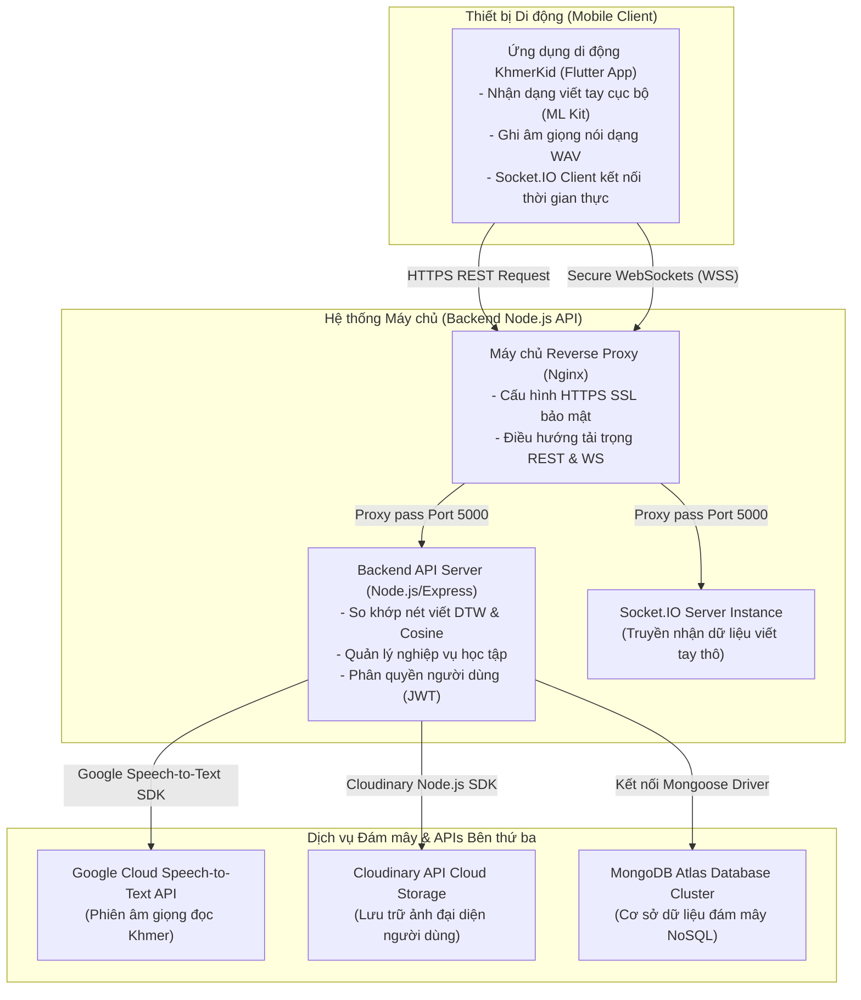

# CẤU TRÚC CHI TIẾT KHÓA LUẬN TỐT NGHIỆP (BẢN CHỈNH SỬA TINH GỌN)

> **TÊN ĐỀ TÀI CHÍNH THỨC**: PHÁT TRIỂN ỨNG DỤNG "KHMERKID" HỖ TRỢ HỌC CHỮ KHMER CHO HỌC SINH TIỂU HỌC
>
> **MÔ TẢ VÀ YÊU CẦU ĐỀ TÀI**:
> *Đề tài tập trung thiết kế và phát triển ứng dụng di động KhmerKid hỗ trợ học sinh tiểu học học chữ Khmer một cách trực quan và sinh động. Ứng dụng cung cấp các bài học cơ bản về bảng chữ cái, cách phát âm, ghép vần và luyện viết, kết hợp hình ảnh, âm thanh và trò chơi tương tác nhằm tăng hứng thú học tập. Hệ thống được thiết kế thân thiện với trẻ em, dễ sử dụng, hoạt động ổn định trực tuyến, và tích hợp các chức năng đánh giá kết quả học tập (chấm điểm nét viết bằng AI, chấm điểm phát âm), theo dõi tiến độ học tập cho phụ huynh.*
>
> **Lưu ý về phạm vi**: Đề tài tập trung làm sâu phân hệ lõi (nhận diện chữ viết tay AI hai tầng). Phần gamification và mini-game được hiện thực ở mức đủ để minh họa mô hình, một số mini-game được liệt kê như định hướng mở rộng trong tương lai (xem mục Kết luận).
>
> **Lưu ý về phân cấp**: Phần Mở đầu, Chương 1, Chương 2 và Kết luận chỉ đánh số tối đa **3 cấp (x.x.x)**; các ý chi tiết hơn trình bày dưới dạng nội dung/bullet bên trong mục cấp 3, không tách thành tiêu đề riêng. Phân cấp **4 cấp (x.x.x.x)** chỉ dùng ở Chương 3, 4, 5 — nơi mỗi tiểu mục tương ứng với một thành phần kỹ thuật độc lập (một schema, một thuật toán, một module mã nguồn, một thử nghiệm cụ thể).

---

## PHẦN MỞ ĐẦU

1. **Lý do chọn đề tài**:
   - Vai trò quan trọng của việc bảo tồn và phát triển ngôn ngữ Khmer cho thế hệ trẻ.
   - Thực trạng dạy và học tiếng Khmer hiện nay tại các trường tiểu học Nam Bộ và các chùa Nam Tông.
   - Khó khăn trong việc tiếp cận chữ viết Khmer (hệ chữ viết phức tạp, chân chữ Coeng, thiếu giáo viên hướng dẫn phát âm).
   - Đề xuất giải pháp xây dựng ứng dụng di động KhmerKid trực quan, sinh động để tăng hiệu quả tự học.
2. **Mục tiêu nghiên cứu**:
   - *Mục tiêu tổng quát*: Thiết kế và phát triển ứng dụng di động KhmerKid hỗ trợ học sinh tiểu học học chữ Khmer trực quan, sinh động, dễ sử dụng, phù hợp với đặc điểm nhận thức của học sinh nhỏ tuổi.
   - *Mục tiêu cụ thể*:
     - Xây dựng lộ trình bài học cơ bản (bảng chữ cái, cách phát âm, ghép vần, luyện viết).
     - Thiết kế mô hình gamification cơ bản (XP, sao, streak, huy hiệu, nhiệm vụ hàng ngày) và hiện thực một số mini-game tiêu biểu minh họa cho mô hình.
     - Phát triển chức năng đánh giá kết quả học tập (chấm điểm nét viết AI, chấm điểm phát âm) và theo dõi tiến độ.
     - Triển khai kết nối trực tuyến để cập nhật trực tiếp tiến độ học tập lên máy chủ (Cloud).
3. **Đối tượng và phạm vi nghiên cứu**:
   - *Đối tượng*: Chữ viết và phát âm tiếng Khmer; công nghệ di động Flutter/Dart; cơ sở dữ liệu tập trung MongoDB (server); các giải pháp AI nhận diện nét vẽ và giọng nói.
   - *Phạm vi*: 11 chủ đề học tập (trong đó có 9 chủ đề hoạt động cốt lõi và 2 chủ đề định hướng tương lai); học sinh tiểu học (6–12 tuổi); môi trường ứng dụng di động đa nền tảng kết hợp máy chủ REST API/WebSocket. Phần thử nghiệm là thử nghiệm sơ bộ (pilot) trên quy mô mẫu nhỏ, không mang tính đại diện thống kê toàn diện.
4. **Phương pháp nghiên cứu**:
   - *Phương pháp lý thuyết*: Nghiên cứu tài liệu ngôn ngữ học Khmer; khảo sát thuật toán DTW và mô hình gamification Octalysis.
   - *Phương pháp thực nghiệm*: Lập trình mã nguồn Client/Server; thu thập dữ liệu thử nghiệm viết tay, ghi âm từ học sinh để hiệu chỉnh thuật toán.
5. **Ý nghĩa khoa học và thực tiễn của đề tài**:
   - *Ý nghĩa khoa học*: Đề xuất mô hình nhận diện nét vẽ lai hai tầng (hybrid) nhằm cân bằng giữa độ trễ phản hồi và độ chính xác đánh giá, phù hợp với điều kiện băng thông di động.
   - *Ý nghĩa thực tiễn*: Mang lại một công cụ EdTech trực quan, hấp dẫn, giúp học sinh tiểu học học tập thuận tiện trên thiết bị di động khi có kết nối Internet.
6. **Bố cục của khóa luận**:
   - Giới thiệu tóm tắt nội dung chính của 5 chương cấu thành khóa luận.

---

## CHƯƠNG 1: TỔNG QUAN ĐỀ TÀI VÀ CƠ SỞ THỰC TIỄN

### 1.1. Cơ sở ngôn ngữ học Khmer và những thách thức tiếp cận
Trình bày liền mạch các nội dung sau (không tách tiêu đề riêng):
- Hệ thống 33 phụ âm Khmer, phân loại theo hàng giọng O (ក, ខ...) và hàng giọng Ô (គ, ឃ...), sự khác biệt về cao độ âm phát ra.
- Hệ thống nguyên âm: nguyên âm phụ thuộc (24 nguyên âm ghép xung quanh phụ âm) và nguyên âm độc lập.
- Hệ thống chân chữ (Coeng/Sub-consonant) — cách viết phụ âm thứ hai dưới dạng ký tự rút gọn để tạo âm tiết ghép.
- Cấu trúc ghép vần và các dấu phụ đặc biệt (Bantak, Samyok-sanhna...).
- Đặc điểm tâm sinh lý học tập của học sinh tiểu học (6-12 tuổi): giới hạn thời gian tập trung, nhạy cảm với phản hồi trực quan, nhu cầu tự khám phá và khen thưởng tức thì.
- Những khó khăn thực tế khi tự học: ghi nhớ thứ tự nét viết (Stroke Order) do nhiều nét uốn lượn, thắt nút; khó tự sửa âm điệu nếu không có giáo viên bản ngữ hướng dẫn trực tiếp.

### 1.2. Khảo sát và đánh giá các giải pháp tương tự

#### 1.2.1. Các ứng dụng hỗ trợ học ngôn ngữ tiêu biểu trên thế giới
- Duolingo: mô hình học tập vi mô (Microlearning), bài học ngắn, cơ chế giữ chuỗi ngày học liên tục (Streak).
- Memrise & Quizlet: phương pháp lặp lại ngắt quãng (Spaced Repetition) và Flashcards trực quan.

#### 1.2.2. Khảo sát các ứng dụng học tiếng Khmer hiện có trên di động
- Lựa chọn 2-3 ứng dụng cụ thể đang phổ biến trên Google Play/App Store (nêu tên, ảnh chụp màn hình minh họa) để khảo sát tính năng: bảng chữ cái tĩnh, audio phát âm thu sẵn.
- Lập bảng so sánh tiêu chí (nhận diện viết tay, chấm điểm phát âm, gamification, trực tuyến) giữa các ứng dụng đã khảo sát, chỉ ra khoảng trống thị trường.

#### 1.2.3. Định vị giải pháp KhmerKid của đề tài
- Bổ sung phân hệ nhận diện viết tay tương tác AI lai hai tầng.
- Bổ sung phân hệ luyện nói tự động chấm điểm phát âm.
- Triển khai mô hình gamification với hệ thống sao thưởng và huy hiệu, một số mini-game minh họa, và lưu trữ trực tuyến tiến độ học tập thời gian thực.

---

## CHƯƠNG 2: CƠ SỞ LÝ THUYẾT VÀ CÔNG NGHỆ TRỌNG TÂM

### 2.1. Phương pháp học chữ Khmer và đặc trưng ngôn ngữ cho trẻ em

#### 2.1.1. Khung lộ trình học tiếng Khmer cho học sinh tiểu học
- Phương pháp xây dựng lộ trình tiếp cận chữ viết tuần tự: Nhận diện mặt chữ -> Tập phát âm -> Luyện nét viết -> Ghép vần -> Đọc câu.
- Áp dụng phương pháp sư phạm trực quan sinh động phù hợp với tâm lý lứa tuổi tiểu học.

#### 2.1.2. Đặc trưng ngôn ngữ Khmer: phụ âm, nguyên âm và chân chữ (Coeng)
- Hệ thống 33 phụ âm, phân loại giọng O (giọng nhẹ) và Ô (giọng trầm).
- Hệ thống nguyên âm độc lập và nguyên âm phụ thuộc.
- Khái niệm chân chữ (Coeng) và quy tắc ghép phụ âm thứ hai dưới chân phụ âm chính.

#### 2.1.3. Các lỗi thường gặp khi học tiếng Khmer
- Viết sai thứ tự nét viết (Stroke Order) do chữ có cấu trúc uốn lượn và thắt nút phức tạp.
- Viết thiếu hoặc đặt sai vị trí chân chữ Coeng và các dấu phụ.
- Lỗi phát âm sai âm điệu đặc trưng giữa các phụ âm hàng giọng O và Ô.

### 2.2. Tìm hiểu Flutter và ngôn ngữ lập trình Dart

#### 2.2.1. Tổng quan về Flutter và ngôn ngữ Dart
- Giới thiệu Flutter SDK và ngôn ngữ Dart, cơ chế biên dịch trước thời hạn (AOT - Ahead-Of-Time) và biên dịch tức thời (JIT - Just-In-Time).

#### 2.2.2. Kiến trúc hoạt động và Widget Lifecycle
- Kiến trúc phân tầng Framework (Dart) và Engine (C++), công cụ dựng hình đồ họa Skia/Impeller.
- Vòng đời của Widget (StatefulWidget và State Lifecycle).

#### 2.2.3. Ưu điểm và nhược điểm
- Ưu điểm: Hiệu năng native, cơ chế Hot Reload, tái sử dụng mã nguồn tối đa trên Android & iOS.
- Nhược điểm: Kích thước file cài đặt lớn, hạn chế trong việc tối ưu hóa tác vụ phần cứng chuyên biệt.

### 2.3. Tìm hiểu Node.js và Express.js

#### 2.3.1. Tổng quan về Node.js và Express.js
- Giới thiệu môi trường chạy mã nguồn JavaScript Node.js và thư viện định tuyến Express.js cho RESTful API.

#### 2.3.2. Kiến trúc xử lý bất đồng bộ non-blocking I/O
- Cơ chế Event Loop đơn luồng (Single-threaded Event Loop) giúp xử lý số lượng lớn yêu cầu mạng đồng thời hiệu quả.

#### 2.3.3. Ưu điểm và nhược điểm
- Ưu điểm: Phát triển nhanh, dùng chung ngôn ngữ JS với Client, cộng đồng package NPM phong phú.
- Nhược điểm: Xử lý kém với các tác vụ nặng về tính toán CPU (như thuật toán hình học), không phù hợp đa luồng phức tạp.

### 2.4. Tìm hiểu Socket.IO và truyền thông thời gian thực

#### 2.4.1. Giao thức WebSockets và Socket.IO
- Khái niệm giao thức truyền tải dữ liệu hai chiều thời gian thực. Sự khác biệt giữa HTTP Polling và WebSockets.

#### 2.4.2. Cơ chế kênh (Rooms/Namespaces) và quản lý kết nối
- Cách thiết lập kênh riêng giữa Client và Server để truyền tọa độ nét vẽ thời gian thực.

#### 4.2.3. Ưu điểm và nhược điểm của Socket.IO
- Ưu điểm: Độ trễ cực thấp, tự động kết nối lại khi gián đoạn, hỗ trợ truyền nhận luồng dữ liệu liên tục.
- Nhược điểm: Tiêu tốn bộ nhớ server để duy trì trạng thái kết nối (stateful connection).

### 2.5. Tìm hiểu MongoDB và Mongoose ODM

#### 2.5.1. Tổng quan về MongoDB
- Cơ sở dữ liệu NoSQL hướng tài liệu (Document-oriented), lưu trữ dữ liệu dạng BSON/JSON.

#### 2.5.2. Mongoose ODM và mô hình hóa dữ liệu
- Cơ chế ánh xạ đối tượng Schema và Model, xác thực dữ liệu đầu vào và quản lý liên kết ref khóa ngoại.

#### 2.5.3. Ưu điểm và nhược điểm của MongoDB
- Ưu điểm: Lược đồ dữ liệu linh hoạt (Schema-less), dễ dàng mở rộng theo chiều ngang (Sharding), hiệu suất ghi đọc nhanh.
- Nhược điểm: Không hỗ trợ giao dịch phức tạp (ACID) mạnh mẽ như RDBMS, trùng lặp dữ liệu do thiếu chuẩn hóa.

### 2.6. Tìm hiểu công nghệ nhận diện chữ viết tay bằng AI

#### 2.6.1. Google ML Kit Digital Ink Recognition
- Nhận diện nét viết tay cục bộ trên thiết bị di động bằng mô hình mạng nơ-ron học sâu (Deep Neural Networks) hỗ trợ tiếng Khmer.

#### 2.6.2. Thuật toán Dynamic Time Warping (DTW)
- Phương pháp so khớp độ tương đồng giữa hai chuỗi thời gian có độ dài khác nhau, đo khoảng cách Euclidean để đánh giá hình dáng nét chữ.

#### 2.6.3. Tiền xử lý hình học nét vẽ và tính toán Cosine Similarity
- Các bước chuẩn hóa tọa độ: Resampling (lấy mẫu lại về 32 điểm/nét), Translation (dịch tâm về 0), Scaling (co giãn tỷ lệ).
- Sử dụng Cosine Similarity để so sánh góc hướng nét vẽ phát hiện lỗi viết ngược nét.

### 2.7. Tìm hiểu công nghệ nhận diện giọng nói và chấm điểm phát âm

#### 2.7.1. Google Cloud Speech-to-Text API
- Công nghệ nhận dạng giọng nói tự động (ASR) đám mây hỗ trợ tiếng Khmer, xử lý luồng ghi âm WAV 16kHz mono.

#### 2.7.2. Thuật toán đo độ tương đồng chuỗi phiên âm
- Khoảng cách Levenshtein (tính số phép biến đổi ký tự) và hệ số Sørensen-Dice (đo độ trùng khớp n-gram từ vựng).

#### 2.7.3. Ứng dụng tự động chấm điểm phát âm tiếng Khmer cho trẻ em
- Phương pháp làm mịn và bộ lọc giọng đọc còn non nớt của trẻ em tiểu học trước khi chấm điểm tương đồng.

### 2.8. Lý thuyết Trò chơi hóa (Gamification) trong giáo dục

#### 2.8.1. Khung lý thuyết Octalysis
- Phân tích 8 động lực cốt lõi thúc đẩy người dùng (Core Drives), áp dụng động lực Thành tựu (Accomplishment) và Sở hữu (Ownership) vào ứng dụng.

#### 2.8.2. Vòng lặp tương tác (Core Loops)
- Thiết kế vòng lặp học tập khép kín: Học/Chơi bài -> Tích lũy điểm XP/Stars -> Đổi thưởng huy hiệu và vật phẩm trang trí -> Mở khóa bài học mới.

---

## CHƯƠNG 3: PHÂN TÍCH VÀ THIẾT KẾ HỆ THỐNG

### 3.1. Yêu cầu hệ thống và bảo mật riêng tư trẻ em

#### 3.1.1. Yêu cầu chức năng (Functional Requirements)

##### 3.1.1.1. Phân hệ dành cho Học sinh (Trẻ em & Phụ huynh kết hợp)

- *Xác thực & Tài khoản*: Đăng ký, đăng nhập email, đăng nhập Google OAuth 2.0 (Mobile Native Flow), đăng nhập Mock (giả lập), tự động đăng nhập (Auto-login), tự động dò tìm IP máy chủ backend.
- *Lộ trình học tập cá nhân hóa*: Bản đồ lộ trình học 11 chủ đề (bao gồm 9 chủ đề cốt lõi đã hiện thực và 2 chủ đề mở rộng tương lai) dạng timeline zigzag. Mỗi bài học gồm 3 cấu phần tương tác: Nghe (phát âm bản ngữ đa tốc độ + fallback TTS), Nói (ghi âm giọng đọc WAV 16kHz, chấm điểm phát âm tương đồng qua Google Cloud STT API), Viết (luyện viết chữ trên canvas có nét đứt hướng dẫn, chấm điểm AI 2 tầng).
- *Trò chơi giáo dục (Mini-games)*: Chơi các mini-game (Elephant Run, Letter Catch, Matching Game...) để củng cố kiến thức.
- *Gamification & Tương tác*: Hệ thống tích lũy XP, tăng cấp bậc (Level), thăng hạng bảng xếp hạng toàn hệ thống (Leaderboard), sao (Stars) làm tiền tệ trong cửa hàng ảo để đổi các vật phẩm trang trí hồ sơ (khung ảnh đại diện, bộ hình dán), nhiệm vụ hàng ngày (Daily Missions) nhận thưởng, thành tích (Achievements) và bộ sưu tập huy hiệu học tập (Badges).
- *Thư viện bổ trợ (Library) & Bài kiểm tra*: Xem sách tranh truyện, nghe audio kể truyện cổ tích, xem video văn hóa Khmer. Làm bài kiểm tra trắc nghiệm tổng hợp theo độ khó để đánh giá năng lực.
- *Nhận thông báo*: Xem hộp thư thông báo trong app (từ hệ thống/admin) và nhận thông báo nhắc nhở học tập hàng ngày ngoài màn hình khóa (Local Notifications).
- *Báo cáo & Thống kê học tập*: Biểu đồ radar năng lực phân tích 4 kỹ năng (Nghe, Nói, Đọc, Viết) từ 0-100%, thống kê số bài học đã hoàn thành, tổng thời gian học tích lũy và chuỗi ngày học liên tục (streak) để trẻ tự theo dõi và phụ huynh giám sát.

##### 3.1.1.2. Phân hệ dành cho Quản trị viên (Admin Panel)

- *Bảng điều khiển chung (Dashboard)*: Thống kê số lượng học sinh đăng ký, số lượt học trực tuyến, tỷ lệ hoàn thành bài học, biểu đồ phát triển người dùng.
- *Quản lý người dùng (User Management)*: Xem danh sách học sinh, phân quyền tài khoản (admin/user), khóa/mở khóa tài khoản.
- *Quản lý học liệu (Lesson Management)*: Thêm, sửa, xóa các bài học trong 11 chủ đề (phụ âm, nguyên âm, từ vựng...).
- *Quản lý nhiệm vụ & Huy hiệu (Missions & Badges)*: Cài đặt nhiệm vụ ngày, quản lý hệ thống huy hiệu học tập.
- *Quản lý thư viện & bài test (Library & Tests)*: CRUD sách, video, âm thanh bổ trợ; quản lý bộ câu hỏi kiểm tra trắc nghiệm.
- *Quản lý thông báo (Notification Center)*: Soạn thảo và gửi thông báo chung hoặc thông báo đẩy cho toàn bộ học sinh.

#### 3.1.2. Yêu cầu phi chức năng và bảo mật riêng tư trẻ em

##### 3.1.2.1. Hiệu năng & Khả năng hoạt động

Độ trễ kết nối WebSocket dưới 300ms–500ms, tốc độ phản hồi API dưới 500ms, hệ thống lưu trữ trực tiếp trên máy chủ đám mây.

##### 3.1.2.2. Bảo vệ dữ liệu trẻ em (Child Data Privacy)

Cơ chế xin phép phụ huynh trước khi ghi âm; lưu file ghi âm tạm thời và tự động xóa ngay sau khi chấm điểm phát âm; không lưu trữ vĩnh viễn audio trên máy chủ bên thứ ba.

### 3.2. Thiết kế các sơ đồ chức năng và Use Case

#### 3.2.1. Sơ đồ Use Case hệ thống

Sơ đồ Use Case tổng quát mô tả các chức năng của hệ thống và mối liên kết phụ thuộc giữa chúng. Các chức năng yêu cầu xác thực tài khoản đều phụ thuộc vào Use Case **Đăng nhập** thông qua quan hệ bao hàm `«include»`. Các tính năng thực hành chi tiết hoặc các thao tác CRUD của quản trị viên được phân rã dưới dạng quan hệ mở rộng `«extend»`.

```mermaid
graph LR
    %% Actors %%
    User((👤 Người dùng))
    Admin((🔑 Quản trị viên))

    style User fill:#fff,stroke:#000,stroke-width:2px,color:#000
    style Admin fill:#fff,stroke:#000,stroke-width:2px,color:#000

    subgraph SystemBoundary ["Hệ thống ứng dụng học chữ khmer cho học sinh tiểu học"]
        %% Use Case Trung Tâm %%
        DangNhap(["Đăng nhập"])
        DangKy(["Đăng ký"])

        %% Nhóm Use Cases Bên Trái (Người dùng) %%
        HocTap(["Học tập"])
        TroChoi(["Trò chơi"])
        XepHang(["Xếp hạng"])
        HoSo(["Hồ sơ"])
        ThanhTich(["Thành tích"])
        ThuVien(["Thư viện"])
        NhiemVu(["Nhiệm vụ"])

        %% Các mối quan hệ extend bên trái %%
        LoTrinhHoc(["Lộ trình học"])
        NgheVietNoi(["Nghe, viết, Nói"])
        ChoiCácGame(["Chơi các game"])
        TheoThangAll(["Theo tháng, tất cả"])
        CapNhatThongTin(["Cập nhật thông tin"])
        NhanThuong(["Nhận thưởng"])
        TimKiemLoc(["Tìm kiếm, lọc"])
        LamNhiemVuDoiThuong(["Làm nhiệm vụ, <br/> đổi thưởng"])

        LoTrinhHoc -.->|«extend»| HocTap
        NgheVietNoi -.->|«extend»| HocTap
        ChoiCácGame -.->|«extend»| TroChoi
        TheoThangAll -.->|«extend»| XepHang
        CapNhatThongTin -.->|«extend»| HoSo
        NhanThuong -.->|«extend»| ThanhTich
        TimKiemLoc -.->|«extend»| ThuVien
        LamNhiemVuDoiThuong -.->|«extend»| NhiemVu

        %% Nhóm Use Cases Bên Phải (Quản trị viên) %%
        Dashboard(["Dashboard"])
        QuanLyNguoiDung(["Quản lý Người dùng"])
        QuanLyBaiHoc(["Quản lý Bài học"])
        QuanLyNhiemVu(["Quản lý Nhiệm vụ"])
        QuanLyHuyHieu(["Quản lý Huy hiệu"])
        QuanLyThuVien(["Quản lý Thư viện"])
        QuanLyCauHoiGame(["Quản lý Câu hỏi <br/> Game"])
        QuanLyBaiKiemTra(["Quản lý Bài <br/> kiểm tra"])
        QuanLyThongBao(["Quản lý Thông báo"])

        %% Các mối quan hệ extend bên phải %%
        XoaNangAdmin(["Xóa, nâng <br/> admin"])
        ThemSuaXoaBH(["Thêm, sửa, <br/> xóa"])
        ThemSuaXoaNV(["Thêm, sửa, <br/> xóa"])
        ThemSuaXoaHH(["Thêm, sửa, <br/> xóa"])
        ThemSuaXoaTV(["Thêm, sửa, <br/> xóa"])
        ThemSuaXoaCH(["Thêm, sửa, <br/> xóa"])
        ThemSuaXoaKT(["Thêm, sửa, <br/> xóa"])
        ThemXoaTB(["Thêm, xóa"])

        XoaNangAdmin -.->|«extend»| QuanLyNguoiDung
        ThemSuaXoaBH -.->|«extend»| QuanLyBaiHoc
        ThemSuaXoaNV -.->|«extend»| QuanLyNhiemVu
        ThemSuaXoaHH -.->|«extend»| QuanLyHuyHieu
        ThemSuaXoaTV -.->|«extend»| QuanLyThuVien
        ThemSuaXoaCH -.->|«extend»| QuanLyCauHoiGame
        ThemSuaXoaKT -.->|«extend»| QuanLyBaiKiemTra
        ThemXoaTB -.->|«extend»| QuanLyThongBao

        classDef ucStyle fill:#fff,stroke:#000,stroke-width:1.5px,color:#000;
        class DangNhap,DangKy,HocTap,TroChoi,XepHang,HoSo,ThanhTich,ThuVien,NhiemVu,LoTrinhHoc,NgheVietNoi,ChoiCácGame,TheoThangAll,CapNhatThongTin,NhanThuong,TimKiemLoc,LamNhiemVuDoiThuong,Dashboard,QuanLyNguoiDung,QuanLyBaiHoc,QuanLyNhiemVu,QuanLyHuyHieu,QuanLyThuVien,QuanLyCauHoiGame,QuanLyBaiKiemTra,QuanLyThongBao,XoaNangAdmin,ThemSuaXoaBH,ThemSuaXoaNV,ThemSuaXoaHH,ThemSuaXoaTV,ThemSuaXoaCH,ThemSuaXoaKT,ThemXoaTB ucStyle;
    end

    %% Tương tác Actors %%
    User ---> DangKy
    User ---> HocTap
    User ---> TroChoi
    User ---> XepHang
    User ---> HoSo
    User ---> ThanhTich
    User ---> ThuVien
    User ---> NhiemVu

    Admin ---> Dashboard
    Admin ---> QuanLyNguoiDung
    Admin ---> QuanLyBaiHoc
    Admin ---> QuanLyNhiemVu
    Admin ---> QuanLyHuyHieu
    Admin ---> QuanLyThuVien
    Admin ---> QuanLyCauHoiGame
    Admin ---> QuanLyBaiKiemTra
    Admin ---> QuanLyThongBao

    %% Quan hệ include %%
    HocTap -.->|«include»| DangNhap
    TroChoi -.->|«include»| DangNhap
    XepHang -.->|«include»| DangNhap
    HoSo -.->|«include»| DangNhap
    ThanhTich -.->|«include»| DangNhap
    ThuVien -.->|«include»| DangNhap
    NhiemVu -.->|«include»| DangNhap

    Dashboard -.->|«include»| DangNhap
    QuanLyNguoiDung -.->|«include»| DangNhap
    QuanLyBaiHoc -.->|«include»| DangNhap
    QuanLyNhiemVu -.->|«include»| DangNhap
    QuanLyHuyHieu -.->|«include»| DangNhap
    QuanLyThuVien -.->|«include»| DangNhap
    QuanLyCauHoiGame -.->|«include»| DangNhap
    QuanLyBaiKiemTra -.->|«include»| DangNhap
    QuanLyThongBao -.->|«include»| DangNhap
```

##### 3.2.1.1. Xác định tác nhân (Actors Identification)

Hệ thống phân định rõ hai nhóm tác nhân chính tham gia tương tác với các Use Case:

*   **Người dùng (User / Học sinh)**:
    - *Vai trò:* Tác nhân chính sử dụng ứng dụng di động để học tập và rèn luyện. Tác nhân này là học sinh tiểu học thực hiện các hoạt động học tập trực quan sinh động, chơi các trò chơi giáo dục bổ trợ và tích lũy sao thưởng.
    - *Hành động:* Thực hiện đăng ký/đăng nhập; học chữ cái, nguyên âm, đánh vần, số học, tập đọc, tập viết nét; tham gia các mini-games tương tác; nhận huy hiệu thành tích; xem bảng xếp hạng; làm nhiệm vụ ngày; mua vật phẩm ở cửa hàng và tra cứu từ vựng trong thư viện.

*   **Quản trị viên (Admin)**:
    - *Vai trò:* Nhân viên quản trị hệ thống, giáo viên hoặc người quản lý nội dung. Chịu trách nhiệm giám sát toàn bộ hoạt động của hệ thống, quản lý tài nguyên học tập và kiểm duyệt các thông tin liên quan đến người học.
    - *Hành động:* Truy cập dashboard phân tích dữ liệu; quản lý danh sách và phân quyền người dùng; biên soạn nội dung bài học; thiết lập nhiệm vụ và huy hiệu; quản lý đề kiểm tra trắc nghiệm và ngân hàng câu hỏi game; quản lý sách truyện trong thư viện; soạn và phát đi thông báo đẩy hệ thống.

#### 3.2.2. Đặc tả các Use Case cốt lõi

##### 3.2.2.1. Đặc tả Use Case "Đăng nhập tài khoản"

    | Thành phần | Đặc tả chi tiết |
    | :--- | :--- |
    | **Tên Use Case** | Đăng nhập tài khoản |
    | **Tác nhân** | Học sinh, Quản trị viên |
    | **Mục đích** | Xác thực danh tính của người dùng để cấp quyền truy cập vào các tính năng tương ứng (Giao diện học tập/trò chơi cho Học sinh hoặc Giao diện quản trị cho Quản trị viên). |
    | **Điều kiện tiền đề** | - Tài khoản của người dùng đã được đăng ký thành công trên hệ thống. - Thiết bị có kết nối Internet (hoặc đang kết nối cùng mạng LAN với máy chủ). |
    | **Luồng sự kiện chính** | 1. Người dùng mở ứng dụng KhmerKid. 2. Hệ thống hiển thị màn hình Đăng nhập (LoginScreen) yêu cầu nhập Email và Mật khẩu. 3. Người dùng nhập đầy đủ thông tin Email và Mật khẩu, sau đó nhấn nút "Đăng nhập". 4. Ứng dụng gửi yêu cầu xác thực (`POST /api/auth/login`) lên máy chủ backend. 5. Máy chủ backend tiếp nhận thông tin, kiểm tra tính hợp lệ của tài khoản trong cơ sở dữ liệu MongoDB Atlas. 6. Nếu thông tin khớp, backend tạo một mã JSON Web Token (JWT) đại diện cho phiên làm việc, kèm thông tin vai trò (role) của tài khoản và trả về phản hồi thành công (HTTP 200 OK) cho Client. 7. Client tiếp nhận dữ liệu, lưu JWT và thông tin tài khoản vào bộ nhớ cục bộ (StorageService) và điều hướng người dùng: &nbsp;&nbsp;&nbsp;&nbsp;- Nếu vai trò là `user`: Điều hướng vào màn hình chính `MainScreen` (chế độ học sinh). &nbsp;&nbsp;&nbsp;&nbsp;- Nếu vai trò là `admin`: Điều hướng vào màn hình quản trị `AdminMainScreen` (chế độ quản trị). |
    | **Ngoại lệ (Exception)** | - *Sai thông tin đăng nhập:* Nếu Email hoặc Mật khẩu không chính xác, backend trả về mã lỗi HTTP 401. Ứng dụng hiển thị thông báo lỗi "Tài khoản hoặc mật khẩu không chính xác" và yêu cầu người dùng nhập lại. - *Lỗi kết nối mạng:* Hệ thống báo lỗi và cho phép người dùng đăng nhập bằng tài khoản lưu trữ ngoại tuyến trước đó (Offline mode) để tiếp tục học. |

##### 3.2.2.2. Đặc tả Use Case "Học lộ trình bài học"

| Thành phần | Đặc tả chi tiết |
| :--- | :--- |
| **Tên Use Case** | Học lộ trình bài học |
| **Tác nhân** | Học sinh |
| **Mục đích** | Hỗ trợ học sinh học chữ Khmer theo lộ trình cá nhân hóa gồm các kỹ năng Nghe, Nói, Viết nét của từng chữ cái/nguyên âm/chữ số. |
| **Điều kiện tiền đề** | - Học sinh đã đăng nhập tài khoản. - Học sinh chọn một bài học trên bản đồ bài học (Roadmap). |
| **Luồng sự kiện chính** | 1. Học sinh truy cập Tab "Học tập" và chọn bài học mong muốn trên bản đồ. 2. Hệ thống tải nội dung bài học và hiển thị giao diện chi tiết bài học (`LetterDetailScreen`). 3. Học sinh thực hành **Nghe**: Nhấn nút phát âm để nghe âm mẫu của chữ cái từ giọng bản xứ hoặc TTS. 4. Học sinh thực hành **Viết**: Vẽ ngón tay theo nét đứt hướng dẫn trên Canvas mờ. Hệ thống tự động kiểm tra độ chính xác của hướng nét vẽ. 5. Học sinh thực hành **Nói**: Nhấn giữ nút ghi âm, phát âm chữ cái và hệ thống gửi tệp ghi âm lên backend chấm điểm tương đồng qua API Google STT. 6. Sau khi hoàn thành tất cả các phần thực hành đạt điểm chuẩn, hệ thống tự động lưu tiến trình học, cộng điểm thưởng (sao, XP) cho học sinh. |
| **Ngoại lệ (Exception)** | - *Mất kết nối mạng:* Nếu bị mất mạng trong lúc thực hành phát âm hoặc viết chữ, hệ thống chuyển sang chế độ chấm điểm offline (bằng thư viện ML Kit nội bộ trên thiết bị) để tránh làm gián đoạn bài học của học sinh. |

##### 3.2.2.3. Đặc tả Use Case "Chơi trò chơi giáo dục"

| Thành phần | Đặc tả chi tiết |
| :--- | :--- |
| **Tên Use Case** | Chơi trò chơi giáo dục |
| **Tác nhân** | Học sinh |
| **Mục đích** | Giúp học sinh tham gia các trò chơi mini-games tương tác nhằm ôn tập và củng cố kiến thức chữ Khmer đã học một cách vui nhộn. |
| **Điều kiện tiền đề** | - Học sinh đã đăng nhập tài khoản. - Học sinh chọn một trò chơi trong danh sách trò chơi (PlayScreen). |
| **Luồng sự kiện chính** | 1. Học sinh truy cập Tab "Trò chơi" và chọn một trò chơi hoạt động (ví dụ: Bắt chữ Khmer, Giải cứu thú rừng, Voi con vượt ải). 2. Hệ thống tải dữ liệu câu hỏi ôn tập tương ứng với cấp độ hiện tại của học sinh và bắt đầu trò chơi. 3. Học sinh thực hiện các nhiệm vụ trong trò chơi (như tìm từ, chọn chữ cái đúng, điều khiển voi ăn chữ) trước khi hết giờ hoặc hết số mạng chơi. 4. Hệ thống tính điểm dựa trên số câu trả lời đúng và thời gian hoàn thành của học sinh. 5. Khi trò chơi kết thúc, hệ thống hiển thị bảng kết quả, cộng điểm thưởng (sao, XP) tương ứng và gửi kết quả lưu trữ về server backend. |
| **Ngoại lệ (Exception)** | - *Hết lượt chơi (hết mạng):* Trò chơi dừng lại, học sinh có thể sử dụng vật phẩm bổ trợ (Bình sữa trái tim) mua từ Cửa hàng để thêm mạng và tiếp tục chơi, hoặc chấp nhận kết thúc game. |

##### 3.2.2.4. Đặc tả Use Case "Làm nhiệm vụ và đổi thưởng"

| Thành phần | Đặc tả chi tiết |
| :--- | :--- |
| **Tên Use Case** | Làm nhiệm vụ và đổi thưởng |
| **Tác nhân** | Học sinh |
| **Mục đích** | Tạo động lực học tập hàng ngày cho học sinh thông qua việc hoàn thành các nhiệm vụ cụ thể để nhận sao và đổi lấy vật phẩm trong Cửa hàng ảo. |
| **Điều kiện tiền đề** | - Học sinh đã đăng nhập tài khoản. |
| **Luồng sự kiện chính** | 1. Học sinh xem danh sách Nhiệm vụ hàng ngày (ví dụ: "Hoàn thành 2 bài học", "Đạt 100 điểm game"). 2. Học sinh tiến hành thực hiện các hoạt động học tập hoặc chơi game trong ngày để hoàn thành chỉ tiêu nhiệm vụ. 3. Khi đạt đủ chỉ tiêu, hệ thống hiển thị nút "Nhận thưởng" trong danh sách nhiệm vụ. Học sinh nhấn nút để nhận số sao thưởng tương ứng. 4. Học sinh truy cập vào "Cửa hàng" (ShopScreen) để xem các vật phẩm (như Avatar nhân vật mới, bình sữa trái tim, gợi ý câu hỏi). 5. Học sinh chọn vật phẩm muốn mua và nhấn "Đổi thưởng". Hệ thống kiểm tra số lượng sao tích lũy: &nbsp;&nbsp;&nbsp;&nbsp;- Nếu đủ sao: Hệ thống trừ số sao tương ứng, mở khóa vật phẩm và cập nhật vào kho đồ của học sinh. |
| **Ngoại lệ (Exception)** | - *Không đủ sao để đổi:* Hệ thống hiển thị thông báo "Không đủ sao để đổi vật phẩm" và gợi ý học sinh hoàn thành thêm bài học/nhiệm vụ để kiếm thêm sao. |

### 3.3. Thiết kế kiến trúc phần mềm và luồng tương tác

#### 3.3.1. Thiết kế kiến trúc phân tầng Client-Server

Hệ thống học chữ Khmer KhmerKid được thiết kế theo kiến trúc Client-Server độc lập, chia nhỏ thành các tầng chức năng nhằm đảm bảo khả năng bảo trì, mở rộng và tối ưu hóa hiệu năng truyền dữ liệu.

##### 3.3.1.1. Kiến trúc phân tầng Client Flutter

Ứng dụng Client di động phát triển bằng Flutter được phân rã thành 4 tầng kiến trúc chặt chẽ như sau:

*   **Presentation Layer (Tầng hiển thị):**
    - *Chức năng:* Gồm các Screens (màn hình giao diện như `HomeScreen`, `LearnScreen`, `PlayScreen`, `ProfileScreen`) và các Widgets thành phần (như Canvas vẽ chữ tay, bộ micro thu âm). Tầng này chịu trách nhiệm nhận tương tác từ người học và hiển thị dữ liệu lên màn hình.
    - *Cơ chế:* Sử dụng `flutter_screenutil` để đáp ứng hiển thị responsive. Trạng thái giao diện được cập nhật một cách phản xạ thông qua việc lắng nghe trạng thái (`ListenableBuilder`) từ các Singleton Service.
*   **Service Layer (Tầng dịch vụ nghiệp vụ):**
    - *Chức năng:* Nơi xử lý các logic nghiệp vụ phía ứng dụng di động. Tầng này kết nối logic giữa giao diện người dùng và kho dữ liệu.
    - *Ví dụ:* `AuthService` quản lý trạng thái đăng nhập và giải mã token JWT; `SyncManager` quản lý hàng đợi lưu trữ offline và đồng bộ hóa; `ConnectivityService` phát hiện thay đổi mạng; `LocalNotificationService` lên lịch nhắc nhở học tập hàng ngày.
*   **Repository Layer (Tầng kho lưu trữ):**
    - *Chức năng:* Lớp trung gian trừu tượng hóa nguồn gốc dữ liệu. Tầng này quyết định xem sẽ tải dữ liệu học tập từ Local CSDL hay gọi lên Remote API dựa trên trạng thái kết nối mạng thực tế.
    - *Ví dụ:* `ProgressRepository` quản lý việc đọc/ghi tiến độ của học sinh.
*   **Data Layer (Tầng dữ liệu):**
    - *Chức năng:* Tiếp xúc trực tiếp với các cơ chế lưu trữ vật lý.
    - *Phân chia:* Gồm `Local Data Source` (truy cập CSDL nội bộ Isar để ghi nhận tiến độ tức thời dạng offline) và `Remote Data Source` (truy cập API của Server thông qua HTTP REST API và kênh kết nối Socket.IO).

##### 3.3.1.2. Kiến trúc phân tầng Server Node.js

Hệ thống Server chạy trên môi trường Node.js (sử dụng Express framework và Mongoose ORM) được chia thành 5 tầng chức năng tuần tự:

```mermaid
graph TD
    subgraph ServerNodejs ["Kiến trúc phân tầng Server Node.js"]
        RouteLayer["Tầng Định tuyến (Route Layer)<br/>- Nhận request API từ Client<br/>- userRoutes.js, progressRoutes.js"]
        MiddlewareLayer["Tầng Trung gian (Middleware Layer)<br/>- Bộ lọc bảo mật & Kiểm thực token<br/>- Auth Middleware, Role Verification"]
        ControllerLayer["Tầng Điều khiển (Controller Layer)<br/>- Điều phối request, validate dữ liệu<br/>- authController.js, progressController.js"]
        ServiceLayer["Tầng Nghiệp vụ (Service Layer)<br/>- Logic nghiệp vụ hệ thống lõi<br/>- progressService, rankService, ttsService"]
        ModelLayer["Tầng Mô hình (Model Layer)<br/>- Mongoose Schemas & Kết nối DB<br/>- User.js, Progress.js, Badge.js"]
        Database[(MongoDB Atlas Cloud)]

        RouteLayer --> MiddlewareLayer
        MiddlewareLayer --> ControllerLayer
        ControllerLayer --> ServiceLayer
        ServiceLayer --> ModelLayer
        ModelLayer --> Database
    end
    style ServerNodejs fill:#F5F5F5,stroke:#333,stroke-width:1px
    style RouteLayer fill:#E0F7FA,stroke:#00ACC1,stroke-width:1.5px
    style MiddlewareLayer fill:#EDE7F6,stroke:#5E35B1,stroke-width:1.5px
    style ControllerLayer fill:#FFF3E0,stroke:#FB8C00,stroke-width:1.5px
    style ServiceLayer fill:#E8F5E9,stroke:#4CAF50,stroke-width:1.5px
    style ModelLayer fill:#FCE4EC,stroke:#D81B60,stroke-width:1.5px
    style Database fill:#ECEFF1,stroke:#37474F,stroke-width:1.5px
```

*   **Route Layer (Tầng định tuyến):**
    - *Chức năng:* Tiếp nhận các gói tin HTTP request từ Client gửi lên, ánh xạ địa chỉ URL và phương thức (GET, POST, PUT, DELETE) về đúng phân hệ xử lý.
    - *Ví dụ:* `userRoutes.js` (xác thực và cấu hình tài khoản), `progressRoutes.js` (tiến độ học tập).
*   **Middleware Layer (Tầng trung gian):**
    - *Chức năng:* Đóng vai trò như bộ lọc đầu vào để giải quyết các bài toán chung: Xác thực JWT token (`authMiddleware.js`), kiểm tra quyền quản trị (`adminMiddleware.js`), hoặc giới hạn tần suất gửi yêu cầu để bảo vệ máy chủ (Rate Limiting).
*   **Controller Layer (Tầng điều khiển):**
    - *Chức năng:* Trích xuất tham số từ request (body, query, params), thực hiện kiểm tra định dạng dữ liệu (validation), sau đó gọi đến tầng Service tương ứng để xử lý. Nhận kết quả từ Service và trả về response cho Client dưới định dạng chuẩn JSON.
    - *Ví dụ:* `authController.js`, `progressController.js`.
*   **Service Layer (Tầng nghiệp vụ lõi):**
    - *Chức năng:* Nơi hiện thực hóa tất cả các logic nghiệp vụ chính của hệ thống như: tính điểm XP/Sao thưởng, thăng hạng Leaderboard, tổng hợp thống kê biểu đồ năng lực, tạo tệp âm thanh TTS hoặc tính toán thuật toán so khớp nét vẽ Dynamic Time Warping (DTW).
    - *Ví dụ:* `progressService.js`, `rankService.js`, `userService.js`.
    *   **Model Layer (Tầng mô hình dữ liệu):**
        - *Chức năng:* Tương tác trực tiếp với cơ sở dữ liệu MongoDB thông qua các Mongoose Schema. Định nghĩa cấu trúc thuộc tính, kiểm tra ràng buộc kiểu dữ liệu, thiết lập chỉ mục tìm kiếm nhanh (indexes) và các trường ảo (virtuals).
        - *Ví dụ:* `User.js`, `Progress.js`, `Lesson.js`.
#### 3.3.2. Sơ đồ tuần tự (Sequence Diagrams) và Luồng dữ liệu

##### 3.3.2.1. Sơ đồ tuần tự nhận diện chữ viết tay AI 2 tầng

Sơ đồ này mô tả chi tiết luồng truyền nhận tọa độ các nét vẽ thời gian thực giữa ứng dụng di động của học sinh và máy chủ backend thông qua kênh kết nối Socket.IO để phục vụ thuật toán so khớp nét vẽ DTW kết hợp ML Kit local.

##### 3.3.2.2. Sơ đồ tuần tự chấm điểm phát âm

Sơ đồ mô tả luồng ghi âm giọng phát âm của trẻ từ Client, đóng gói dữ liệu định dạng WAV và gửi lên API của Google Speech-to-Text thông qua Backend để phân tích và tính toán điểm tương đồng từ vựng.

##### 3.3.2.3. Sơ đồ tuần tự cập nhật tiến độ học tập

Sơ đồ này mô tả luồng cập nhật tiến trình bài học (hoàn thành bài học, trò chơi) trực tuyến thông qua API RESTful, cập nhật chỉ số sao, XP và mở khóa bài tiếp theo.

##### 3.3.2.4. Sơ đồ tuần tự Đăng nhập tài khoản (Authentication Flow)

Sơ đồ này biểu diễn chi tiết luồng xác thực danh tính của người dùng (Học sinh/Admin) khi nhập thông tin đăng nhập, đối chiếu với cơ sở dữ liệu để sinh token bảo mật và điều hướng giao diện phù hợp.

##### 3.3.2.5. Sơ đồ tuần tự Đăng ký tài khoản mới (Register Flow)

Sơ đồ này mô tả chi tiết luồng đăng ký tài khoản mới của người dùng, thực hiện validate dữ liệu ở client, mã hóa bảo mật mật khẩu ở backend và lưu trữ tài khoản vào cơ sở dữ liệu.

### 3.4. Thiết kế cơ sở dữ liệu

Hệ thống sử dụng cơ sở dữ liệu đám mây MongoDB Atlas làm nền tảng lưu trữ tập trung cho toàn bộ ứng dụng. Giải pháp NoSQL hướng tài liệu này giúp xử lý linh hoạt các cấu trúc dữ liệu học tập phân cấp của trẻ (tiến độ học, nét vẽ canvas, câu hỏi game) bằng cơ chế tài liệu nhúng (embedded documents) và mảng liên kết (array references) mà không cần dùng các câu lệnh JOIN phức tạp, tối ưu hóa tốc độ phản hồi hệ thống.

Quy ước chung: Các tài liệu trong các bộ sưu tập (collections) đều sử dụng trường khóa chính `_id` kiểu `ObjectId` tự sinh bởi MongoDB Atlas. Mọi bộ sưu tập nghiệp vụ đều tích hợp hai thuộc tính thời gian `createdAt` và `updatedAt` kiểu `Date` thông qua cấu hình `timestamps` của Mongoose. Để nâng cao hiệu năng truy vấn cho ứng dụng di động, hệ thống thiết lập các chỉ mục đơn, chỉ mục phức hợp (Compound Indexes) và chỉ mục hết hạn tự động (TTL Indexes) cho phân hệ nhiệm vụ ngày.

#### 3.4.1. Lược đồ cơ sở dữ liệu và Sơ đồ thực thể liên kết (ERD)

Sơ đồ thực thể liên kết (ERD) của hệ thống bao gồm 19 bộ sưu tập (collections), được nhóm thành 5 cụm nghiệp vụ chính:
1.  **Nhóm thực thể tài khoản và bài học:** Quản lý thông tin định danh người dùng (`User`), thông tin bài học (`Lesson`), và tiến độ học tập tổng quát (`Progress`).
2.  **Nhóm thực thể Gamification và Nhiệm vụ:** Quản lý hệ thống trò chơi hóa gồm huy hiệu (`Badge`), thành tựu (`Achievement`), nhiệm vụ (`Mission`), và tiến độ nhiệm vụ ngày (`MissionProgress`).
3.  **Nhóm thực thể Trò chơi (Games):** Quản lý phiên chơi game (`GamePlaySession`), tiến trình game (`GameProgress`), ngân hàng câu hỏi game (`GameQuestion`), và kết quả lưu điểm game (`GameResult`).
4.  **Nhóm thực thể Đánh giá kỹ năng và AI:** Quản lý tiến trình tập viết chữ cái Khmer (`WritingProgress`), bộ nét vẽ chuẩn dùng so khớp DTW (`StandardCharacter`), kết quả luyện nghe (`ListeningResult`), kết quả luyện đọc (`ReadingResult`), và ngân hàng câu hỏi kiểm tra (`TestQuestion`).
5.  **Nhóm thực thể Bổ trợ và Hệ thống:** Quản lý kho sách truyện thư viện (`LibraryItem`), thông báo đẩy (`Notification`), và bộ đệm âm thanh phát âm Khmer (`TtsCache`).

Sơ đồ hình dưới đây thể hiện các bộ sưu tập cốt lõi và mối quan hệ liên kết giữa các thực thể:

```mermaid
erDiagram
    User ||--|| Progress : "owns (1:1)"
    User ||--o{ WritingProgress : "tracks (1:N)"
    User ||--o{ GamePlaySession : "plays (1:N)"
    User ||--o{ GameProgress : "records (1:N)"
    User ||--o{ MissionProgress : "completes (1:N)"
    User ||--o{ GameResult : "achieves (1:N)"
    User ||--o{ ListeningResult : "performs (1:N)"
    User ||--o{ ReadingResult : "reads (1:N)"
    User ||--o{ Notification : "receives (1:N)"

    User ||--o{ UserBadge : "has (1:N)"
    Badge ||--o{ UserBadge : "awarded_to (1:N)"
    User ||--o{ UserAchievement : "has (1:N)"
    Achievement ||--o{ UserAchievement : "unlocked_by (1:N)"

    Mission ||--o{ MissionProgress : "referenced_in (1:N)"
    Lesson ||--o{ ListeningResult : "graded_in (1:N)"
    Lesson ||--o{ ReadingResult : "graded_in (1:N)"

    User {
        VARCHAR id PK
        VARCHAR name
        VARCHAR email
        VARCHAR password
        VARCHAR role
        VARCHAR authProvider
        VARCHAR googleId
        TINYINT isEmailVerified
        INT level
        INT xp
        INT stars
        INT streak
        INT longestStreak
        INT userRank
        INT totalLessonsCompleted
        INT totalGamesPlayed
        INT totalStudyTime
        INT listeningLevel
        INT speakingLevel
        INT readingLevel
        INT writingLevel
        JSON purchasedItems
        DATETIME lastLoginDate
        DATETIME lastActiveDate
    }

    Progress {
        VARCHAR id PK
        VARCHAR userId FK "unique"
        JSON completedLessons
        JSON unlockedLessons
        JSON gameResults
        JSON achievements
        DATETIME lastSyncAt
    }

    WritingProgress {
        VARCHAR id PK
        VARCHAR userId FK "compound_index"
        VARCHAR khmerChar "compound_index"
        INT bestScore
        INT stars
        INT attempts
        TINYINT isCompleted
        JSON history
    }

    GamePlaySession {
        VARCHAR id PK
        VARCHAR userId FK
        VARCHAR lessonId
        VARCHAR characterId
        INT totalQuestions
        INT correctAnswers
        INT wrongAnswers
        INT totalStars
        INT totalXP
        TINYINT perfectReward
        DATETIME completedAt
    }

    GameProgress {
        VARCHAR id PK
        VARCHAR userId FK "compound_index"
        VARCHAR lessonId "compound_index"
        VARCHAR characterId "compound_index"
        TINYINT game1Completed
        TINYINT game2Completed
        TINYINT game3Completed
        TINYINT game4Completed
        INT totalScore
        INT totalStars
        INT xp
        TINYINT unlocked
    }

    Mission {
        VARCHAR id PK
        VARCHAR title
        TEXT description
        VARCHAR type
        INT targetValue
        INT rewardXP
        INT rewardStars
        TINYINT isActive
    }

    MissionProgress {
        VARCHAR id PK
        VARCHAR userId FK "compound_index"
        VARCHAR missionId FK "compound_index"
        INT progress
        TINYINT isCompleted
        TINYINT isClaimed
        DATETIME claimedAt
        DATETIME expiresAt
    }

    Lesson {
        VARCHAR id PK
        VARCHAR title
        TEXT description
        VARCHAR type
        VARCHAR khmerText
        VARCHAR romanized
        VARCHAR meaning
        INT sortOrder
        TINYINT isActive
        JSON strokeOrder
        JSON readingLines
        JSON questions
    }

    Badge {
        VARCHAR id PK
        VARCHAR name
        TEXT description
        VARCHAR iconUrl
        VARCHAR conditionType
        INT targetValue
    }

    Achievement {
        VARCHAR id PK
        VARCHAR title
        TEXT description
        INT xpReward
    }

    UserBadge {
        VARCHAR userId FK
        VARCHAR badgeId FK
        DATETIME earnedAt
    }

    UserAchievement {
        VARCHAR userId FK
        VARCHAR achievementId FK
        DATETIME unlockedAt
    }

    GameQuestion {
        VARCHAR id PK
        VARCHAR gameKey
        VARCHAR title
        TEXT prompt
        VARCHAR answer
        JSON choices
        JSON additionalData
        TINYINT isActive
    }

    GameResult {
        VARCHAR id PK
        VARCHAR userId FK
        VARCHAR gameType
        INT score
        INT stars
        INT gameLevel
        INT playTime
        INT correctAnswers
        INT totalQuestions
        INT xpEarned
    }

    LibraryItem {
        VARCHAR id PK
        VARCHAR title
        VARCHAR type
        TEXT description
        VARCHAR image
        VARCHAR contentUrl
        INT views
        DOUBLE rating
        VARCHAR duration
        TINYINT isActive
    }

    ListeningResult {
        VARCHAR id PK
        VARCHAR userId FK
        VARCHAR lessonId FK
        INT score
        INT correctAnswers
        INT totalQuestions
        TINYINT passed
        INT xpEarned
        JSON answers
    }

    ReadingResult {
        VARCHAR id PK
        VARCHAR userId FK
        VARCHAR lessonId FK
        INT score
        INT accuracy
        INT wordsRead
        INT totalWords
        INT timeSpent
        TINYINT passed
        INT xpEarned
        JSON linesCompleted
    }

    TestQuestion {
        VARCHAR id PK
        VARCHAR question
        JSON options
        VARCHAR answer
        VARCHAR testRange
        TINYINT isActive
    }

    Notification {
        VARCHAR id PK
        VARCHAR userId FK
        VARCHAR title
        TEXT message
        VARCHAR type
        TINYINT isRead
        VARCHAR reminderType
        JSON data
    }

    TtsCache {
        VARCHAR id PK
        VARCHAR sourceText
        VARCHAR locale
        LONGTEXT audioBase64
        DATETIME createdAt
    }

    StandardCharacter {
        VARCHAR id PK
        VARCHAR khmerChar "unique"
        VARCHAR romanized
        VARCHAR type
        JSON standardStrokes
        INT totalStrokes
        VARCHAR difficulty
        VARCHAR hint
        TINYINT isActive
    }
```

**Mô tả các mối quan hệ liên kết cốt lõi:**
1. **User - Progress (1:1)**: Mỗi tài khoản người dùng chỉ có duy nhất một tài liệu theo dõi tiến độ tổng thể (Progress) làm "Source of Truth" để phục vụ việc đồng bộ hóa dữ liệu.
2. **User - WritingProgress (1:N)**: Bản ghi theo dõi chi tiết điểm số viết chữ cái Khmer của học sinh. Chỉ mục phức hợp `{ userId: 1, character: 1 }` đảm bảo tính duy nhất.
3. **User - GameProgress (1:N)**: Theo dõi tiến trình 4 trò chơi mini-game đi kèm của từng chữ cái. Cấu hình chỉ mục phức hợp `{ userId: 1, lessonId: 1, characterId: 1 }`.
4. **User - MissionProgress (1:N) & Mission - MissionProgress (1:N)**: Theo dõi trạng thái thực hiện các nhiệm vụ hàng ngày của học sinh. Bảng `MissionProgress` sử dụng cơ chế TTL Index (Time-To-Live) của MongoDB để tự động hết hạn và xóa bản ghi sau mỗi ngày.
5. **User - GameResult, ListeningResult, ReadingResult, Notification (1:N)**: Lưu trữ các kết quả phiên chơi trò chơi độc lập, lịch sử rèn luyện kỹ năng nghe, đọc, và các thông báo đẩy/nhắc nhở học tập tương ứng của từng học sinh.
6. **Lesson - ListeningResult & ReadingResult (1:N)**: Mỗi bài học kỹ năng (nghe/đọc) liên kết trực tiếp với kết quả kiểm tra tương ứng để đánh giá chính xác sự tiến bộ của học sinh trên bài học đó.
7. **Mối quan hệ mảng (N:N)**: MongoDB hỗ trợ lưu các mảng ID trực tiếp, `User` chứa mảng liên kết khóa ngoại (`ref`) đến các bảng tĩnh `Badge`, `Achievement` và `Lesson` để tra cứu nhanh thông tin hiển thị trên giao diện Profile, Achievements của trẻ.
8. **Các bảng độc lập bổ trợ (`GameQuestion`, `TestQuestion`, `LibraryItem`, `TtsCache`, `StandardCharacter`)**: 
   - `GameQuestion` & `TestQuestion` lưu trữ các ngân hàng câu hỏi dùng chung cho game và bài thi.
   - `LibraryItem` quản lý kho tài nguyên đọc sách, truyện cổ tích.
   - `TtsCache` lưu trữ bộ đệm âm thanh phiên âm Khmer TTS để tối ưu hiệu năng và giảm chi phí API.
   - `StandardCharacter` lưu trữ tọa độ các nét chữ viết Khmer chuẩn dạng "Golden Path" phục vụ trực tiếp cho thuật toán so khớp DTW của tầng AI backend.

#### 3.4.2. Chi tiết các thực thể (Collections Schema)

*   **Bảng `users` (Tài khoản người dùng/học sinh/admin):** Lưu trữ thông tin cá nhân, cấu hình xác thực, chỉ số Gamification (XP, Stars, Level, Streak) và tóm tắt năng lực kỹ năng.

| STT | Thuộc tính | Kiểu dữ liệu | Ràng buộc | Ý nghĩa |
| :--- | :--- | :--- | :--- | :--- |
| 1 | `id` | varchar | Khóa chính, Bắt buộc | Mã định danh người dùng (tương đương ObjectId) |
| 2 | `name` | varchar | Bắt buộc | Tên hiển thị của người dùng |
| 3 | `email` | varchar | Duy nhất, Bắt buộc | Địa chỉ email đăng nhập |
| 4 | `password` | varchar | Có thể rỗng | Mật khẩu băm (Rỗng nếu dùng Google OAuth) |
| 5 | `avatar` | varchar | Mặc định: '' | URL ảnh đại diện trên Cloudinary |
| 6 | `role` | varchar | Mặc định: 'user' | Vai trò tài khoản (học sinh hoặc quản trị viên) |
| 7 | `authProvider` | varchar | Mặc định: 'local' | Nguồn đăng nhập ('local' hoặc 'google') |
| 8 | `googleId` | varchar | Duy nhất, Có thể rỗng | Google OAuth ID dùng cho đăng nhập nhanh |
| 9 | `isEmailVerified` | tinyint | Mặc định: 0 | Trạng thái xác minh email (1: Đã xác minh, 0: Chưa) |
| 10 | `refreshToken` | varchar | Có thể rỗng | Token làm mới phiên đăng nhập |
| 11 | `passwordResetToken` | varchar | Có thể rỗng | Token hỗ trợ khôi phục mật khẩu |
| 12 | `passwordResetExpires` | datetime | Có thể rỗng | Thời gian hết hạn của reset token |
| 13 | `level` | int | Mặc định: 1 | Cấp độ học tập hiện tại của trẻ |
| 14 | `xp` | int | Mặc định: 0 | Điểm kinh nghiệm tích lũy |
| 15 | `stars` | int | Mặc định: 0 | Số sao tích lũy (tiền tệ ảo trong game) |
| 16 | `streak` | int | Mặc định: 0 | Chuỗi ngày học liên tục hiện tại |
| 17 | `longestStreak` | int | Mặc định: 0 | Chuỗi ngày học liên tục dài nhất |
| 18 | `userRank` | int | Mặc định: 0 | Thứ hạng trên bảng xếp hạng toàn hệ thống |
| 19 | `totalLessonsCompleted` | int | Mặc định: 0 | Tổng số bài học đã hoàn thành |
| 20 | `totalGamesPlayed` | int | Mặc định: 0 | Tổng số lượt chơi mini-game |
| 21 | `totalStudyTime` | int | Mặc định: 0 | Tổng thời gian học tập (tính bằng phút) |
| 22 | `listeningLevel` | int | Mặc định: 0 | Cấp độ kỹ năng nghe (thang điểm 0 - 100) |
| 23 | `speakingLevel` | int | Mặc định: 0 | Cấp độ kỹ năng nói (thang điểm 0 - 100) |
| 24 | `readingLevel` | int | Mặc định: 0 | Cấp độ kỹ năng đọc (thang điểm 0 - 100) |
| 25 | `writingLevel` | int | Mặc định: 0 | Cấp độ kỹ năng viết (thang điểm 0 - 100) |
| 26 | `writingPracticeCount` | int | Mặc định: 0 | Tổng số lần học sinh thực hành luyện viết |
| 27 | `readingCorrectCount` | int | Mặc định: 0 | Số từ luyện đọc chính xác tích lũy |
| 28 | `speakingSuccessCount` | int | Mặc định: 0 | Số lần phát âm chuẩn thành công |
| 29 | `listeningCompleteCount` | int | Mặc định: 0 | Số lượt hoàn thành bài tập nghe |
| 30 | `readingLessonsCompleted` | int | Mặc định: 0 | Số bài luyện đọc dài đã hoàn thành |
| 31 | `hints` | int | Mặc định: 2 | Số lượng trợ giúp hỗ trợ gợi ý trong game |
| 32 | `timePowerups` | int | Mặc định: 2 | Số lượng thẻ đóng băng thời gian |
| 33 | `livesPowerups` | int | Mặc định: 1 | Số lượng thẻ thêm mạng (lượt chơi) |
| 34 | `doubleScorePowerups` | int | Mặc định: 1 | Số lượng thẻ nhân đôi điểm số |
| 35 | `purchasedItems` | json | Có thể rỗng | Mảng JSON lưu trữ danh sách mã vật phẩm đã mua |
| 36 | `lastLoginDate` | datetime | Mặc định: CURRENT_TIMESTAMP | Thời điểm đăng nhập hệ thống gần nhất |
| 37 | `lastActiveDate` | datetime | Mặc định: CURRENT_TIMESTAMP | Thời điểm hoạt động gần nhất |
| 38 | `createdAt` | datetime | Mặc định: CURRENT_TIMESTAMP | Thời điểm tạo tài khoản |
| 39 | `updatedAt` | datetime | Mặc định: CURRENT_TIMESTAMP | Thời điểm cập nhật thông tin gần nhất |

*   **Bảng `lessons` (Bài học trong 11 chủ đề):** Lưu trữ nội dung bài học tĩnh, các tệp tài nguyên đa phương tiện và cấu hình câu hỏi/nét viết đính kèm.

| STT | Thuộc tính | Kiểu dữ liệu | Ràng buộc | Ý nghĩa |
| :--- | :--- | :--- | :--- | :--- |
| 1 | `id` | varchar | Khóa chính, Bắt buộc | Mã định danh bài học |
| 2 | `title` | varchar | Bắt buộc | Tiêu đề bài học |
| 3 | `description` | text | Có thể rỗng | Mô tả tóm tắt nội dung bài học |
| 4 | `type` | varchar | Bắt buộc | Phân loại thể loại bài học tiếng Khmer (consonant, vowel, etc.) |
| 5 | `khmerText` | varchar | Bắt buộc | Chữ Khmer gốc của bài học |
| 6 | `romanized` | varchar | Mặc định: '' | Phiên âm Latin hỗ trợ |
| 7 | `meaning` | varchar | Mặc định: '' | Nghĩa tiếng Việt |
| 8 | `pronunciation` | varchar | Mặc định: '' | Chỉ dẫn phát âm âm thanh |
| 9 | `examples` | json | Có thể rỗng | Mảng JSON chứa các từ ví dụ minh họa |
| 10 | `imageUrl` | varchar | Mặc định: '' | URL ảnh minh họa bài học |
| 11 | `imagePublicId` | varchar | Mặc định: '' | ID tài nguyên ảnh trên Cloudinary |
| 12 | `audioUrl` | varchar | Mặc định: '' | URL âm thanh phát âm bản xứ |
| 13 | `audioPublicId` | varchar | Mặc định: '' | ID tài nguyên âm thanh trên Cloudinary |
| 14 | `audioDuration` | int | Mặc định: 0 | Thời lượng file âm thanh (giây) |
| 15 | `videoUrl` | varchar | Mặc định: '' | URL video hướng dẫn viết/phát âm |
| 16 | `difficulty` | varchar | Mặc định: 'beginner' | Mức độ khó của bài học ('beginner', 'intermediate', 'advanced') |
| 17 | `sortOrder` | int | Mặc định: 0 | Thứ tự sắp xếp phân cấp bài học |
| 18 | `category` | varchar | Mặc định: '' | Tên chủ đề/chương mục bài học |
| 19 | `isActive` | tinyint | Mặc định: 1 | Trạng thái hiển thị (1: Hiển thị, 0: Ẩn) |
| 20 | `strokeOrder` | json | Có thể rỗng | Mảng JSON lưu thông tin thứ tự và hướng các nét viết |
| 21 | `readingLines` | json | Có thể rỗng | Mảng JSON chứa các câu tập đọc |
| 22 | `questions` | json | Có thể rỗng | Mảng JSON câu hỏi luyện nghe đính kèm bài |
| 23 | `createdAt` | datetime | Mặc định: CURRENT_TIMESTAMP | Thời điểm tạo bài học |
| 24 | `updatedAt` | datetime | Mặc định: CURRENT_TIMESTAMP | Thời điểm cập nhật gần nhất |

*   **Bảng `progresses` (Tiến độ học tập tổng quát):** Đóng vai trò là "Source of Truth" hỗ trợ cơ chế đồng bộ hóa tiến độ đa thiết bị của học sinh.

| STT | Thuộc tính | Kiểu dữ liệu | Ràng buộc | Ý nghĩa |
| :--- | :--- | :--- | :--- | :--- |
| 1 | `id` | varchar | Khóa chính, Bắt buộc | Mã định danh bản ghi tiến độ |
| 2 | `userId` | varchar | Duy nhất, Khóa ngoại, Bắt buộc | Liên kết 1:1 với người dùng |
| 3 | `completedLessons` | json | Có thể rỗng | Mảng JSON lưu trữ danh sách các ID bài học đã xong |
| 4 | `unlockedLessons` | json | Có thể rỗng | Mảng JSON lưu trữ danh sách các ID bài học được mở |
| 5 | `gameResults` | json | Có thể rỗng | Mảng lưu lịch sử tóm tắt kết quả các game đã chơi |
| 6 | `achievements` | json | Có thể rỗng | Mảng lưu danh sách ID thành tựu đã nhận thưởng |
| 7 | `lastSyncAt` | datetime | Mặc định: CURRENT_TIMESTAMP | Thời điểm đồng bộ lên máy chủ gần nhất |
| 8 | `createdAt` | datetime | Mặc định: CURRENT_TIMESTAMP | Thời điểm tạo bản ghi |
| 9 | `updatedAt` | datetime | Mặc định: CURRENT_TIMESTAMP | Thời điểm cập nhật gần nhất |

*   **Bảng `badges` (Danh sách huy hiệu):** Quản lý các huy hiệu tĩnh được thiết kế sẵn trong hệ thống.

| STT | Thuộc tính | Kiểu dữ liệu | Ràng buộc | Ý nghĩa |
| :--- | :--- | :--- | :--- | :--- |
| 1 | `id` | varchar | Khóa chính, Bắt buộc | Mã định danh huy hiệu |
| 2 | `name` | varchar | Bắt buộc | Tên huy hiệu |
| 3 | `description` | text | Có thể rỗng | Mô tả điều kiện đạt huy hiệu |
| 4 | `iconUrl` | varchar | Mặc định: '' | URL hình ảnh biểu tượng huy hiệu |
| 5 | `conditionType` | varchar | Mặc định: '' | Loại điều kiện (ví dụ: 'streak', 'lessons') |
| 6 | `targetValue` | int | Mặc định: 0 | Giá trị mốc cần đạt để mở khóa |
| 7 | `createdAt` | datetime | Mặc định: CURRENT_TIMESTAMP | Thời điểm tạo |
| 8 | `updatedAt` | datetime | Mặc định: CURRENT_TIMESTAMP | Thời điểm cập nhật |

*   **Bảng `achievements` (Danh sách thành tựu hệ thống):** Quản lý các thành tựu dài hạn giúp học sinh nhận lượng lớn XP.

| STT | Thuộc tính | Kiểu dữ liệu | Ràng buộc | Ý nghĩa |
| :--- | :--- | :--- | :--- | :--- |
| 1 | `id` | varchar | Khóa chính, Bắt buộc | Mã định danh thành tựu |
| 2 | `title` | varchar | Bắt buộc | Tên thành tựu |
| 3 | `description` | text | Có thể rỗng | Mô tả chi tiết yêu cầu đạt thành tựu |
| 4 | `xpReward` | int | Mặc định: 0 | Điểm XP thưởng khi mở khóa |
| 5 | `createdAt` | datetime | Mặc định: CURRENT_TIMESTAMP | Thời điểm tạo |
| 6 | `updatedAt` | datetime | Mặc định: CURRENT_TIMESTAMP | Thời điểm cập nhật |

*   **Bảng `user_badges` (Liên kết N:N giữa User và Badge):** Ghi nhận các huy hiệu mà học sinh đã đạt được.

| STT | Thuộc tính | Kiểu dữ liệu | Ràng buộc | Ý nghĩa |
| :--- | :--- | :--- | :--- | :--- |
| 1 | `userId` | varchar | Khóa chính, Khóa ngoại, Bắt buộc | Liên kết đến người dùng đạt huy hiệu |
| 2 | `badgeId` | varchar | Khóa chính, Khóa ngoại, Bắt buộc | Liên kết đến huy hiệu đạt được |
| 3 | `earnedAt` | datetime | Mặc định: CURRENT_TIMESTAMP | Thời điểm học sinh đạt huy hiệu |

*   **Bảng `user_achievements` (Liên kết N:N giữa User và Achievement):** Ghi nhận các thành tựu học sinh đã mở khóa.

| STT | Thuộc tính | Kiểu dữ liệu | Ràng buộc | Ý nghĩa |
| :--- | :--- | :--- | :--- | :--- |
| 1 | `userId` | varchar | Khóa chính, Khóa ngoại, Bắt buộc | Liên kết đến người dùng mở thành tựu |
| 2 | `achievementId` | varchar | Khóa chính, Khóa ngoại, Bắt buộc | Liên kết đến thành tựu mở khóa được |
| 3 | `unlockedAt` | datetime | Mặc định: CURRENT_TIMESTAMP | Thời điểm học sinh mở khóa thành tựu |

*   **Bảng `missions` (Danh mục nhiệm vụ hệ thống):** Chứa thông tin các nhiệm vụ ngày được cấu hình trên hệ thống.

| STT | Thuộc tính | Kiểu dữ liệu | Ràng buộc | Ý nghĩa |
| :--- | :--- | :--- | :--- | :--- |
| 1 | `id` | varchar | Khóa chính, Bắt buộc | Mã định danh nhiệm vụ |
| 2 | `title` | varchar | Bắt buộc | Tên nhiệm vụ hàng ngày |
| 3 | `description` | text | Có thể rỗng | Mô tả nhiệm vụ |
| 4 | `type` | varchar | Bắt buộc | Loại hành vi (ví dụ: 'complete_lesson', 'play_game') |
| 5 | `targetValue` | int | Mặc định: 0 | Số lần thực hiện cần đạt |
| 6 | `rewardXP` | int | Mặc định: 0 | Điểm XP nhận được |
| 7 | `rewardStars` | int | Mặc định: 0 | Số sao nhận được |
| 8 | `isActive` | tinyint | Mặc định: 1 | Trạng thái hoạt động |
| 9 | `createdAt` | datetime | Mặc định: CURRENT_TIMESTAMP | Thời điểm tạo |
| 10 | `updatedAt` | datetime | Mặc định: CURRENT_TIMESTAMP | Thời điểm cập nhật |

*   **Bảng `mission_progresses` (Trạng thái làm nhiệm vụ hàng ngày):** Theo dõi tiến độ làm nhiệm vụ trong ngày của từng người dùng. Cơ chế xóa tự động bản ghi hết hạn (sau 24 giờ) được quản lý qua cột `expiresAt`.

| STT | Thuộc tính | Kiểu dữ liệu | Ràng buộc | Ý nghĩa |
| :--- | :--- | :--- | :--- | :--- |
| 1 | `id` | varchar | Khóa chính, Bắt buộc | Mã định danh bản ghi tiến độ nhiệm vụ |
| 2 | `userId` | varchar | Khóa ngoại, Bắt buộc | Liên kết đến người dùng làm nhiệm vụ |
| 3 | `missionId` | varchar | Khóa ngoại, Bắt buộc | Liên kết đến nhiệm vụ tương ứng |
| 4 | `progress` | int | Mặc định: 0 | Tiến độ tích lũy hiện tại |
| 5 | `isCompleted` | tinyint | Mặc định: 0 | Trạng thái hoàn thành nhiệm vụ (1: Đúng, 0: Chưa) |
| 6 | `isClaimed` | tinyint | Mặc định: 0 | Đã bấm nhận phần thưởng chưa (1: Đúng, 0: Chưa) |
| 7 | `claimedAt` | datetime | Có thể rỗng | Thời điểm bấm nhận thưởng |
| 8 | `expiresAt` | datetime | Bắt buộc | Thời điểm hết hạn của nhiệm vụ (dùng cho TTL) |
| 9 | `createdAt` | datetime | Mặc định: CURRENT_TIMESTAMP | Thời điểm tạo bản ghi tiến độ |
| 10 | `updatedAt` | datetime | Mặc định: CURRENT_TIMESTAMP | Thời điểm cập nhật tiến độ gần nhất |

*   **Bảng `game_play_sessions` (Phiên chơi mini-game của trẻ):** Lưu trữ kết quả của một phiên chơi game hoàn chỉnh gồm điểm số, số câu đúng/sai, số sao và XP tích lũy.

| STT | Thuộc tính | Kiểu dữ liệu | Ràng buộc | Ý nghĩa |
| :--- | :--- | :--- | :--- | :--- |
| 1 | `id` | varchar | Khóa chính, Bắt buộc | Mã định danh phiên chơi game |
| 2 | `userId` | varchar | Khóa ngoại, Bắt buộc | Liên kết đến người chơi |
| 3 | `lessonId` | varchar | Bắt buộc | Mã bài học chứa trò chơi này |
| 4 | `characterId` | varchar | Bắt buộc | Ký tự Khmer liên quan trong game |
| 5 | `totalQuestions` | int | Mặc định: 20 | Tổng số câu hỏi trong phiên chơi |
| 6 | `correctAnswers` | int | Bắt buộc | Số câu trả lời chính xác |
| 7 | `wrongAnswers` | int | Bắt buộc | Số câu trả lời sai |
| 8 | `stars` | int | Mặc định: 0 | Số sao cơ bản đạt được |
| 9 | `bonusStars` | int | Mặc định: 0 | Số sao thưởng thêm |
| 10 | `totalStars` | int | Mặc định: 0 | Tổng số sao nhận được sau phiên |
| 11 | `xp` | int | Mặc định: 0 | Số điểm XP cơ bản |
| 12 | `bonusXP` | int | Mặc định: 0 | Số XP thưởng thêm |
| 13 | `totalXP` | int | Mặc định: 0 | Tổng điểm XP thực tế tích lũy được |
| 14 | `perfectReward` | tinyint | Mặc định: 0 | Trạng thái đạt điểm tuyệt đối 100% |
| 15 | `completedAt` | datetime | Mặc định: CURRENT_TIMESTAMP | Thời điểm hoàn thành phiên chơi |
| 16 | `createdAt` | datetime | Mặc định: CURRENT_TIMESTAMP | Thời điểm bắt đầu phiên chơi |
| 17 | `updatedAt` | datetime | Mặc định: CURRENT_TIMESTAMP | Thời điểm cập nhật |

*   **Bảng `game_progresses` (Tiến trình trò chơi của tài khoản):** Theo dõi cụ thể trạng thái hoàn thành (Completed, Score, Stars, Duration) của từng game trong nhóm 4 mini-game thuộc mỗi chữ cái.

| STT | Thuộc tính | Kiểu dữ liệu | Ràng buộc | Ý nghĩa |
| :--- | :--- | :--- | :--- | :--- |
| 1 | `id` | varchar | Khóa chính, Bắt buộc | Mã định danh tiến trình trò chơi chữ cái |
| 2 | `userId` | varchar | Khóa ngoại, Bắt buộc | Liên kết đến tài khoản học sinh |
| 3 | `lessonId` | varchar | Bắt buộc | Liên kết đến bài học chứa chữ cái |
| 4 | `characterId` | varchar | Bắt buộc | Chữ cái Khmer đang theo dõi tiến trình game |
| 5 | `game1Completed` | tinyint | Mặc định: 0 | Trạng thái xong Game 1 (Nhận diện chữ cái) |
| 6 | `game1Score` | int | Mặc định: 0 | Điểm cao nhất của Game 1 |
| 7 | `game1Stars` | int | Mặc định: 0 | Số sao đạt được ở Game 1 |
| 8 | `game1Duration` | int | Mặc định: 0 | Thời gian hoàn thành Game 1 (giây) |
| 9 | `game1CompletedAt` | datetime | Có thể rỗng | Thời điểm hoàn thành Game 1 |
| 10 | `game2Completed` | tinyint | Mặc định: 0 | Trạng thái xong Game 2 (Trắc nghiệm âm thanh) |
| 11 | `game2Score` | int | Mặc định: 0 | Điểm cao nhất của Game 2 |
| 12 | `game2Stars` | int | Mặc định: 0 | Số sao đạt được ở Game 2 |
| 13 | `game2Duration` | int | Mặc định: 0 | Thời gian hoàn thành Game 2 (giây) |
| 14 | `game2WrongAnswers` | int | Mặc định: 0 | Số lần chọn sai ở Game 2 |
| 15 | `game2CompletedAt` | datetime | Có thể rỗng | Thời điểm hoàn thành Game 2 |
| 16 | `game3Completed` | tinyint(1) | DEFAULT 0 | Trạng thái xong Game 3 (Nối nét và ráp hình) |
| 17 | `game3Score` | int | DEFAULT 0 | Điểm cao nhất của Game 3 |
| 18 | `game3Stars` | int | DEFAULT 0 | Số sao đạt được ở Game 3 |
| 19 | `game3Duration` | int | DEFAULT 0 | Thời gian hoàn thành Game 3 (giây) |
| 20 | `game3Attempts` | int | DEFAULT 0 | Số lần thử sức của Game 3 |
| 21 | `game3CompletedAt` | datetime | DEFAULT NULL | Thời điểm hoàn thành Game 3 |
| 22 | `game4Completed` | tinyint(1) | DEFAULT 0 | Trạng thái xong Game 4 (Luyện phát âm chữ) |
| 23 | `game4Score` | int | DEFAULT 0 | Điểm cao nhất của Game 4 |
| 24 | `game4Stars` | int | DEFAULT 0 | Số sao đạt được ở Game 4 |
| 25 | `game4Confidence` | int | DEFAULT 0 | Chỉ số tự tin phát âm (0-100) |
| 26 | `game4Similarity` | int | DEFAULT 0 | Điểm so khớp phát âm giống người bản xứ |
| 27 | `game4RecognizedText` | varchar(255) | DEFAULT '' | Từ ngữ tiếng Khmer nhận dạng được từ giọng trẻ |
| 28 | `game4CompletedAt` | datetime | DEFAULT NULL | Thời điểm hoàn thành Game 4 |
| 29 | `totalScore` | int | DEFAULT 0 | Tổng điểm tích lũy của cả 4 game |
| 30 | `totalStars` | int | DEFAULT 0 | Tổng số sao tích lũy của cả 4 game |
| 31 | `xp` | int | DEFAULT 0 | Tổng điểm XP đạt được từ cụm game này |
| 32 | `unlocked` | tinyint(1) | DEFAULT 0 | Trạng thái mở khóa của cụm game (1: Mở, 0: Khóa) |
| 33 | `createdAt` | datetime | DEFAULT CURRENT_TIMESTAMP | Thời điểm khởi tạo tiến trình |
| 34 | `updatedAt` | datetime | DEFAULT CURRENT_TIMESTAMP | Thời điểm cập nhật tiến trình |

*   **Bảng `game_questions` (Câu hỏi trong game):** Ngân hàng câu hỏi dùng chung cho các màn chơi trắc nghiệm hoặc bắt chữ rơi.

| STT | Thuộc tính | Kiểu dữ liệu | Ràng buộc | Ý nghĩa |
| :--- | :--- | :--- | :--- | :--- |
| 1 | `id` | varchar(24) | PRIMARY KEY, NOT NULL | Mã định danh câu hỏi |
| 2 | `gameKey` | varchar(100) | NOT NULL | Khóa loại game tương ứng (ví dụ: 'letter_catch') |
| 3 | `title` | varchar(255) | NOT NULL | Tiêu đề nội dung câu hỏi |
| 4 | `prompt` | text | NOT NULL | Gợi ý/Câu hỏi hiển thị |
| 5 | `answer` | varchar(255) | NOT NULL | Đáp án chính xác |
| 6 | `choices` | json | DEFAULT NULL | Mảng JSON chứa các đáp án nhiễu |
| 7 | `additionalData` | json | DEFAULT NULL | Các thuộc tính cấu hình mở rộng cho từng loại game |
| 8 | `isActive` | tinyint(1) | DEFAULT 1 | Trạng thái sử dụng (1: Đang dùng, 0: Khóa) |
| 9 | `createdAt` | datetime | DEFAULT CURRENT_TIMESTAMP | Thời điểm tạo câu hỏi |
| 10 | `updatedAt` | datetime | DEFAULT CURRENT_TIMESTAMP | Thời điểm cập nhật câu hỏi |

*   **Bảng `game_results` (Kết quả lưu điểm các trò chơi độc lập):** Lưu trữ lịch sử điểm số của các mini-game độc lập (không thuộc 4 game bắt buộc của chữ cái như game chạy đường ray Elephant Run).

| STT | Thuộc tính | Kiểu dữ liệu | Ràng buộc | Ý nghĩa |
| :--- | :--- | :--- | :--- | :--- |
| 1 | `id` | varchar(24) | PRIMARY KEY, NOT NULL | Mã định danh bản ghi kết quả chơi |
| 2 | `userId` | varchar(24) | FOREIGN KEY (users.id), NOT NULL | Liên kết tới người chơi |
| 3 | `gameType` | varchar(50) | NOT NULL | Tên định danh của trò chơi độc lập |
| 4 | `score` | int | NOT NULL | Điểm số đạt được |
| 5 | `stars` | int | DEFAULT 0 | Số sao kiếm được |
| 6 | `gameLevel` | int | DEFAULT 1 | Cấp độ khó của màn chơi |
| 7 | `playTime` | int | DEFAULT 0 | Thời gian hoàn thành màn chơi (giây) |
| 8 | `correctAnswers` | int | DEFAULT 0 | Số câu trả lời đúng |
| 9 | `totalQuestions` | int | DEFAULT 0 | Tổng số câu hỏi đã làm |
| 10 | `xpEarned` | int | DEFAULT 0 | XP kiếm được |
| 11 | `createdAt` | datetime | DEFAULT CURRENT_TIMESTAMP | Thời điểm kết thúc màn chơi |
| 12 | `updatedAt` | datetime | DEFAULT CURRENT_TIMESTAMP | Thời điểm cập nhật gần nhất |

*   **Bảng `writing_progresses` (Tiến độ và điểm số luyện viết chữ cái):** Ghi nhận tiến độ tập viết chữ cái Khmer của học sinh, lưu trữ điểm số cao nhất cùng lịch sử tọa độ nét vẽ thô đã nộp lên.

| STT | Thuộc tính | Kiểu dữ liệu | Ràng buộc | Ý nghĩa |
| :--- | :--- | :--- | :--- | :--- |
| 1 | `id` | varchar(24) | PRIMARY KEY, NOT NULL | Mã định danh tiến trình viết |
| 2 | `userId` | varchar(24) | FOREIGN KEY (users.id), NOT NULL | Liên kết tới tài khoản học sinh |
| 3 | `khmerChar` | varchar(10) | NOT NULL | Ký tự Khmer luyện viết |
| 4 | `bestScore` | int | DEFAULT 0 | Điểm số cao nhất đạt được (thang điểm 100) |
| 5 | `stars` | int | DEFAULT 0 | Số sao đạt được dựa trên điểm số (0 - 3 sao) |
| 6 | `attempts` | int | DEFAULT 0 | Số lần thực hiện nộp bài tập viết |
| 7 | `isCompleted` | tinyint(1) | DEFAULT 0 | Trạng thái đạt yêu cầu viết (1: Đã đạt, 0: Chưa) |
| 8 | `history` | json | DEFAULT NULL | Mảng JSON lưu trữ lịch sử viết chi tiết |
| 9 | `createdAt` | datetime | DEFAULT CURRENT_TIMESTAMP | Thời điểm tạo bản ghi luyện viết chữ này |
| 10 | `updatedAt` | datetime | DEFAULT CURRENT_TIMESTAMP | Thời điểm cập nhật gần nhất |

*   **Bảng `standard_characters` (Tọa độ các nét chữ Khmer chuẩn phục vụ so khớp DTW):** Lưu trữ bộ dữ liệu mẫu chữ viết tay chuẩn ("Golden Path") dùng để làm tham chiếu so khớp khoảng cách động DTW và hướng vector Cosine.

| STT | Thuộc tính | Kiểu dữ liệu | Ràng buộc | Ý nghĩa |
| :--- | :--- | :--- | :--- | :--- |
| 1 | `id` | varchar(24) | PRIMARY KEY, NOT NULL | Mã định danh ký tự mẫu |
| 2 | `khmerChar` | varchar(10) | UNIQUE, NOT NULL | Chữ Khmer chuẩn |
| 3 | `romanized` | varchar(50) | DEFAULT '' | Phiên âm tương ứng |
| 4 | `type` | enum('consonant', 'vowel', 'number', 'diacritical', 'combined') | DEFAULT 'consonant' | Phân loại ký tự (consonant, vowel, number, combined...) |
| 5 | `standardStrokes` | json | NOT NULL | Mảng JSON lưu tọa độ chuẩn hóa (x, y) của các nét vẽ chuẩn |
| 6 | `totalStrokes` | int | NOT NULL | Tổng số nét cấu thành chữ |
| 7 | `difficulty` | enum('easy', 'medium', 'hard') | DEFAULT 'easy' | Độ khó viết của chữ cái |
| 8 | `hint` | varchar(500) | DEFAULT '' | Gợi ý hướng dẫn nét viết |
| 9 | `isActive` | tinyint(1) | DEFAULT 1 | Trạng thái khả dụng |
| 10 | `createdAt` | datetime | DEFAULT CURRENT_TIMESTAMP | Thời điểm khởi tạo mẫu |
| 11 | `updatedAt` | datetime | DEFAULT CURRENT_TIMESTAMP | Thời điểm cập nhật gần nhất |

*   **Bảng `listening_results` (Kết quả luyện nghe):** Lưu kết quả làm bài trắc nghiệm nghe hiểu đính kèm mỗi bài học.

| STT | Thuộc tính | Kiểu dữ liệu | Ràng buộc | Ý nghĩa |
| :--- | :--- | :--- | :--- | :--- |
| 1 | `id` | varchar(24) | PRIMARY KEY, NOT NULL | Mã định danh bản ghi |
| 2 | `userId` | varchar(24) | FOREIGN KEY (users.id), NOT NULL | Liên kết tới học sinh làm bài |
| 3 | `lessonId` | varchar(24) | FOREIGN KEY (lessons.id), DEFAULT NULL | Liên kết tới bài học luyện nghe |
| 4 | `score` | int | DEFAULT 0 | Điểm số nghe hiểu đạt được (0-100) |
| 5 | `correctAnswers` | int | DEFAULT 0 | Số câu nghe đúng |
| 6 | `totalQuestions` | int | DEFAULT 0 | Tổng số câu hỏi nghe |
| 7 | `passed` | tinyint(1) | DEFAULT 0 | Trạng thái đạt bài luyện nghe |
| 8 | `xpEarned` | int | DEFAULT 0 | Điểm XP tích lũy |
| 9 | `answers` | json | DEFAULT NULL | Chi tiết các phương án chọn lựa của học sinh |
| 10 | `createdAt` | datetime | DEFAULT CURRENT_TIMESTAMP | Thời điểm nộp bài nghe |
| 11 | `updatedAt` | datetime | DEFAULT CURRENT_TIMESTAMP | Thời điểm cập nhật gần nhất |

*   **Bảng `reading_results` (Kết quả luyện đọc):** Ghi nhận điểm số, độ chính xác, số từ đọc đúng của trẻ đối với bài học tập đọc.

| STT | Thuộc tính | Kiểu dữ liệu | Ràng buộc | Ý nghĩa |
| :--- | :--- | :--- | :--- | :--- |
| 1 | `id` | varchar(24) | PRIMARY KEY, NOT NULL | Mã định danh bản ghi đọc |
| 2 | `userId` | varchar(24) | FOREIGN KEY (users.id), NOT NULL | Liên kết tới học sinh tập đọc |
| 3 | `lessonId` | varchar(24) | FOREIGN KEY (lessons.id), DEFAULT NULL | Liên kết tới bài đọc tương ứng |
| 4 | `score` | int | DEFAULT 0 | Điểm số tập đọc (0-100) |
| 5 | `accuracy` | int | DEFAULT 0 | Độ chính xác phát âm (phần trăm) |
| 6 | `wordsRead` | int | DEFAULT 0 | Số lượng từ được phát âm chính xác |
| 7 | `totalWords` | int | DEFAULT 0 | Tổng số từ trong bài tập đọc |
| 8 | `timeSpent` | int | DEFAULT 0 | Thời gian trẻ thực hiện ghi âm đọc (giây) |
| 9 | `passed` | tinyint(1) | DEFAULT 0 | Trạng thái hoàn thành bài đọc |
| 10 | `xpEarned` | int | DEFAULT 0 | XP nhận được từ bài đọc |
| 11 | `linesCompleted` | json | DEFAULT NULL | Chi tiết kết quả đọc của từng dòng trong bài |
| 12 | `createdAt` | datetime | DEFAULT CURRENT_TIMESTAMP | Thời điểm thực hiện bài đọc |
| 13 | `updatedAt` | datetime | DEFAULT CURRENT_TIMESTAMP | Thời điểm cập nhật |

*   **Bảng `test_questions` (Ngân hàng câu hỏi kiểm tra):** Ngân hàng câu hỏi trắc nghiệm tổng hợp phục vụ các bài kiểm tra định kỳ (Test) sau mỗi cụm bài học.

| STT | Thuộc tính | Kiểu dữ liệu | Ràng buộc | Ý nghĩa |
| :--- | :--- | :--- | :--- | :--- |
| 1 | `id` | varchar(24) | PRIMARY KEY, NOT NULL | Mã định danh câu hỏi kiểm tra |
| 2 | `question` | varchar(500) | NOT NULL | Nội dung câu hỏi dạng văn bản hoặc liên kết âm thanh |
| 3 | `options` | json | NOT NULL | Mảng các phương án trả lời trắc nghiệm |
| 4 | `answer` | varchar(255) | NOT NULL | Đáp án chính xác |
| 5 | `testRange` | varchar(50) | NOT NULL | Phạm vi bài học câu hỏi bao quát (ví dụ: '1-10') |
| 6 | `isActive` | tinyint(1) | DEFAULT 1 | Trạng thái câu hỏi đang kích hoạt |
| 7 | `createdAt` | datetime | DEFAULT CURRENT_TIMESTAMP | Thời điểm tạo câu hỏi |
| 8 | `updatedAt` | datetime | DEFAULT CURRENT_TIMESTAMP | Thời điểm cập nhật |

*   **Bảng `library_items` (Tài liệu sách truyện bổ trợ):** Quản lý các tài nguyên đọc, audio truyện và video hoạt hình tiếng Khmer bổ sung cho trẻ.

| STT | Thuộc tính | Kiểu dữ liệu | Ràng buộc | Ý nghĩa |
| :--- | :--- | :--- | :--- | :--- |
| 1 | `id` | varchar(24) | PRIMARY KEY, NOT NULL | Mã định danh tài nguyên thư viện |
| 2 | `title` | varchar(255) | NOT NULL | Tiêu đề sách truyện hoặc bài nghe |
| 3 | `type` | enum('sách', 'audio', 'video') | NOT NULL | Định dạng của tài nguyên |
| 4 | `description` | text | DEFAULT NULL | Tóm tắt mô tả nội dung tài liệu |
| 5 | `image` | varchar(500) | DEFAULT '' | URL ảnh bìa tài nguyên |
| 6 | `contentUrl` | varchar(500) | DEFAULT '' | URL tệp PDF hoặc liên kết tệp phương tiện |
| 7 | `views` | int | DEFAULT 0 | Tổng lượt truy cập/đọc của học sinh |
| 8 | `rating` | double | DEFAULT 5.0 | Điểm đánh giá trung bình (0.0 đến 5.0) |
| 9 | `duration` | varchar(50) | DEFAULT '' | Thời lượng phát (nếu là video hoặc audio) |
| 10 | `isActive` | tinyint(1) | DEFAULT 1 | Trạng thái hiển thị trong thư viện |
| 11 | `createdAt` | datetime | DEFAULT CURRENT_TIMESTAMP | Thời điểm đưa lên thư viện |
| 12 | `updatedAt` | datetime | DEFAULT CURRENT_TIMESTAMP | Thời điểm sửa đổi tài liệu |

*   **Bảng `notifications` (Thông báo đẩy/hệ thống):** Lưu trữ các thông báo đẩy nhắc nhở chuyên cần, cảnh báo mất streak, thông báo chúc mừng thành tựu hoặc thông báo hệ thống.

| STT | Thuộc tính | Kiểu dữ liệu | Ràng buộc | Ý nghĩa |
| :--- | :--- | :--- | :--- | :--- |
| 1 | `id` | varchar(24) | PRIMARY KEY, NOT NULL | Mã định danh thông báo |
| 2 | `userId` | varchar(24) | FOREIGN KEY (users.id), NOT NULL | Liên kết tài khoản nhận thông báo |
| 3 | `title` | varchar(255) | NOT NULL | Tiêu đề thông báo |
| 4 | `message` | text | NOT NULL | Nội dung chi tiết thông báo |
| 5 | `type` | enum('system', 'achievement', 'reminder', 'promotion') | NOT NULL | Phân loại mục đích thông báo |
| 6 | `isRead` | tinyint(1) | DEFAULT 0 | Trạng thái đã đọc thông báo (1: Rồi, 0: Chưa) |
| 7 | `reminderType` | enum('daily_first', 'daily_second', 'streak_warning', 'comeback') | DEFAULT NULL | Loại nhắc nhở học tập cụ thể |
| 8 | `data` | json | DEFAULT NULL | Dữ liệu cấu trúc mở rộng đính kèm sự kiện |
| 9 | `createdAt` | datetime | DEFAULT CURRENT_TIMESTAMP | Thời điểm gửi thông báo |
| 10 | `updatedAt` | datetime | DEFAULT CURRENT_TIMESTAMP | Thời điểm cập nhật trạng thái đọc |

*   **Bảng `tts_caches` (Bộ nhớ đệm âm thanh phát âm Khmer TTS):** Đệm dữ liệu âm thanh Base64 của các cụm từ Khmer được dịch bởi dịch vụ Text-to-Speech nhằm tránh gọi lặp lại API đám mây.

| STT | Thuộc tính | Kiểu dữ liệu | Ràng buộc | Ý nghĩa |
| :--- | :--- | :--- | :--- | :--- |
| 1 | `id` | varchar(24) | PRIMARY KEY, NOT NULL | Mã định danh bản ghi cache |
| 2 | `sourceText` | varchar(255) | NOT NULL | Chuỗi ký tự Khmer cần phát âm |
| 3 | `locale` | varchar(10) | DEFAULT 'km' | Ngôn ngữ quốc gia phát âm (km = Khmer) |
| 4 | `audioBase64` | longtext | NOT NULL | Dữ liệu tệp âm thanh nhị phân mã hóa Base64 |
| 5 | `createdAt` | datetime | DEFAULT CURRENT_TIMESTAMP | Thời điểm tạo cache |

### 3.5. Triển khai hệ thống

Quá trình triển khai hệ thống được chia thành hai phần: môi trường phát triển cục bộ và kiến trúc triển khai sản phẩm. Ở môi trường cục bộ, mục tiêu chính là giúp backend Node.js, cơ sở dữ liệu MongoDB và kết nối Socket.IO chạy ổn định trên máy phát triển. Ở môi trường sản phẩm, mục tiêu là tối ưu hóa hiệu năng, bảo đảm an toàn dữ liệu học tập của trẻ và cung cấp endpoint HTTPS ổn định để client kết nối.

#### 3.5.1. Môi trường phát triển cục bộ

Môi trường cục bộ tập trung vào việc thiết lập máy chủ Backend API và chạy thử nghiệm ứng dụng di động Flutter trên các thiết bị giả lập.

Phía máy chủ Backend được cấu hình chạy trên Node.js/Express và mở cổng `5000` để lắng nghe kết nối từ client. Trong quá trình phát triển, cơ sở dữ liệu có thể kết nối trực tiếp đến MongoDB chạy cục bộ (Local MongoDB Community Server) hoặc thông qua cụm cơ sở dữ liệu đám mây thử nghiệm. Thư viện Mongoose ORM thực hiện kết nối và tự động khởi tạo các chỉ mục cần thiết. Dịch vụ Node.js sử dụng công cụ `nodemon` để tự động tải lại ứng dụng mỗi khi có thay đổi trong mã nguồn, giúp tăng tốc độ phát triển. Dữ liệu âm thanh thô (.wav) ghi âm từ micro thiết bị di động được truyền lên qua giao thức HTTP Multipart và được lưu trữ tạm thời trong thư mục cache cục bộ của máy chủ trước khi gọi đến API Speech-to-Text để phiên âm.

Ứng dụng di động Flutter không chạy trong môi trường ảo hóa mà được biên dịch trực tiếp trên máy của lập trình viên thông qua Flutter SDK. Ứng dụng chạy trên thiết bị giả lập (Android Emulator / iOS Simulator) hoặc thiết bị vật lý kết nối qua cáp USB, thực hiện kết nối với API backend thông qua địa chỉ IP cục bộ của máy phát triển (ví dụ: `http://10.0.2.2:5000` trên Android emulator hoặc địa chỉ IP mạng nội bộ). Kết nối Socket.IO thời gian thực cũng được trỏ về địa chỉ IP này để phục vụ việc truyền tải tọa độ nét vẽ canvas.

#### 3.5.2. Kiến trúc triển khai sản phẩm

Phiên bản triển khai sản phẩm sử dụng mô hình kết hợp giữa đám mây lai nhằm tối ưu hóa chi phí vận hành và nâng cao tính bảo mật cho hệ thống học tập của học sinh.

Hình 3.6 dưới đây mô tả sơ đồ kiến trúc triển khai hạ tầng trong môi trường Production:

**Hình 3.6. Sơ đồ triển khai hạ tầng Production.**

Ở tầng backend, mã nguồn Node.js/Express được đóng gói và triển khai lên máy chủ đám mây (như AWS EC2, Render, hoặc Vercel), chạy dưới dạng tiến trình ngầm được quản lý bởi PM2 để tự động phục hồi khi gặp sự cố. Máy chủ được chắn phía trước bởi Nginx Reverse Proxy để cấu hình chứng chỉ HTTPS SSL tự động (qua Let's Encrypt), mã hóa lưu lượng truyền tải và điều phối kết nối Socket.IO thời gian thực.

Ở tầng cơ sở dữ liệu, hệ thống sử dụng dịch vụ lưu trữ đám mây MongoDB Atlas dạng cụm ba bản sao (Replica Set) giúp bảo đảm tính sẵn sàng cao và tự động sao lưu dữ liệu. Các thông tin nhạy cảm như khóa xác thực, chuỗi kết nối và API key của Google Speech-to-Text, Cloudinary được cấu hình hoàn toàn dưới dạng biến môi trường (.env) trên máy chủ backend để bảo mật, đảm bảo không bị lộ lọt thông qua mã nguồn client. Ứng dụng Flutter được đóng gói thành các tệp cài đặt chính thức là `.apk`/`.aab` cho Android và `.ipa` cho iOS để phân phối tới người dùng cuối.

---

## CHƯƠNG 4: KẾT QUẢ THỰC HIỆN

### 4.1. Giao diện trang Người dùng

Ứng dụng di động của hệ thống được thiết kế theo nền sáng, chữ lớn, các nút thao tác rõ và thanh điều hướng cố định ở cuối màn hình. Học sinh có thể đi theo luồng học chính từ trang chủ (bản đồ lộ trình học tập) đến chủ đề bài học, danh sách các từ vựng và các bài tập thực hành. Ngoài luồng bài học chính, ứng dụng còn tích hợp các mini-game giáo dục củng cố kiến thức (Elephant Run, Letter Catch, Matching Game), hệ thống cửa hàng đổi quà ảo và phần hồ sơ cá nhân hiển thị biểu đồ theo dõi năng lực.

Phần giao diện được sắp xếp theo thứ tự sử dụng thông thường của học sinh bao gồm: đăng nhập/đăng ký tài khoản, màn hình trang chủ lộ trình 11 chủ đề, thực hành các kỹ năng học tập (Nghe - Nói - Viết), chơi các trò chơi ôn tập, thi đua trên bảng xếp hạng thành tích, đổi vật phẩm trang trí tại cửa hàng và quản lý hồ sơ theo dõi tiến độ.

#### 4.1.1. Giao diện đăng nhập, đăng ký và quên mật khẩu

**Hình 4.1. Giao diện đăng nhập, đăng ký và quên mật khẩu**
Màn hình đăng nhập của ứng dụng KhmerKid nổi bật với hình ảnh chú mascot voi con dễ thương đội mũ cử nhân đang chăm chú đọc sách có biểu tượng chữ "ក" (Ka) tiếng Khmer ở chính giữa phía trên, tạo cảm giác thân thiện và thu hút trẻ nhỏ ngay khi mở ứng dụng. Phía dưới mascot là dòng tiêu đề ứng dụng "Khmer Kid" màu xanh đậm, đi kèm thông điệp hướng dẫn "Đăng nhập để tiếp tục sử dụng ứng dụng". Biểu mẫu đăng nhập bao gồm hai ô nhập thông tin được bo góc mềm mại: ô nhập "Tên đăng nhập hoặc email" có biểu tượng người dùng ở bên trái và ô nhập "Mật khẩu" có biểu tượng ổ khóa kèm nút mắt bật/tắt để ẩn hoặc hiện mật khẩu khi nhập. Học sinh có thể chọn ghi nhớ thông tin đăng nhập thông qua ô checkbox "Ghi nhớ đăng nhập" hoặc nhấn vào liên kết "Quên mật khẩu?" để khôi phục tài khoản. Bên dưới nút "Đăng nhập" màu xanh dương lớn là phần đăng nhập nhanh qua liên kết mạng xã hội "Đăng nhập với Google" và "Đăng nhập với Facebook".

Màn hình tạo tài khoản giữ nguyên phong cách thiết kế nhất quán với hình ảnh chú mascot voi con vẫy tay ở chính giữa phía trên và tiêu đề "Tạo tài khoản" cùng khẩu hiệu "Bắt đầu hành trình học tiếng Khmer vui nhộn 🎉". Biểu mẫu đăng ký được mở rộng thành bốn trường thông tin: Họ và tên, Địa chỉ Email, Mật khẩu và Xác nhận mật khẩu, tất cả đều có các biểu tượng chỉ dẫn trực quan và nút ẩn/hiện mật khẩu. Nút "Đăng ký" màu xanh dương nằm ở giữa màn hình và bên dưới là các nút liên kết đăng ký nhanh thông qua Google và Facebook, cùng liên kết chuyển hướng "Đã có tài khoản? Đăng nhập" ở cạnh dưới cùng màn hình.

Màn hình quên mật khẩu là công cụ hỗ trợ người dùng khôi phục quyền truy cập tài khoản khi không nhớ mật khẩu. Giao diện có một nút mũi tên quay lại màu xanh nằm gọn trong hình tròn trắng ở góc trên cùng bên trái để học sinh dễ dàng quay về màn hình trước đó. Trung tâm màn hình hiển thị một thẻ khung trắng chứa dòng tiêu đề "Đừng lo lắng! 🔐" và chỉ dẫn "Nhập email hoặc số điện thoại đã đăng ký để nhận mã xác minh." Người dùng chỉ cần nhập thông tin liên lạc vào ô nhập "Email hoặc số điện thoại" và nhấn nút "Gửi mã xác minh" màu xanh để nhận hướng dẫn khôi phục. Ở cạnh dưới cùng của màn hình là liên kết "Quay lại đăng nhập" kèm biểu tượng mũi tên chỉ sang trái để người dùng quay về màn hình đăng nhập nhanh chóng.

#### 4.1.2. Giao diện trang chủ

**Hình 4.2. Giao diện trang chủ**
Màn hình trang chủ hiển thị toàn bộ lộ trình học tập của trẻ dưới dạng một bản đồ Saga Map hoạt họa màu sắc sinh động, gồm 11 trạm dừng tương ứng với 11 chủ đề học tập từ cơ bản đến nâng cao. Mỗi trạm dừng được ký hiệu bằng một biểu tượng hình tròn lớn, được khóa hoặc mở khóa tuần tự dựa vào tiến độ học tập thực tế của học sinh. Phía trên cùng màn hình là thanh trạng thái hiển thị ngọn lửa Streak (chuỗi ngày học liên tục), số lượng sao vàng tích lũy được và cấp độ Level hiện tại của trẻ. Khi trẻ bấm chọn vào một chủ đề học, một bảng Bottom Sheet sẽ tự động trượt nhẹ từ dưới lên, hiển thị danh mục các bài học nhỏ, điểm số thực hành viết hoặc nói cao nhất đã đạt được cùng một nút "Bắt đầu học" màu xanh nổi bật để trẻ bắt đầu tham gia bài học.

#### 4.1.3. Giao diện phân hệ Học tập (Nghe - Nói - Viết)

##### 4.1.3.1. Màn hình luyện nghe và trả lời trắc nghiệm chữ cái

**Hình 4.3. Giao diện luyện nghe và chọn đáp án trắc nghiệm**
Màn hình này được thiết kế để phát triển kỹ năng nghe hiểu tiếng Khmer của học sinh tiểu học. Bố cục màn hình đặt một biểu tượng loa phát thanh lớn ở trung tâm, đi kèm hai nút tùy chọn tốc độ phát âm là "Bình thường" (Normal) và "Chậm" (0.75x) giúp trẻ dễ dàng lắng nghe và bắt chước ngữ điệu của người bản xứ. Phần dưới của màn hình hiển thị câu hỏi trắc nghiệm dưới dạng các thẻ Card UI trực quan, chứa ký tự chữ cái Khmer hoặc hình ảnh minh họa từ vựng sinh động. Trẻ thực hiện bài tập bằng cách chạm vào thẻ đáp án tương ứng với âm thanh nghe được. Hệ thống lập tức chấm điểm và phản hồi bằng cách đổi màu thẻ: màu xanh lá kèm âm thanh vui tươi khích lệ nếu trẻ chọn đúng, hoặc màu đỏ cảnh báo kèm chỉ dẫn chọn lại nếu trẻ chọn sai đáp án.

##### 4.1.3.2. Màn hình canvas tập viết chữ cái và phản hồi nét AI

**Hình 4.4. Giao diện canvas tập viết và kết quả so khớp AI**
Màn hình luyện viết cung cấp cho trẻ một không gian bảng vẽ (Canvas) rộng rãi ở trung tâm màn hình để thực hành viết chữ. Phía trên bảng vẽ hiển thị hoạt ảnh gif hướng dẫn thứ tự và hướng vẽ của từng nét chữ cái chuẩn. Trẻ sử dụng ngón tay hoặc bút cảm ứng vẽ trực tiếp lên canvas; nét vẽ của trẻ được hiển thị mượt mà theo thời gian thực nhờ bộ lắng nghe cử chỉ PointerEvents. Khi trẻ hoàn thành và nhấc tay khỏi màn hình, dữ liệu nét vẽ thô được gửi lên backend để so khớp bằng thuật toán DTW và Cosine. Kết quả đánh giá nét vẽ hiển thị trực tiếp trên canvas: những nét viết đúng hướng và đúng vị trí sẽ chuyển sang màu xanh lá cây, trong khi các nét viết ngược hướng hoặc sai thứ tự sẽ bị tô màu đỏ để cảnh báo trẻ. Điểm số luyện viết (0-100) và số sao thưởng tương ứng (0-3 sao) cũng được hiển thị nổi bật ở phía trên canvas.

##### 4.1.3.3. Màn hình luyện phát âm tiếng Khmer và kết quả chấm điểm tự động

**Hình 4.5. Giao diện luyện nói phát âm và kết quả chấm điểm**
Giao diện này phục vụ việc rèn luyện kỹ năng nói và phát âm từ vựng tiếng Khmer của trẻ. Màn hình hiển thị một thẻ từ vựng lớn chứa chữ Khmer gốc, phiên âm Latin và nghĩa tiếng Việt tương ứng ở phía trên. Ở giữa màn hình là một nút ghi âm hình Micro lớn màu xanh lá nổi bật. Để thực hiện bài học, trẻ nhấn và giữ nút micro để thu âm giọng đọc của mình. Trong suốt quá trình nhấn giữ, hệ thống hiển thị sóng âm động để báo hiệu trạng thái ghi âm WAV 16kHz đang hoạt động. Khi trẻ thả tay ra, file âm thanh được tự động tải lên backend để chấm điểm qua Google Speech-to-Text. Kết quả nhận diện giọng đọc và điểm số phần trăm tương đồng Sørensen-Dice sẽ hiển thị ngay lập tức trên màn hình cùng các hiệu ứng sao vàng và điểm kinh nghiệm (XP) thưởng để động viên trẻ.

#### 4.1.4. Giao diện phân hệ Gamification và Trò chơi

##### 4.1.4.1. Các màn chơi mini-game Elephant Run, Letter Catch và Matching Game

**Hình 4.6. Giao diện các trò chơi mini-game củng cố từ vựng**
Nhóm màn hình trò chơi được thiết kế nhằm lồng ghép việc học và chơi một cách tự nhiên cho học sinh tiểu học. Trò chơi "Voi con vượt ải" (Elephant Run) sử dụng đồ họa 2D cuộn cảnh ngang bắt mắt, trẻ điều khiển chú voi nhảy qua các chướng ngại vật để thu thập đúng chữ cái Khmer phát ra từ loa. Trò chơi "Bắt chữ Khmer" (Letter Catch) có cơ chế phản xạ, yêu cầu trẻ di chuyển một chiếc giỏ qua lại ở cạnh dưới màn hình để hứng các chữ cái tương ứng với từ vựng đích đang rơi tự do từ phía trên xuống. Cả hai trò chơi đều tích hợp thanh hiển thị điểm số, số lượt mạng chơi (Lives) còn lại ở góc trên màn hình và các hiệu ứng âm thanh sống động, giúp trẻ hứng thú ôn tập lại kiến thức sau bài học.

##### 4.1.4.2. Màn hình cửa hàng vật phẩm ảo và bảng xếp hạng thành tích

**Hình 4.7. Giao diện bảng xếp hạng và kho thành tích huy hiệu**
Màn hình Bảng xếp hạng (Leaderboard) được thiết kế theo dạng danh sách xếp hạng tuần và tháng, hiển thị thứ hạng, ảnh đại diện, tên và tổng điểm kinh nghiệm (XP) tích lũy của trẻ so với các bạn học khác, thúc đẩy động lực thi đua học tập lành mạnh. Giao diện Cửa hàng (Shop UI) và Kho thành tích (Achievements UI) hiển thị bộ sưu tập các huy hiệu đạt được (như chăm chỉ, streak dài, viết đẹp) dưới dạng các cúp ảo và huy hiệu huy hoàng. Trẻ có thể sử dụng số sao tích lũy được từ các bài học để mua các trang phục trang trí (mũ, kính, quần áo) cho chú mascot voi con trong tủ đồ cá nhân.

#### 4.1.5. Giao diện báo cáo học tập và thống kê năng lực

##### 4.1.5.1. Màn hình hồ sơ cá nhân và biểu đồ mạng nhện 4 kỹ năng

**Hình 4.8. Giao diện biểu đồ radar phân tích năng lực 4 kỹ năng**
Màn hình hồ sơ cá nhân hiển thị báo cáo học tập trực quan dành cho phụ huynh để theo dõi tiến độ của con em mình. Trung tâm màn hình là một biểu đồ mạng nhện (Radar Chart) phân tích chi tiết tỷ lệ thành thạo của 4 kỹ năng ngôn ngữ cốt lõi bao gồm Nghe, Nói, Đọc, Viết. Các chỉ số này được tính toán tự động dựa trên điểm số trung bình của trẻ ở các bài tập và các mini-game tương ứng trong cơ sở dữ liệu. Xung quanh biểu đồ hiển thị các thông tin cơ bản về tổng số XP, Streak hiện tại và tỷ lệ hoàn thành lộ trình học tập của trẻ.

##### 4.1.5.2. Màn hình danh sách nhiệm vụ ngày và tiến độ streak chuyên cần

**Hình 4.9. Giao diện danh mục nhiệm vụ ngày và lịch chuyên cần**
Màn hình này hiển thị danh sách các nhiệm vụ hàng ngày được làm mới mỗi 24 giờ để tạo thói quen rèn luyện đều đặn cho học sinh. Các nhiệm vụ như "Luyện viết 3 chữ cái mới", "Chơi 2 màn mini-game" được hiển thị dạng danh sách đi kèm thanh tiến độ phần trăm hoàn thành trực quan và nút "Nhận thưởng" (Claim) màu cam nổi bật. Phía trên màn hình hiển thị biểu tượng ngọn lửa Streak lớn kèm theo số ngày học liên tiếp hiện tại và lịch tuần chuyên cần hiển thị các ngày trong tuần được đánh dấu tick xanh nếu trẻ đã hoàn thành nhiệm vụ của ngày đó.

---

### 4.2. Tổ chức cấu trúc thư mục mã nguồn dự án

#### 4.2.1. Cấu trúc mã nguồn ứng dụng di động Flutter

##### 4.2.1.1. Thư mục `lib/constants` & `lib/theme`
Quản lý Design Tokens (bảng màu, khoảng cách chuẩn, kiểu chữ, cấu hình theme sáng/tối).

##### 4.2.1.2. Thư mục `lib/models`
Định nghĩa các lớp mô hình dữ liệu chữ viết, từ vựng, điểm số, nhiệm vụ ngày.

##### 4.2.1.3. Thư mục `lib/services`
Cài đặt các dịch vụ nghiệp vụ cốt lõi (Auth, TTS, AudioPlayer, ML Kit, WebSocket Client, Voice Recording, ApiClient).

##### 4.2.1.4. Thư mục `lib/repositories`
Đóng gói các lớp thao tác dữ liệu theo mẫu thiết kế Repository (phục vụ truy xuất dữ liệu trực tuyến).

##### 4.2.1.5. Thư mục `lib/data`
Nguồn cấp dữ liệu từ xa (Remote API datasources).

##### 4.2.1.6. Thư mục `lib/screens` & `lib/widgets`
Tổ chức các màn hình giao diện (Học, Chơi, Hồ sơ, Cửa hàng...) và các widget dùng lại.

#### 4.2.2. Cấu trúc mã nguồn máy chủ Backend Node.js

##### 4.2.2.1. Thư mục `src/config`
Cấu hình cơ sở dữ liệu MongoDB Atlas, xác thực Passport Google OAuth, và cấu hình Cloudinary lưu trữ ảnh hồ sơ.

##### 4.2.2.2. Thư mục `src/routes` & `src/controllers`
Các file định tuyến API RESTful và controller xử lý nghiệp vụ xác thực, bài học, xếp hạng, nhiệm vụ.

##### 4.2.2.3. Thư mục `src/services`
Cài đặt dịch vụ so khớp nét chữ AI, dịch vụ tương tác Google Speech STT API và chấm điểm giọng nói.

##### 4.2.2.4. Thư mục `src/sockets`
Xử lý logic Socket.IO kết nối thời gian thực cho vẽ canvas.

### 4.3. Hiện thực hóa các tính năng phía Client (Flutter)

#### 4.3.1. Lập trình cơ chế giao tiếp API trực tuyến và lưu trữ dữ liệu

##### 4.3.1.1. Hiện thực `ApiClient`
Cấu hình Client kết nối HTTP/HTTPS, thiết lập thời gian chờ (Timeout) và các interceptor để đính kèm Token xác thực.

##### 4.3.1.2. Hiện thực `ProgressRepository`
Gửi trực tiếp yêu cầu cập nhật và lưu trữ tiến trình học tập của học sinh lên máy chủ thông qua các API RESTful (không lưu đệm ngoại tuyến).

##### 4.3.1.3. Cơ chế tự động thử lại khi kết nối gián đoạn (Auto-Retry)
Xử lý lỗi kết nối mạng tạm thời khi gửi yêu cầu lưu tiến độ.

#### 4.3.2. Lập trình giao diện Canvas viết chữ và nhận diện AI

##### 4.3.2.1. Lập trình `KhmerWriteWidget`
Lắng nghe cử chỉ chạm vẽ trên màn hình bằng `GestureDetector`/`PointerEvents` để vẽ nét bút mượt mà và lưu chuỗi điểm tọa độ nét vẽ.

##### 4.3.2.2. Tích hợp `KhmerHandwritingService`
Chuyển đổi chuỗi tọa độ nét vẽ của người dùng thành đối tượng ML Kit Ink, gửi yêu cầu nhận diện cục bộ tức thì thông qua gói ngôn ngữ tiếng Khmer.

##### 4.3.2.3. Tích hợp `HandwritingWebSocketClient`
Mở kết nối Socket.IO truyền tải chuỗi điểm tọa độ nét vẽ thô lên backend phục vụ phân tích chi tiết.

#### 4.3.3. Hiện thực phân hệ Nghe và Luyện phát âm

##### 4.3.3.1. Lập trình dịch vụ `voice_recognition_service.dart`
Sử dụng package `record` thiết lập cấu hình ghi âm chất lượng chuẩn WAV 16kHz mono không nén, lưu vào bộ nhớ tạm của thiết bị.

##### 4.3.3.2. Lập trình `audio_asset_service.dart` & `tts_service.dart`
Quản lý phát file audio ghi âm của người bản ngữ, tự động kích hoạt bộ máy TTS của hệ điều hành làm phương án dự phòng.

### 4.4. Hiện thực hóa các tính năng phía Server (Node.js)

#### 4.4.1. Lập trình WebSocket kết nối nhận diện viết tay thời gian thực

##### 4.4.1.1. Hiện thực `writingHandler.js`
Lắng nghe sự kiện WebSocket và quản lý luồng dữ liệu truyền nhận nét chữ.

##### 4.4.1.2. Phân tích cấu trúc font chữ chuẩn
Sử dụng thư viện `opentype.js` để đọc file font chữ Khmer chuẩn dạng TTF/OTF, trích xuất cấu trúc các nét chữ làm gốc so sánh cho AI.

#### 4.4.2. Hiện thực các bộ phân tích nét vẽ AI hình học

##### 4.4.2.1. Hiện thực `aiStrokeAnalyzer.js`
Viết mã nguồn cho các thuật toán resample nét về 32 điểm, dịch chuyển nét vẽ về gốc tọa độ, và tính khoảng cách DTW.

##### 4.4.2.2. Hiện thực tính toán Cosine Similarity
Lập trình so sánh góc vector hướng nét để phát hiện lỗi vẽ ngược nét.

##### 4.4.2.3. Hiện thực phân tích nét cho nguyên âm phức hợp và ký tự ghép có chân chữ Coeng
Mở rộng `aiStrokeAnalyzer.js` để xử lý các trường hợp ký tự ghép phức tạp hơn.

#### 4.4.3. Triển khai API chấm điểm phát âm tiếng Khmer

##### 4.4.3.1. Hiện thực `speech.service.js`
Kết nối SDK Google Cloud Speech-to-Text để nhận diện âm thanh WAV và trả về văn bản phiên âm; tự động xóa file tạm sau xử lý.

##### 4.4.3.2. Hiện thực `scoring.service.js`
Cài đặt thuật toán Levenshtein và Sørensen–Dice chấm điểm tương đồng chuỗi ký tự phát âm.

### 4.5. Hiện thực giao diện người dùng và mô hình gamification

#### 4.5.1. Thiết lập hệ thống Design Tokens và responsive layout với `flutter_screenutil`

#### 4.5.2. Lập trình các mini-game giáo dục tiêu biểu (3-4 game)

##### 4.5.2.1. Game *Elephant Run*
Thiết kế màn hình chơi chạy cuộn cảnh dọc, điều khiển mascot voi tránh chướng ngại vật và thu thập đúng ký tự Khmer theo âm thanh phát ra.

##### 4.5.2.2. Game *Letter Catch* (bắt chữ rơi)
Cơ chế phản xạ, củng cố nhận diện mặt chữ.

##### 4.5.2.3. Game *Matching Game* (nối từ vựng)
Cơ chế ghi nhớ và liên kết hình ảnh - từ vựng.

##### 4.5.2.4. Ghi chú thiết kế cho các mini-game mở rộng
Mô tả ý tưởng/wireframe cho Board Game, Letter Find, Sentence Builder, Sorting Game... như định hướng phát triển tiếp theo (không hiện thực đầy đủ trong phạm vi khóa luận).

#### 4.5.3. Lập trình hệ thống Cửa hàng ảo và Bảng xếp hạng

##### 4.5.3.1. Hệ thống Cửa hàng vật phẩm ảo
Thiết lập giao diện cửa hàng, logic đổi sao lấy vật phẩm trang trí hồ sơ cá nhân và bộ sưu tập hình dán.

##### 4.5.3.2. Bảng xếp hạng thành tích
Xây dựng UI và logic hiển thị bảng xếp hạng thành tích tích lũy XP của trẻ toàn hệ thống.

## CHƯƠNG 5: THỬ NGHIỆM, ĐÁNH GIÁ VÀ KẾT LUẬN

### 5.1. Thiết lập môi trường và kịch bản thử nghiệm

#### 5.1.1. Cấu hình phần cứng và phần mềm thiết bị kiểm thử

##### 5.1.1.1. Cấu hình phần cứng thiết bị kiểm thử
Cấu hình các dòng máy Android và iOS với các kích thước màn hình và phiên bản hệ điều hành khác nhau.

##### 5.1.1.2. Môi trường mạng giả lập
Tốc độ mạng cao (Wifi), mạng di động yếu (3G/4G chập chờn) và kiểm thử phản ứng của hệ thống khi mất kết nối mạng.

#### 5.1.2. Thiết lập tập dữ liệu thử nghiệm sơ bộ (pilot)

##### 5.1.2.1. Tập dữ liệu chữ viết tay pilot
Khoảng 30 mẫu chữ viết tay tiếng Khmer do trẻ em tiểu học thực hiện (gồm mẫu viết đúng nét, viết đúng hình nhưng sai hướng nét, và nét vẽ nguệch ngoạc) — trình bày rõ đây là dữ liệu pilot, dùng để minh họa và hiệu chỉnh tham số, không dùng để khẳng định độ chính xác tổng quát.

##### 5.1.2.2. Tập dữ liệu âm thanh giọng đọc pilot
Khoảng 50 mẫu âm thanh giọng đọc từ trẻ em với các môi trường tiếng ồn khác nhau (phòng kín yên tĩnh, môi trường ngoài trời có tiếng ồn giao thông).

##### 5.1.2.3. Quy trình thu thập dữ liệu đạo đức
Quy trình thu thập dữ liệu có sự đồng ý của phụ huynh/giáo viên, dữ liệu thô được ẩn danh và xóa sau khi hoàn tất phân tích.

### 5.2. Đánh giá kết quả nhận diện chữ viết tay AI

#### 5.2.1. Thử nghiệm chất lượng nhận diện cục bộ của tầng 1 (Google ML Kit)

##### 5.2.1.1. Tỷ lệ nhận diện đúng phụ âm cơ bản
Thống kê tỷ lệ nhận diện đúng (Accuracy) đối với các phụ âm cơ bản viết đúng nét vẽ.

##### 5.2.1.2. Tỷ lệ chấp nhận sai khi viết nguệch ngoạc
Thống kê tỷ lệ chấp nhận sai (False Positive) khi trẻ viết nguệch ngoạc nhưng hệ thống vẫn chấp nhận do bộ lọc Top-3 quá rộng.

#### 5.2.2. Thử nghiệm chất lượng phân tích của tầng 2 (Server DTW + Cosine)

##### 5.2.2.1. Phát hiện lỗi vẽ ngược nét
Đánh giá khả năng phát hiện lỗi viết ngược nét vẽ (Cosine Similarity hướng nét âm).

##### 5.2.2.2. Phát hiện lỗi thiếu chân chữ Coeng
Khả năng phát hiện sai số lượng nét vẽ hoặc viết thiếu chân chữ Coeng.

#### 5.2.3. Đánh giá so sánh hiệu năng và độ trễ của mô hình nhận diện lai hai tầng

##### 5.2.3.1. So sánh độ chính xác
Bản đối chiếu kết quả nhận diện giữa việc chỉ dùng ML Kit đơn thuần so với việc kết hợp thêm phân tích DTW trên máy chủ.

##### 5.2.3.2. Đánh giá thời gian phản hồi
Đo lường thời gian trễ từ lúc người dùng nhấc bút đến khi nhận được phản hồi đánh giá (đo bằng miligiây - ms), đối chiếu với mục tiêu thiết kế đã nêu ở mục 3.1.2.1 và phân tích nguyên nhân nếu chưa đạt.

### 5.3. Thử nghiệm chức năng đánh giá phát âm

#### 5.3.1. Đánh giá tỷ lệ nhận diện tiếng Khmer của Google Speech API với giọng đọc trẻ em

##### 5.3.1.1. Tác động của tiếng ồn môi trường
Thống kê tỷ lệ nhận diện thành công trong môi trường yên tĩnh so với môi trường có tiếng ồn.

##### 5.3.1.2. Đánh giá chất lượng tiền xử lý
Đánh giá khả năng xử lý của bộ lọc âm thanh thô trước khi gửi lên API đám mây.

#### 5.3.2. Thử nghiệm thuật toán chấm điểm độ tương đồng phiên âm

##### 5.3.2.1. So sánh điểm số hệ thống với giáo viên bản ngữ
So sánh điểm số tự động chấm của hệ thống với điểm số đánh giá trực quan của giáo viên tiếng Khmer bản xứ trên cùng một mẫu âm thanh.

##### 5.3.2.2. Hiệu chỉnh ngưỡng chấm điểm
Tinh chỉnh ngưỡng (threshold) của phép đo Sørensen–Dice để đảm bảo đánh giá công bằng với giọng đọc còn non nớt của trẻ em tiểu học.

### 5.4. Đánh giá hiệu năng hệ thống và phản hồi người dùng

#### 5.4.1. Đo lường hiệu năng truyền tải dữ liệu

##### 5.4.1.1. Băng thông WebSocket
Đánh giá băng thông tiêu thụ của giao thức WebSocket khi truyền tải nét vẽ thời gian thực.

##### 5.4.1.2. Độ trễ mạng và khả năng tải máy chủ
Đo lường độ trễ mạng (Network Latency) và khả năng xử lý đồng thời (Concurrency) của Express server khi có nhiều kết nối giả lập cùng lúc.

#### 5.4.2. Đánh giá độ ổn định khi truyền nhận dữ liệu trực tuyến

##### 5.4.2.1. Độ tin cậy của API đồng bộ khi mất mạng
Thử nghiệm độ tin cậy của API lưu tiến trình học trong điều kiện kết nối mạng yếu hoặc mất kết nối đột ngột.

##### 5.4.2.2. Khả năng đồng bộ bất đồng bộ
Kiểm thử khả năng xử lý bất đồng bộ khi cập nhật đồng thời tiến trình học tập từ nhiều giao diện.

#### 5.4.3. Khảo sát trải nghiệm người dùng (UX/UI)

##### 5.4.3.1. Đánh giá giao diện từ học sinh tiểu học
Khảo sát trên nhóm 15–20 học sinh tiểu học về mức độ yêu thích giao diện mascot voi, độ mượt của các animation chuyển trang.

##### 5.4.3.2. Phản hồi từ phụ huynh học sinh
Phản hồi từ phụ huynh học sinh về tính hữu ích của biểu đồ năng lực kỹ năng học tập của trẻ và về cơ chế bảo vệ dữ liệu cá nhân của con em.

### 5.5. Kết luận

Sau quá trình nghiên cứu lý thuyết, thiết kế kiến trúc và hiện thực hóa hệ thống, đề tài đã đạt được một số kết quả khoa học và thực tiễn đáng kể, đồng thời cũng chỉ ra những hạn chế cần tiếp tục hoàn thiện trong tương lai.

Về mặt lý thuyết và khoa học, nghiên cứu đã xây dựng thành công quy trình nhận diện chữ viết tay lai hai tầng (Two-Tier Hybrid Recognition). Quy trình này kết hợp tối ưu giữa thư viện nhận dạng ký tự quang học Google ML Kit chạy trực tiếp ở client để phán đoán chữ cái nhanh chóng và thuật toán so khớp chuỗi thời gian đàn hồi DTW kết hợp đo góc hướng nét Cosine Similarity chạy ở server nhằm kiểm tra tỉ mỉ hướng vẽ, thứ tự nét viết của học sinh. Song song với đó, đề tài đã thiết kế và triển khai giải pháp chấm điểm phát âm tiếng Khmer tự động thích nghi với đặc điểm giọng đọc trẻ em tiểu học, sử dụng Google Cloud Speech-to-Text kết hợp đo độ tương đồng chuỗi ký tự bằng khoảng cách Levenshtein và hệ số Sørensen-Dice sau khi đã làm mịn giọng nói để giảm thiểu tiếng ồn môi trường.

Về mặt ứng dụng và thực tiễn, đề tài đã phát triển hoàn thiện ứng dụng di động đa nền tảng KhmerKid bằng Flutter SDK với giao diện sáng sủa, màu sắc tươi vui, chữ viết tiếng Khmer lớn và rõ ràng cùng mascot voi con dễ thương, mang lại trải nghiệm tương tác trực quan cao phù hợp với lứa tuổi tiểu học. Hệ thống đã tích hợp thành công mô hình trò chơi hóa (Gamification) gồm hệ thống điểm kinh nghiệm XP, sao vàng làm tiền tệ, nhiệm vụ hàng ngày và cửa hàng đổi quà cùng bảng xếp hạng thi đua tuần/tháng. Kiến trúc truyền thông Client-Server cũng được vận hành tin cậy nhờ kết nối WebSocket trực tuyến thời gian thực qua Socket.IO và cơ sở dữ liệu đám mây MongoDB Atlas.

Tuy nhiên, hệ thống vẫn tồn tại một số hạn chế nhất định cần được khắc phục. Phía thiết bị di động của học sinh có dung lượng bộ cài đặt tương đối lớn do phải lưu trữ cục bộ các tệp tin âm thanh phát âm chuẩn chất lượng cao của hàng trăm từ vựng tiếng Khmer. Phía máy chủ backend, việc tính toán thuật toán DTW cho các yêu cầu so khớp nét vẽ đồng thời từ nhiều học sinh có thể dẫn đến hiện tượng quá tải và tiêu hao nhiều năng lượng CPU. Ngoài ra, ứng dụng hiện tại phụ thuộc chặt chẽ vào kết nối Internet để đồng bộ tiến trình học tập, chấm điểm giọng nói qua API đám mây và chấm điểm nét vẽ trên server. Quy mô trò chơi hóa mới dừng lại ở việc hiện thực hóa 3 mini-game biểu diễn đại diện, chưa bao phủ hết các ý tưởng mở rộng. Cuối cùng, tập dữ liệu thử nghiệm pilot với 30 mẫu chữ viết tay và 50 mẫu âm thanh tuy hữu ích để hiệu chỉnh các ngưỡng tham số của mô hình AI nhưng vẫn còn nhỏ, chưa đủ để đưa ra các kết luận thống kê khái quát hóa cho toàn bộ thực tế.

### 5.6. Hướng nghiên cứu và phát triển tương lai

Để giải quyết triệt để các hạn chế nêu trên và nâng cao chất lượng dịch vụ của ứng dụng học tập, các hướng nghiên cứu và phát triển hệ thống trong tương lai sẽ tập trung vào các nội dung trọng tâm dưới đây.

Đầu tiên, hệ thống cần tối ưu hóa hiệu năng bằng cách chuyển đổi thuật toán so khớp nét vẽ DTW và phép đo Cosine Similarity hướng nét từ máy chủ backend về tính toán trực tiếp trên thiết bị di động (on-device) của người dùng. Việc này có thể được hiện thực hóa thông qua C++ Native Binding hoặc Rust WebAssembly để chạy mã máy tối ưu, giúp loại bỏ hoàn toàn độ trễ truyền tải mạng, giảm tải cho CPU máy chủ và nâng cao tính bảo mật dữ liệu của học sinh. Bên cạnh đó, việc nghiên cứu tích hợp các mô hình nhận diện giọng nói on-device siêu nhẹ (như Whisper Mobile hoặc PocketSphinx đã được tinh chỉnh riêng cho tiếng Khmer) là vô cùng cần thiết để ứng dụng hỗ trợ luyện nói và chấm điểm phát âm ngay cả khi thiết bị di động không có kết nối Internet.

Tiếp theo, về mặt mở rộng tính năng ứng dụng, hệ thống sẽ phát triển phân hệ Bảng điều khiển dành cho giáo viên (Teacher Dashboard). Phân hệ này cho phép giáo viên quản lý lớp học trực tuyến, giao các nhiệm vụ học tập theo chủ đề, theo dõi sát sao biểu đồ radar 4 kỹ năng của từng học sinh và nhận báo cáo thống kê tự động về kết quả luyện tập. Đồng thời, nhóm phát triển sẽ bổ sung đầy đủ bộ trò chơi học tập (Board Game, Letter Find, Sentence Builder, Sorting Game) theo đúng thiết kế khung dây wireframe đã hoạch định ở Chương 4 nhằm đa dạng hóa hoạt động học tập của trẻ. Cuối cùng, dự án cần thu thập một tập dữ liệu chữ viết tay và giọng đọc của trẻ em tiếng Khmer với quy mô lớn hơn ở nhiều nhóm tuổi và vùng miền khác nhau để huấn luyện và tối ưu hóa các ngưỡng chấm điểm của bộ so khớp AI, giúp nâng cao độ tin cậy và chính xác của hệ thống trong thực tế.
