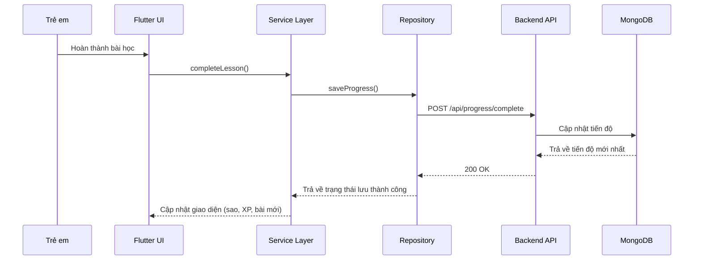

# TỔNG QUAN ỨNG DỤNG KHMERKID

Phân tích mã nguồn dự án — Phiên bản 1.0.0

## Mục lục
1. [Giới thiệu hệ thống](#1-giới-thiệu-hệ-thống)
2. [Mục tiêu của hệ thống](#2-mục-tiêu-của-hệ-thống)
3. [Chức năng chính](#3-chức-năng-chính)
4. [Kiến trúc hệ thống](#4-kiến-trúc-hệ-thống)
5. [Công nghệ sử dụng](#5-công-nghệ-sử-dụng)
6. [Cấu trúc thư mục dự án](#6-cấu-trúc-thư-mục-dự-án)
7. [Luồng hoạt động của ứng dụng](#7-luồng-hoạt-động-của-ứng-dụng)
8. [Ưu điểm của hệ thống](#8-ưu-điểm-của-hệ-thống)
9. [Kết luận](#9-kết-luận)

---

## 1. Giới thiệu hệ thống

### 1.1. Tên ứng dụng
**KhmerKid** — Ứng dụng học chữ Khmer cho trẻ em tiểu học.

### 1.2. Mục đích xây dựng
Ứng dụng KhmerKid được phát triển nhằm cung cấp một nền tảng học tập ngôn ngữ Khmer toàn diện, tương tác và thân thiện dành riêng cho trẻ em trong độ tuổi tiểu học. Hệ thống kết hợp các phương pháp sư phạm hiện đại với công nghệ trí tuệ nhân tạo (AI), bao gồm nhận diện chữ viết tay và phân tích đánh giá phát âm, nhằm tạo ra trải nghiệm học tập đa giác quan: Nghe — Nói — Đọc — Viết.

### 1.3. Đối tượng sử dụng
*   **Đối tượng chính**: Trẻ em tiểu học (6–12 tuổi) muốn học hoặc củng cố kiến thức tiếng Khmer.
*   **Đối tượng phụ**: Phụ huynh, giáo viên theo dõi tiến độ học tập của trẻ.

### 1.4. Bài toán mà ứng dụng giải quyết
*   Thiếu hụt các công cụ học tiếng Khmer số hóa, tương tác cho trẻ em.
*   Khó khăn trong việc học viết chữ Khmer — hệ chữ viết phức tạp với 33 phụ âm, 24 nguyên âm, hệ thống dấu và quy tắc ghép vần riêng biệt.
*   Nhu cầu luyện phát âm chuẩn khi thiếu giáo viên bản ngữ.
*   Sự cần thiết phải duy trì động lực học tập cho trẻ em thông qua cơ chế gamification (trò chơi hóa).

---

## 2. Mục tiêu của hệ thống

### 2.1. Mục tiêu chính
Xây dựng một ứng dụng di động đa nền tảng (Android/iOS) hỗ trợ trẻ em học tiếng Khmer một cách toàn diện, bao gồm đầy đủ bốn kỹ năng ngôn ngữ: Nghe, Nói, Đọc, Viết — hoạt động theo mô hình Client-Server trực tuyến, nơi mọi dữ liệu tiến trình học tập được cập nhật và lưu trữ trực tiếp lên máy chủ thông qua kết nối Internet.

### 2.2. Mục tiêu cụ thể
*   **Hệ thống bài học có cấu trúc**: Cung cấp lộ trình học tập tuần tự gồm 11 chủ đề (bao gồm 9 chủ đề cốt lõi đã hiện thực và 2 chủ đề mở rộng tương lai).
*   **Nhận diện chữ viết tay bằng AI**: Tích hợp Google ML Kit (Tier 1: on-device) và bộ phân tích hình học DTW trên máy chủ (Tier 2: backend AI) để đánh giá chữ viết tay của trẻ trên canvas theo thời gian thực.
*   **Đánh giá phát âm**: Sử dụng Google Cloud Speech-to-Text API để nhận diện giọng nói tiếng Khmer, kết hợp thuật toán so khớp chuỗi để đánh giá mức độ chính xác phát âm.
*   **Phát âm chuẩn tiếng Khmer**: Ưu tiên file âm thanh được ghi âm bởi người bản ngữ, kết hợp Text-to-Speech (TTS) engine hỗ trợ tiếng Khmer làm phương án dự phòng.
*   **Gamification toàn diện**: Hệ thống sao, điểm kinh nghiệm (XP), chuỗi học tập liên tiếp (streak), huy hiệu, bảng xếp hạng, cửa hàng vật phẩm ảo (khung avatar, hình dán stickers) và 11 trò chơi mini giáo dục.
*   **Lưu trữ trực tuyến**: Lưu trữ tiến trình học tập trực tiếp lên máy chủ cơ sở dữ liệu đám mây MongoDB thông qua các endpoint RESTful API ngay khi hoàn thành bài học.

### 2.3. Lợi ích mang lại cho người dùng
*   Trẻ em có thể học tập thuận tiện trên thiết bị di động khi có kết nối Internet.
*   Phản hồi tức thì và trực quan giúp trẻ tự sửa lỗi trong quá trình viết chữ và phát âm.
*   Cơ chế trò chơi hóa duy trì hứng thú và động lực học tập lâu dài.
*   Phụ huynh và giáo viên có thể theo dõi tiến độ học tập chi tiết theo thời gian thực thông qua trang Hồ sơ và Báo cáo.

---

## 3. Chức năng chính

### 3.1. Xác thực và Quản lý tài khoản
*   Đăng ký tài khoản bằng email và mật khẩu; đăng nhập bằng email/mật khẩu hoặc đăng nhập bằng Google OAuth 2.0.
*   Hỗ trợ đăng nhập giả lập Google (Mock Login) để kiểm thử trong môi trường phát triển khi chưa có SHA-1 Certificate.
*   Tự động đăng nhập (Auto Login) khi mở lại ứng dụng bằng cơ chế Refresh Token.
*   Quên mật khẩu và đặt lại mật khẩu.
*   Đăng xuất và dọn dẹp phiên làm việc để bảo mật thông tin tài khoản.
*   Tự động dò tìm IP máy chủ backend trong mạng cục bộ (LAN): quét subnet, danh sách ưu tiên, lưu IP đã tìm được, hỗ trợ nhập IP thủ công.
*   *Các file liên quan*: [auth_service.dart](file:///c:/Users/ASUS/Desktop/KHOALUAN/lib/services/auth_service.dart), [login_screen.dart](file:///c:/Users/ASUS/Desktop/KHOALUAN/lib/screens/auth/login_screen.dart), [register_screen.dart](file:///c:/Users/ASUS/Desktop/KHOALUAN/lib/screens/auth/register_screen.dart), [forgot_password_screen.dart](file:///c:/Users/ASUS/Desktop/KHOALUAN/lib/screens/auth/forgot_password_screen.dart), [authRoutes.js](file:///c:/Users/ASUS/Desktop/KHOALUAN/backend/src/routes/authRoutes.js).

### 3.2. Hệ thống bài học (Learning System)
*   Màn hình Lộ trình học hiển thị 11 chủ đề dạng timeline dọc, với tiến độ phần trăm và thanh tiến trình cho từng chủ đề.
*   Mỗi chủ đề dẫn đến một bản đồ bài học (Map Screen) hiển thị danh sách bài học đánh số, trạng thái mở khóa/đã hoàn thành/chưa học.
*   Bài học chi tiết bao gồm ba thành phần tương tác chính: Nghe (phát âm chuẩn), Nói (ghi âm và đánh giá phát âm), Viết (vẽ chữ trên canvas và nhận diện AI).
*   Hoàn thành bài học nhận sao (1–3 sao), điểm XP, tự động mở khóa bài kế tiếp.

**Danh sách 11 chủ đề bài học (tồn tại trong mã nguồn):**

| # | Chủ đề | Mô tả | Số bài |
|---|---|---|---|
| 1 | Học phụ âm | 33 phụ âm Khmer (ក đến អ) | 33 |
| 2 | Học nguyên âm | 24 nguyên âm Khmer | 24 |
| 3 | Phụ âm o-ô | Phân biệt 2 nhóm phụ âm hàng o và hàng ô | 57 (33 phụ âm + 24 nguyên âm) |
| 4 | Học số Khmer | Chữ số Khmer ០ đến ៩ | 10 |
| 5 | Ghép vần | Ghép âm thành tiếng và từ | 330 (33 phụ âm × 10 nguyên âm) |
| 6 | Học dấu | Các dấu Khmer ់ ំ ះ ៈ | 12 |
| 7 | Tập đọc | Đọc câu đơn giản | 5 |
| 8 | Luyện viết / Dictation | Tập viết chính tả - Nghe và gõ lại tiếng Khmer | 20 bài chia theo 3 nhóm chủ đề |
| 9 | Từ vựng | Học các từ vựng căn bản | 38 |
| 10 | Đọc hiểu | Hiểu nội dung câu và trả lời câu hỏi | Sắp ra mắt |
| 11 | Khám phá văn hóa | Tìm hiểu văn hóa lịch sử Khmer | Sắp ra mắt |

*   *Các file liên quan*: [learn_screen.dart](file:///c:/Users/ASUS/Desktop/KHOALUAN/lib/screens/learn/learn_screen.dart), [letter_map_screen.dart](file:///c:/Users/ASUS/Desktop/KHOALUAN/lib/screens/learn/letter_map_screen.dart), [letter_detail_screen.dart](file:///c:/Users/ASUS/Desktop/KHOALUAN/lib/screens/learn/letter_detail_screen.dart), [vowel_screen.dart](file:///c:/Users/ASUS/Desktop/KHOALUAN/lib/screens/learn/vowel_screen.dart), [number_detail_screen.dart](file:///c:/Users/ASUS/Desktop/KHOALUAN/lib/screens/learn/number_detail_screen.dart), [spelling_screen.dart](file:///c:/Users/ASUS/Desktop/KHOALUAN/lib/screens/learn/spelling_screen.dart), [reading_screen.dart](file:///c:/Users/ASUS/Desktop/KHOALUAN/lib/screens/learn/reading_screen.dart), [writing_detail_screen.dart](file:///c:/Users/ASUS/Desktop/KHOALUAN/lib/screens/learn/writing_detail_screen.dart), [diacritical_screen.dart](file:///c:/Users/ASUS/Desktop/KHOALUAN/lib/screens/learn/diacritical_screen.dart), [coeng_screen.dart](file:///c:/Users/ASUS/Desktop/KHOALUAN/lib/screens/learn/coeng_screen.dart), [consonant_series_screen.dart](file:///c:/Users/ASUS/Desktop/KHOALUAN/lib/screens/learn/consonant_series_screen.dart), [vocabulary_screen.dart](file:///c:/Users/ASUS/Desktop/KHOALUAN/lib/screens/learn/vocabulary_screen.dart).

### 3.3. Nhận diện chữ viết tay bằng AI (Two-Tier Hybrid Recognition)
*   **Tier 1 — On-device ML Kit** ([khmer_handwriting_service.dart](file:///c:/Users/ASUS/Desktop/KHOALUAN/lib/services/khmer_handwriting_service.dart)): Chạy ngay trên thiết bị, phản hồi tức thì. Sử dụng Google ML Kit Digital Ink Recognition với mô hình ngôn ngữ Khmer (`km`). ML Kit trả về danh sách ứng viên; nếu chữ cái mục tiêu nằm trong top 3, hệ thống tạm chấp nhận (phù hợp trẻ nhỏ nét viết chưa đều).
*   **Tier 2 — Backend AI Geometric Analysis** ([aiStrokeAnalyzer.js](file:///c:/Users/ASUS/Desktop/KHOALUAN/backend/src/services/aiStrokeAnalyzer.js), [writingHandler.js](file:///c:/Users/ASUS/Desktop/KHOALUAN/backend/src/sockets/writingHandler.js)): Chạy trên máy chủ qua kênh WebSocket, phân tích chi tiết hình dạng nét chữ. Quy trình gồm: chuẩn hóa toạ độ nét vẽ, lấy mẫu đều (resample 32 điểm/nét), tính toán độ sai khác hình học bằng thuật toán Dynamic Time Warping (DTW), so sánh hướng nét bằng cosine similarity, ghép nối các nét vẽ để so khớp với cơ sở dữ liệu mẫu ([StandardCharacter.js](file:///c:/Users/ASUS/Desktop/KHOALUAN/backend/src/models/StandardCharacter.js)).
*   *Các file liên quan*: [khmer_write_widget.dart](file:///c:/Users/ASUS/Desktop/KHOALUAN/lib/widgets/khmer_write_widget.dart), [handwriting_websocket_client.dart](file:///c:/Users/ASUS/Desktop/KHOALUAN/lib/services/handwriting_websocket_client.dart).

### 3.4. Phát âm và nhận diện giọng nói
*   **Nghe**: Phát âm chuẩn ưu tiên phát file âm thanh mẫu do người bản ngữ ghi âm (lưu trữ trong `assets/audio/khmer/`). Thiết bị hỗ trợ 3 tốc độ nghe (chậm/vừa/nhanh) và có Text-to-Speech (TTS) làm phương án dự phòng.
*   **Nói**: Học sinh nhấn giữ nút ghi âm để thu âm giọng đọc tiếng Khmer của mình qua định dạng WAV (LINEAR16, 16kHz, mono) sử dụng thư viện `record`. File ghi âm được tải lên backend để phân tích qua Google Cloud Speech-to-Text API, trả về kết quả đối chiếu tính điểm chính xác. Hệ thống có cơ chế Simulated STT để chạy thử nghiệm khi không có API Credentials.
*   *Các file liên quan*: [tts_service.dart](file:///c:/Users/ASUS/Desktop/KHOALUAN/lib/services/tts_service.dart), [audio_asset_service.dart](file:///c:/Users/ASUS/Desktop/KHOALUAN/lib/services/audio_asset_service.dart), [voice_recognition_service.dart](file:///c:/Users/ASUS/Desktop/KHOALUAN/lib/services/voice_recognition_service.dart), [khmer_speak_widget.dart](file:///c:/Users/ASUS/Desktop/KHOALUAN/lib/widgets/khmer_speak_widget.dart), [khmer_listen_widget.dart](file:///c:/Users/ASUS/Desktop/KHOALUAN/lib/widgets/khmer_listen_widget.dart).

### 3.5. Trò chơi giáo dục (Mini-games)
Hệ thống tích hợp 11 trò chơi giáo dục ôn luyện kiến thức:

| # | Trò chơi | File | Mô tả |
|---|---|---|---|
| 1 | Board Game | [board_game_screen.dart](file:///c:/Users/ASUS/Desktop/KHOALUAN/lib/screens/play/board_game_screen.dart) | Trò chơi bàn cờ tỷ phú với các thử thách câu hỏi tiếng Khmer |
| 2 | Elephant Run | [elephant_run_game_screen.dart](file:///c:/Users/ASUS/Desktop/KHOALUAN/lib/screens/play/elephant_run_game_screen.dart) | Chạy vượt chướng ngại vật thu thập chữ cái |
| 3 | Letter Catch | [letter_catch_game_screen.dart](file:///c:/Users/ASUS/Desktop/KHOALUAN/lib/screens/play/letter_catch_game_screen.dart) | Bắt các chữ cái Khmer rơi xuống |
| 4 | Letter Find | [letter_find_game_screen.dart](file:///c:/Users/ASUS/Desktop/KHOALUAN/lib/screens/play/letter_find_game_screen.dart) | Tìm kiếm các chữ cái Khmer theo yêu cầu |
| 5 | Matching Game | [matching_game_screen.dart](file:///c:/Users/ASUS/Desktop/KHOALUAN/lib/screens/play/matching_game_screen.dart) | Nối chữ/từ vựng Khmer với ý nghĩa tiếng Việt tương ứng |
| 6 | Math Garden | [math_garden_game_screen.dart](file:///c:/Users/ASUS/Desktop/KHOALUAN/lib/screens/play/math_garden_game_screen.dart) | Khu vườn toán học đố các chữ số bằng chữ Khmer |
| 7 | Quiz Game | [quiz_game_screen.dart](file:///c:/Users/ASUS/Desktop/KHOALUAN/lib/screens/play/quiz_game_screen.dart) | Trắc nghiệm câu hỏi kiến thức phản xạ nhanh |
| 8 | Sentence Builder | [sentence_builder_game_screen.dart](file:///c:/Users/ASUS/Desktop/KHOALUAN/lib/screens/play/sentence_builder_game_screen.dart) | Đảo quốc ngữ pháp: Sắp xếp các từ thành câu đúng ngữ pháp |
| 9 | Sorting Game | [sorting_game_screen.dart](file:///c:/Users/ASUS/Desktop/KHOALUAN/lib/screens/play/sorting_game_screen.dart) | Sắp xếp các ký tự Khmer theo thứ tự đúng |
| 10 | Sub-Consonant Game | [sub_consonant_game_screen.dart](file:///c:/Users/ASUS/Desktop/KHOALUAN/lib/screens/play/sub_consonant_game_screen.dart) | Nhà khảo cổ nhí ghép cặp phụ âm với chân chữ (Coeng) tương ứng |
| 11 | Word Search | [word_search_game_screen.dart](file:///c:/Users/ASUS/Desktop/KHOALUAN/lib/screens/play/word_search_game_screen.dart) | Giải cứu thú rừng tìm từ vựng Khmer ẩn trong ma trận ký tự |

### 3.6. Hệ thống Gamification
*   **Sao (Stars)**: Tích lũy khi hoàn thành bài học/chơi game, dùng làm tiền tệ ảo trong cửa hàng (Shop) để đổi vật phẩm.
*   **Điểm kinh nghiệm (XP) & Cấp độ (Level)**: Tích lũy XP để tăng cấp cho nhân vật học tập của trẻ.
*   **Chuỗi học tập (Streak)**: Theo dõi và đếm số ngày liên tục trẻ vào ứng dụng học bài.
*   **Badges (Huy hiệu) & Achievements**: Tự động mở khóa khi đạt các cột mốc học tập.
*   **Nhiệm vụ hàng ngày (Daily Missions)**: Nhận từ server MongoDB, làm xong được nhận quà.
*   **Bảng xếp hạng (Leaderboard)**: Xếp hạng các tài khoản học sinh theo số điểm XP tích lũy toàn hệ thống.
*   **Shop & Cửa hàng ảo**: Mua sắm khung ảnh đại diện, bộ sưu tập hình dán (stickers) trang trí đổi bằng sao.
*   *Các file liên quan*: [score_service.dart](file:///c:/Users/ASUS/Desktop/KHOALUAN/lib/services/score_service.dart), [achievements_screen.dart](file:///c:/Users/ASUS/Desktop/KHOALUAN/lib/screens/achievements/achievements_screen.dart), [leaderboard_screen.dart](file:///c:/Users/ASUS/Desktop/KHOALUAN/lib/screens/leaderboard/leaderboard_screen.dart), [shop_screen.dart](file:///c:/Users/ASUS/Desktop/KHOALUAN/lib/screens/shop/shop_screen.dart).

### 3.7. Thư viện tài liệu (Library)
*   Cung cấp kho tư liệu bổ trợ gồm sách đọc, tệp âm thanh (audio), và video giáo dục.
*   *Các file liên quan*: [library_screen.dart](file:///c:/Users/ASUS/Desktop/KHOALUAN/lib/screens/library/library_screen.dart).

### 3.8. Kiểm tra (Test)
*   Thực hiện làm bài kiểm tra trắc nghiệm theo mức độ khó tăng dần để đánh giá kết quả tổng hợp kiến thức đã học.
*   *Các file liên quan*: [test_screen.dart](file:///c:/Users/ASUS/Desktop/KHOALUAN/lib/screens/test/test_screen.dart).

### 3.9. Hồ sơ cá nhân và Báo cáo
*   Hiển thị thông tin cá nhân học sinh, cho phép cập nhật ảnh đại diện (avatar tải lên Cloudinary), thống kê chi tiết biểu đồ kỹ năng Nghe — Nói — Đọc — Viết (thang điểm 0–100%).
*   *Các file liên quan*: [profile_screen.dart](file:///c:/Users/ASUS/Desktop/KHOALUAN/lib/screens/profile/profile_screen.dart), [report_screen.dart](file:///c:/Users/ASUS/Desktop/KHOALUAN/lib/screens/report/report_screen.dart).

### 3.10. Cài đặt và Thông báo
*   Tùy chỉnh bật/tắt nhạc nền, điều chỉnh tốc độ phát âm (3 tốc độ), bật/tắt rung phản hồi vật lý (haptics), quản lý cấu hình kết nối server IP tự động/thủ công.
*   *Các file liên quan*: [settings_screen.dart](file:///c:/Users/ASUS/Desktop/KHOALUAN/lib/screens/settings/settings_screen.dart), [notification_screen.dart](file:///c:/Users/ASUS/Desktop/KHOALUAN/lib/screens/notification/notification_screen.dart).

---

## 4. Kiến trúc hệ thống

### 4.1. Mô tả kiến trúc tổng thể
Ứng dụng KhmerKid được xây dựng theo kiến trúc **Client-Server Architecture**. Phía client là ứng dụng Flutter đa nền tảng kết nối trực tuyến với phía server là máy chủ RESTful API Node.js/Express.js và cơ sở dữ liệu tập trung MongoDB. Giao tiếp thời gian thực được thực hiện qua Socket.IO.

```
graph TB
    subgraph "Client - Flutter App"
        UI["UI Layer<br/>(Screens + Widgets)"]
        SVC["Service Layer<br/>(AuthService, TtsService,<br/>ScoreService, HandwritingService)"]
        REPO["Repository Layer<br/>(ProgressRepository,<br/>LessonRepository)"]
        LOCAL["Local Configuration Layer<br/>(SharedPrefs)"]
    end

    subgraph "Server - Node.js Backend"
        API["Express.js REST API"]
        WS["Socket.IO WebSocket"]
        CTRL["Controllers"]
        SVC_B["Services<br/>(AI Analyzer, Speech,<br/>Scoring, TTS)"]
        MODELS["Mongoose Models"]
        DB[("MongoDB Cloud")]
        CLOUD["Cloudinary<br/>(Image Storage)"]
        GSTT["Google Cloud<br/>Speech-to-Text"]
    end

    UI --> SVC
    SVC --> REPO
    REPO --> LOCAL
    REPO --> API
    SVC --> WS
    API --> CTRL --> SVC_B --> MODELS --> DB
    WS --> SVC_B
    SVC_B --> GSTT
    CTRL --> CLOUD
```

### 4.2. Các thành phần chính

#### 4.2.1. Client (Flutter)
*   **UI Layer** (`screens/`, `widgets/`): Giao diện người dùng gồm 15+ phân mục chính và các widget tái sử dụng. Sử dụng `flutter_screenutil` cho responsive layout, `google_fonts` cho typography.
*   **Service Layer** (`services/`): Các dịch vụ singleton quản lý nghiệp vụ lõi (xác thực, TTS, nhận diện chữ viết, ghi âm, điểm số, kết nối...).
*   **Repository Layer** (`repositories/`): Triển khai mẫu thiết kế Repository, đóng vai trò trung gian điều phối giữa giao diện UI và dữ liệu từ máy chủ.
*   **Data Layer** (`data/`): Định nghĩa kết nối máy chủ `remote/` (HTTP client kết nối backend).
*   **Model Layer** (`models/`): Định nghĩa cấu trúc dữ liệu tiếng Khmer.
*   **Theme/Constants** (`theme/`, `constants/`): Quản lý design tokens, bảng màu, typography chuẩn thống nhất.

#### 4.2.2. Server (Node.js/Express.js)
*   **Routes** (`routes/`): Cung cấp các file định tuyến API cho xác thực, bài học, tiến độ, trò chơi, phát âm, viết chữ, nhiệm vụ, huy hiệu, xếp hạng, quản trị...
*   **Controllers** (`controllers/`): Tiếp nhận và xử lý logic các yêu cầu request-response.
*   **Services** (`services/`): Xử lý nghiệp vụ chính, tiêu biểu là 3 bộ phân tích nét chữ AI (`aiStrokeAnalyzer.js`, `aiVowelStrokeAnalyzer.js`, `aiCompoundStrokeAnalyzer.js`), `speech.service.js` (Google STT), và `scoring.service.js` (chấm điểm phát âm).
*   **Models** (`models/`): Khởi tạo 19 Mongoose schema tương tác MongoDB (User, Lesson, Progress, Badge, Mission, WritingProgress, StandardCharacter, GamePlaySession, GameProgress, GameQuestion, GameResult, LibraryItem, ListeningResult, ReadingResult, TestQuestion, TtsCache, Notification, Achievement, MissionProgress).
*   **Sockets** (`sockets/`): Xử lý luồng kết nối WebSocket phục vụ phân tích nét vẽ thời gian thực.
*   **Middlewares** (`middlewares/`): Bảo mật token JWT, phân quyền tài khoản (admin/user), rate limiting giới hạn tần suất yêu cầu và xử lý tải file.

### 4.3. Mối quan hệ giữa các thành phần
*   **UI ↔ Service**: UI gọi các phương thức của Service Layer để thực hiện nghiệp vụ. Service sử dụng mẫu Singleton để đảm bảo tính nhất quán dữ liệu.
*   **Service ↔ Repository**: Service gọi Repository để đọc/ghi dữ liệu. Repository giao tiếp trực tiếp với REST API (remote).
*   **Client ↔ Server**: Giao tiếp qua HTTP REST API (CRUD) và Socket.IO WebSocket (phân tích chữ viết tay thời gian thực).

### 4.4. Luồng dữ liệu



---

## 5. Công nghệ sử dụng

### 5.1. Phía Client (Mobile App)

| Thành phần | Công nghệ | Phiên bản | Mục đích sử dụng |
|---|---|---|---|
| Framework | Flutter (Dart) | SDK ^3.11.4 | Phát triển ứng dụng di động đa nền tảng (Android/iOS) |
| Lưu trữ cấu hình | SharedPreferences | 2.3.4 | Lưu cài đặt hiển thị, tùy chọn âm thanh, token đăng nhập |
| Nhận diện chữ viết tay | Google ML Kit Digital Ink | 0.14.0 | Nhận diện on-device chữ Khmer (Tier 1) |
| Text-to-Speech | flutter_tts | 4.2.2 | Phát âm tổng hợp (TTS engine) |
| Phát âm thanh chuẩn | audioplayers | 5.2.1 | Phát file MP3 âm thanh người bản ngữ |
| Ghi âm | record | 5.0.0 | Ghi âm WAV từ microphone để đánh giá phát âm |
| HTTP Client | http | 1.2.1 | Giao tiếp RESTful API với backend |
| WebSocket Client | socket_io_client | 3.0.2 | Giao tiếp thời gian thực cho phân tích nét chữ |
| Đăng nhập Google | google_sign_in | 6.2.1 | Xác thực OAuth 2.0 với Google |
| Responsive UI | flutter_screenutil | 5.9.3 | Co giãn giao diện theo kích thước màn hình |
| Typography | google_fonts | 8.0.2 | Font chữ Plus Jakarta Sans, Noto Sans Khmer |
| Bảo mật | flutter_secure_storage | 9.2.2 | Lưu trữ dữ liệu nhạy cảm an toàn |
| So khớp chuỗi | string_similarity | 2.0.0 | So sánh phiên âm cho đánh giá phát âm |
| Chọn ảnh | image_picker | 1.2.2 | Chọn ảnh đại diện từ thư viện/camera |
| Xử lý quyền | permission_handler | 12.0.1 | Yêu cầu quyền microphone, camera |
| Đường dẫn file | path_provider | 2.1.5 | Lấy đường dẫn thư mục ứng dụng |

### 5.2. Phía Server (Backend)

| Thành phần | Công nghệ | Phiên bản | Mục đích sử dụng |
|---|---|---|---|
| Runtime | Node.js | ≥18.0.0 | Môi trường chạy JavaScript phía server |
| Web Framework | Express.js | 4.21.0 | Xây dựng RESTful API |
| Cơ sở dữ liệu | MongoDB (Mongoose) | 8.7.0 | Lưu trữ dữ liệu người dùng, bài học, tiến độ |
| Giao tiếp thời gian thực | Socket.IO | 4.8.0 | WebSocket cho phân tích chữ viết tay real-time |
| Xác thực | JWT (jsonwebtoken) + Passport | 9.0.2 / 0.7.0 | Xác thực Access Token / Refresh Token |
| OAuth 2.0 | passport-google-oauth20 | 2.0.0 | Đăng nhập bằng Google |
| Nhận diện giọng nói | @google-cloud/speech | 5.6.0 | Google Cloud Speech-to-Text API (tiếng Khmer) |
| Lưu trữ ảnh | Cloudinary | 1.41.3 | Lưu trữ và phục vụ ảnh đại diện |
| Mã hóa mật khẩu | bcryptjs | 2.4.3 | Hash mật khẩu với salt (12 rounds) |
| Upload file | Multer | 1.4.5 | Xử lý multipart file upload |
| Bảo mật | Helmet + CORS + Rate Limiting | - | Bảo vệ API endpoint |
| Validate dữ liệu | express-validator | 7.2.0 | Kiểm tra đầu vào request |
| Logging | Morgan | 1.10.0 | Ghi log HTTP request |
| Font xử lý | opentype.js | 2.0.0 | Phân tích font chữ Khmer cho AI stroke |

---

## 6. Cấu trúc thư mục dự án

```
KHOALUAN/
├── lib/                              # Mã nguồn Flutter chính
│   ├── main.dart                     # Điểm khởi đầu ứng dụng
│   ├── constants/                    # Hằng số ứng dụng
│   │   ├── app_colors.dart           # Bảng màu chủ đề
│   │   ├── app_spacing.dart          # Khoảng cách chuẩn
│   │   ├── app_strings.dart          # Chuỗi văn bản UI
│   │   └── app_text_styles.dart      # Kiểu chữ chuẩn
│   ├── theme/                        # Chủ đề giao diện
│   │   ├── app_theme.dart            # ThemeData chính
│   │   ├── app_typography.dart       # Typography hệ thống
│   │   └── design_tokens.dart        # Design tokens (màu, spacing, radius)
│   ├── models/                       # Mô hình dữ liệu Khmer
│   │   ├── khmer_letter.dart         # 33 phụ âm Khmer
│   │   ├── khmer_vowel.dart          # 24 nguyên âm Khmer
│   │   ├── khmer_number.dart         # Chữ số Khmer ០–៩
│   │   ├── khmer_diacritical.dart    # Dấu Khmer (12 dấu)
│   │   ├── khmer_coeng.dart          # Phụ âm phụ (Coeng)
│   │   ├── khmer_consonant_series.dart # Hàng o/ô phụ âm
│   │   ├── khmer_spelling.dart       # Bài ghép vần
│   │   ├── khmer_reading.dart        # Bài tập đọc
│   │   ├── khmer_writing.dart        # Bài luyện viết (20 bài)
│   │   ├── khmer_vocabulary.dart     # Từ vựng Khmer
│   │   ├── khmer_closed_syllable.dart # Âm tiết đóng
│   │   ├── pronunciation_result.dart # Kết quả đánh giá phát âm
│   │   └── daily_challenge.dart      # Thử thách hàng ngày
│   ├── services/                     # Dịch vụ nghiệp vụ (Singleton)
│   │   ├── auth_service.dart         # Xác thực & dò tìm server
│   │   ├── storage_service.dart      # Lưu trữ cục bộ SharedPreferences
│   │   ├── score_service.dart        # Quản lý điểm số, sao, XP
│   │   ├── tts_service.dart          # Text-to-Speech
│   │   ├── audio_asset_service.dart  # Phát file âm thanh chuẩn
│   │   ├── khmer_handwriting_service.dart # ML Kit nhận diện chữ (Tier 1)
│   │   ├── handwriting_websocket_client.dart # WebSocket client (Tier 2)
│   │   ├── voice_recognition_service.dart   # Ghi âm & upload
│   │   ├── scoring_service.dart      # Chấm điểm client-side
│   │   ├── api_client_service.dart   # Quản lý kết nối HTTP API
│   │   └── lesson_service.dart       # Quản lý bài học
│   ├── repositories/                 # Repository (Quản lý dữ liệu trực tuyến)
│   │   ├── progress_repository.dart  # Tiến độ học — trung tâm
│   │   ├── lesson_repository.dart    # Bài học
│   │   ├── reward_repository.dart    # Phân thưởng
│   │   └── analytics_repository.dart # Phân tích hành vi
│   ├── data/                         # Tầng dữ liệu
│   │   ├── remote/                   # Kết nối API server
│   │   │   ├── progress_remote_datasource.dart # API tiến độ
│   │   │   └── lesson_remote_datasource.dart   # API bài học
│   │   └── stroke_guide_data.dart    # Dữ liệu hướng dẫn nét chữ
│   ├── screens/                      # Các màn hình UI
│   │   ├── main_screen.dart          # Khung chính + Bottom Navigation
│   │   ├── splash/                   # Màn hình khởi động
│   │   ├── auth/                     # Đăng nhập, đăng ký, quên MK
│   │   ├── home/                     # Trang chủ + widgets con
│   │   ├── learn/                    # 25+ file màn hình học tập
│   │   ├── play/                     # 12 file trò chơi (11 mini-games)
│   │   ├── library/                  # Thư viện tài liệu
│   │   ├── test/                     # Bài kiểm tra
│   │   ├── profile/                  # Hồ sơ cá nhân
│   │   ├── leaderboard/             # Bảng xếp hạng
│   │   ├── achievements/            # Thành tích & huy hiệu
│   │   ├── shop/                    # Cửa hàng vật phẩm
│   │   ├── settings/               # Cài đặt
│   │   ├── notification/           # Thông báo
│   │   └── report/                 # Báo cáo học tập
│   └── widgets/                     # Widget tái sử dụng
│   │   ├── khmer_write_widget.dart   # Canvas viết chữ (Handwriting AI)
│   │   ├── khmer_speak_widget.dart   # Widget ghi âm phát âm
│   │   ├── khmer_listen_widget.dart  # Widget nghe phát âm
│   │   ├── confetti_overlay.dart     # Hiệu ứng pháo hoa
│   │   ├── game_xp_progress_bar.dart # Thanh XP trong game
│   │   ├── feedback_dialog.dart      # Hộp thoại phản hồi
│   │   ├── score_result_card.dart    # Thẻ kết quả điểm
│   │   └── ...                       # Các widget khác
├── backend/                          # Mã nguồn Backend Node.js
│   ├── server.js                     # Entry point server Express
│   ├── package.json                  # Dependencies backend
│   ├── .env                          # Biến môi trường
│   └── src/
│       ├── config/                   # Cấu hình
│       │   ├── database.js           # Kết nối MongoDB
│       │   ├── passport.js           # Cấu hình Google OAuth
│       │   └── cloudinary.js         # Cấu hình Cloudinary
│       ├── routes/                   # 12 file định tuyến API
│       ├── controllers/              # 13 controller
│       ├── services/                 # 17 service nghiệp vụ
│       │   ├── aiStrokeAnalyzer.js   # AI phân tích nét phụ âm (DTW)
│       │   ├── aiVowelStrokeAnalyzer.js  # AI phân tích nguyên âm
│       │   ├── aiCompoundStrokeAnalyzer.js # AI phân tích ký tự ghép
│       │   ├── speech.service.js     # Google Cloud STT
│       │   ├── scoring.service.js    # Chấm điểm phát âm
│       │   └── ...
│       ├── models/                   # 16 Mongoose schema
│       ├── sockets/                  # WebSocket handlers
│       │   ├── index.js              # Khởi tạo Socket.IO
│       │   └── writingHandler.js     # Xử lý nét chữ real-time
│       ├── middlewares/              # 8 middleware (auth, error, upload...)
│       ├── seeders/                  # Dữ liệu mẫu (badges, missions, lessons)
│       ├── validators/               # Validate request
│       ├── constants/                # Hằng số backend
│       └── utils/                    # Tiện ích
├── assets/                           # Tài nguyên tĩnh
│   ├── images/                       # Hình ảnh mascot, nền
│   └── audio/khmer/                  # File phát âm chuẩn
│       ├── consonants/               # 33 phụ âm
│       ├── vowels/                   # Nguyên âm
│       ├── numbers/                  # Số
│       └── words/                    # Từ vựng
├── image/                            # Hình ảnh giao diện
├── pubspec.yaml                      # Cấu hình Flutter & dependencies
└── android/ / ios/                   # Cấu hình nền tảng native
```

---

## 7. Luồng hoạt động của ứng dụng

### 7.1. Khi người dùng mở ứng dụng
1.  `main.dart` khởi tạo tuần tự:
    *   Dò tìm IP máy chủ backend đang hoạt động (`AuthService.detectActiveServer()`) kết nối thông qua quét IP mạng cục bộ (LAN), IP đã lưu hoặc IP dự phòng.
2.  `SplashScreen` hiển thị với animation, đồng thời gọi `AuthService.tryAutoLogin()`:
    *   Nếu token hợp lệ → chuyển đến `MainScreen`.
    *   Nếu token hết hạn → tự động refresh → thành công → `MainScreen`, thất bại → `LoginScreen`.
    *   Nếu chưa đăng nhập → `LoginScreen`.
3.  `MainScreen` chứa BottomNavigationBar với 4 tab: Trang chủ, Học, Chơi, Hồ sơ.

### 7.2. Khi thực hiện chức năng học
1.  Trẻ chọn tab Học → hiển thị `LearnScreen` với 11 chủ đề dạng timeline.
2.  Chọn chủ đề (ví dụ: Học phụ âm) → mở `LetterMapScreen` — bản đồ các bài học, bài chưa hoàn thành được hiển thị dạng khóa, bài mở khóa hiển thị số sao.
3.  Chọn bài học → mở chi tiết bài học gồm các tab tương tác:
    *   **Nghe**: Hiển thị chữ cái + phát âm chuẩn (audio mẫu ưu tiên → TTS làm phương án dự phòng).
    *   **Nói**: Nhấn giữ nút ghi âm giọng đọc phát âm, gửi file WAV lên server kiểm tra độ khớp thông qua API Google Speech-to-Text.
    *   **Viết**: Học vẽ chữ trên canvas tích hợp nhận diện chữ viết AI 2 tầng (on-device ML Kit và backend DTW).
4.  Hoàn thành → Gửi trực tiếp yêu cầu lưu trữ tiến trình qua REST API lên máy chủ MongoDB, cập nhật điểm XP, Stars và mở khóa bài học tiếp theo trên giao diện sau khi nhận phản hồi thành công từ máy chủ.

### 7.3. Khi thực hiện chức năng chơi
1.  Tab Chơi → `PlayScreen` hiển thị danh sách 11 trò chơi giáo dục.
2.  Trẻ lựa chọn trò chơi để bắt đầu củng cố kiến thức.
3.  Kết thúc trò chơi, điểm số và số sao đạt được sẽ được cập nhật trực tiếp lên bảng xếp hạng hệ thống.

### 7.4. Cách dữ liệu được xử lý và lưu trữ
Hệ thống sử dụng cơ chế lưu trữ trực tuyến Client-Server kết hợp lưu cấu hình cục bộ:

| Thành phần | Công nghệ | Vai trò | Phương thức và Thời điểm ghi |
|---|---|---|---|
| **Cấu hình cục bộ** | SharedPreferences | Lưu trữ các cài đặt hiển thị đơn giản, tùy chọn âm thanh, token đăng nhập | Ghi ngay lập tức vào bộ nhớ thiết bị |
| **Cơ sở dữ liệu chính** | MongoDB Atlas | Lưu trữ toàn bộ thông tin tiến trình học tập, tài khoản, gamification | Ghi trực tiếp lên máy chủ qua REST API (yêu cầu kết nối Internet) |

*   **Giao tiếp dữ liệu**: Ứng dụng gửi trực tiếp dữ liệu học tập qua API RESTful của server ngay khi người dùng hoàn thành hoạt động để cập nhật tức thì lên máy chủ.
*   **Cách ly dữ liệu**: SharedPreferences sử dụng các khóa định danh riêng cho từng người dùng, đảm bảo cài đặt của các cài đặt của các tài khoản khác nhau trên cùng thiết bị không bị ghi đè lẫn nhau.

---

## 8. Ưu điểm của hệ thống

### 8.1. Điểm mạnh về chức năng
*   **Toàn diện 4 kỹ năng**: Ứng dụng bao phủ đầy đủ Nghe — Nói — Đọc — Viết, hiếm có trong các ứng dụng học ngôn ngữ thiểu số.
*   **AI hai tầng cho chữ viết tay**: Kết hợp nhận diện on-device (phản hồi tức thì) và phân tích hình học trên server (đánh giá chi tiết nét chữ) — cách tiếp cận tiên tiến, phù hợp với đặc thù chữ Khmer phức tạp.
*   **Phát âm chuẩn bản ngữ**: Ưu tiên file âm thanh ghi âm thật thay vì phụ thuộc hoàn toàn vào TTS engine, đảm bảo độ chính xác phát âm cao.
*   **Gamification phong phú**: 11 trò chơi mini, hệ thống sao/XP/streak/huy hiệu/rank/shop — tạo động lực mạnh mẽ cho đối tượng trẻ em.
*   **Cập nhật trực tiếp**: Tiến độ được ghi nhận và lưu trữ trực tuyến nhanh chóng lên hệ thống đám mây.

### 8.2. Điểm mạnh về giao diện
*   **Thiết kế thân thiện trẻ em**: Màu sắc tươi sáng, biểu tượng sinh động (mascot voi), hiệu ứng pháo hoa khi hoàn thành bài, gradient hấp dẫn.
*   **Responsive layout**: Sử dụng `flutter_screenutil` đảm bảo giao diện nhất quán trên mọi kích thước màn hình điện thoại.
*   **Hệ thống thiết kế nhất quán**: Design tokens tập trung (`design_tokens.dart`), bảng màu thống nhất (`app_colors.dart`), typography hệ thống (`app_typography.dart`).
*   **Phản hồi trực quan phong phú**: Animation chuyển trang mượt mà, confetti overlay khi thắng cuộc, progress bar XP dạng hoạt họa sinh động.

### 8.3. Điểm mạnh về kỹ thuật
*   **Kiến trúc phân tầng rõ ràng**: UI → Service → Repository → Data, tuân thủ nguyên tắc tách biệt mối quan tâm (Separation of Concerns).
*   **Mẫu thiết kế chuyên nghiệp**: Sử dụng hiệu quả các mẫu thiết kế Singleton (services), Repository (truy cập dữ liệu), Observer (ChangeNotifier, StreamController).
*   **Tự động dò tìm server**: Cơ chế thông minh quét subnet mạng cục bộ giúp thiết bị tự liên lạc với IP backend nội bộ không cần cấu hình thủ công phức tạp.
*   **Bảo mật đa lớp**: JWT Access/Refresh Token, bcrypt password hashing (12 rounds), Helmet headers, rate limiting, CORS configuration, phân quyền tài khoản rõ ràng.

---

## 9. Kết luận

Qua quá trình phân tích toàn diện mã nguồn, ứng dụng **KhmerKid** thể hiện là một hệ thống giáo dục số hoàn chỉnh, được thiết kế và triển khai ở mức độ chuyên nghiệp cao. Hệ thống giải quyết bài toán thực tiễn — hỗ trợ trẻ em tiểu học học tiếng Khmer — bằng cách kết hợp nhiều công nghệ tiên tiến trong một kiến trúc phần mềm có tổ chức tốt.

Sự phối hợp hài hòa giữa các công nghệ AI (nhận dạng chữ viết, giọng nói), kiến trúc lưu trữ trực tuyến Client-Server, và cơ chế trò chơi hóa (Gamification với 11 mini-games) mang lại trải nghiệm học tập lôi cuốn cho các em học sinh, đáp ứng đầy đủ và vượt trội các tiêu chí kỹ thuật và nghiệp vụ thực tế của một đồ án tốt nghiệp khóa luận chuyên sâu.
